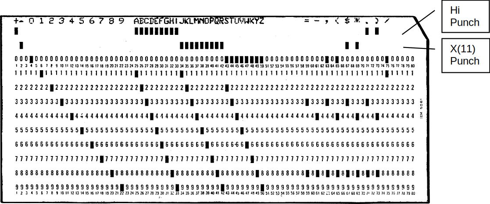

.. -*- coding: utf-8; mode: rst; tab-width: 4; truncate-lines: t; indent-tabs-mode: nil; truncate-lines: t; -*- vim:set et ts=4 ft=rst nowrap:

.. role:: html(raw)
   :format: html

.. |0|   replace:: :html:`<samp>0</samp>`
.. |1|   replace:: :html:`<samp>1</samp>`
.. |2|   replace:: :html:`<samp>2</samp>`
.. |SET| replace:: :html:`<samp><b>SET</b></samp>`

******************************
IBM 650 simulator user's guide
******************************
:Date: 2020-05-14
:Revision: $Format:%H$
:Copyright: See `LICENSE.txt <../LICENSE.txt>`_ for terms of use.

.. topic:: **Copyright notice**

   The following copyright notice applies to the SIMH source, binary, and documentation:

   .. include:: ../LICENSE.txt

.. sectnum:: :suffix: .
.. contents::
   :backlinks: none
   :depth: 3
   :local:

Introduction
============
This manual documents the features and operation of the IBM 650 simulator.
It is intended for use in conjunction with the `SIMH Users' Guide <./simh_doc.rst>`_ manual,
which describes how to compile and run the simulator,
as well as the general commands that may be entered at the Simulation Control Program (SCP) prompt.

The IBM 650 Magnetic Drum Data-Processing Machine
-------------------------------------------------
IBM sold the IBM 650 Magnetic Drum Data-Processing Machine from 1953 through 1962.
The first unit was installed in December 1954.

IBM made several enhancements during the life of the computer
(source: `Wikipedia <https://en.wikipedia.org/wiki/IBM_650>`__).

**1954: Initial model**
    * 1K or 2K word drum memory (IBM 650)
    * Connection of one device Card Read Punch (IBM 533 or 537)
    * IBM 407 for offline printing of punched cards

**1955: Storage Unit**
    * 60 words of core memory
    * 3 index registers
    * Floating-point
    * Magnetic Tape support
    * Connection of up to 3 devices:
      card read punch or modified IBM 407 for online printing

**1956: RAMAC Disc support**
    * Enhancements in Storage Unit to support disc
    * IBM 838 inquiry stations support

**1959: Model 4**
    * 4K word drum memory

All of these were vacuum tube machines.
Each machine word is composed of 10-decimal digits plus sign.
It is a decimal machine.

Reading or writing a word takes 96 microseconds
(called the word time in IBM Operation manual and described as having a duration of 0.096 milliseconds).
This is the basic machine cycle.
As main memory is implemented by a drum,
the CPU waits while drum is seeking to the word to read or write.
This can take from zero to 49 cycles.
An average on optimized code is about 5 cycles per instruction.
The execution speed for optimized code is range of 2K instructions per second.

Simulator files
---------------
The simulator sources are divided into a set of files for the Simulator Control Program and its support libraries,
and a set of files for the IBM 650 CPU and device simulations;
the latter reside in a subdirectory of the directory that contains the SCP files.
The former set is common to all SIMH simulators,
whereas the latter set is specific to the virtual machine being simulated.
The files that make up this simulator are:

+--------------+-------------------+----------------------------------------------------------+
| Subdirectory | File              | Contains                                                 |
+==============+===================+==========================================================+
| ``i650/``    | ``i650_defs.h``   | System architectural declarations                        |
|              +-------------------+----------------------------------------------------------+
|              | ``i650_sys.c``    | SCP interface                                            |
|              +-------------------+----------------------------------------------------------+
|              | ``i650_cpu.c``    | Main CPU simulator                                       |
|              +-------------------+----------------------------------------------------------+
|              | ``i650_cdr.c``    | IBM 533 (card reader part) simulator                     |
|              +-------------------+----------------------------------------------------------+
|              | ``i650_cdp.c``    | IBM 533 (card punch part) and IBM 407 printing simulator |
|              +-------------------+----------------------------------------------------------+
|              | ``i650_mt.c``     | IBM 727 tape simulator                                   |
|              +-------------------+----------------------------------------------------------+
|              | ``i650_dsk.c``    | IBM 355 RAMAC Disk Storage                               |
|              +-------------------+----------------------------------------------------------+
|              | ``I650_test.ini`` | Executes all the ``sw`` test-run scripts                 |
+--------------+-------------------+----------------------------------------------------------+
| ``I650/sw/`` |                   | Contains the included software and test-run script files |
|              |                   | (See usage_ section)                                     |
+--------------+-------------------+----------------------------------------------------------+

PDF files of the original IBM 650 hardware and software manuals are available from `Bitsavers <http://www.bitsavers.org/pdf/ibm/650/>`_.

The computer programming and its operation are described in `IBM 650 Magnetic Drum Data-Processing Machine manual of operation`,
Form 22-6060-2 (1956).

Simulator features
==================
The IBM 650 simulator contains the following device simulations:

.. list-table::
   :header-rows: 1
   :stub-columns: 1

   * - Device name(s)
     - Simulates
   * - ``CPU``
     - | IBM 650 Drum Data Processing Machine
       | IBM 652 Control Unit
       | IBM 653 Storage Unit
       | 1K word, 2K word, or 4K drum
   * - ``CDR1`` to ``CDR3``
     - IBM 533 Card Reader
   * - ``CDP1`` to ``CDP3``
     - IBM 533 Card Punch
   * - ``CDP0``
     - IBM 407 Printing
   * - ``MT0`` to ``MT5``
     - IBM 727 Magnetic Tape
   * - ``DSK0`` to ``DSK3``
     - IBM 355 RAMAC Disk Storage

The simulator has been tested with and supports the following software:

* IBM SOAP II as stated in the `24-4000-0 manual <http://www.bitsavers.org/pdf/ibm/650/24-4000-0_SOAPII.pdf>`_ at Bitsavers_
* IBM SOAP IIA-4000
* IBM Interpretive Floating Decimal Interpretive System
* Bell Interpretive System
* Lockheed Regional Assembler
* Carnegie Internal translator
* IBM Fortransit (version II (S))
* Case Institute SuperSoap

The simulator also provides extensive facilities for tracing CPU and I/O device operations.

Hardware-equivalent actions
---------------------------
The current implementation does not provide simulations of the CPU or peripheral device front panels.
Instead,
commands entered through the simulation console are used to perform hardware actions.
The simulation commands that substitute for IBM 650 console actions are:

.. |CONTROL|        replace:: :html:`<samp>CONTROL</samp>`
.. |ERROR|          replace:: :html:`<samp>ERROR</samp>`
.. |HALF CYCLE|     replace:: :html:`<samp>HALF CYCLE</samp>`
.. |OVERFLOW|       replace:: :html:`<samp>OVERFLOW</samp>`
.. |PROGRAMMED|     replace:: :html:`<samp>PROGRAMMED</samp>`
.. |SENSE|          replace:: :html:`<samp>SENSE</samp>`
.. |STOP|           replace:: :html:`<samp>STOP</samp>`
.. |COMPUTER RESET| replace:: :html:`<samp class="guilabel">COMPUTER RESET</samp>`
.. |PROGRAM START|  replace:: :html:`<samp class="guilabel">PROGRAM START</samp>`
.. |PROGRAM STOP|   replace:: :html:`<samp class="guilabel">PROGRAM STOP</samp>`
.. |TRANSFER|       replace:: :html:`<samp class="guilabel">TRANSFER</samp>`

=============================================  =================================================================
Hardware console action                        Equivalent simulation command
=============================================  =================================================================
Set |PROGRAMMED| switch to ``RUN`` | ``STOP``  :html:`<samp><b>DEPOSIT CSWPS</b> 0 | 1</samp>`
Set |OVERFLOW| switch to ``SENSE`` | ``STOP``  :html:`<samp><b>DEPOSIT CSWOS</b> 0 | 1</samp>`
Set |HALF CYCLE| switch to ``RUN`` | ``HALF``  :html:`<samp><b>DEPOSIT HALF</b > 0 | 1</samp>`
Set |ERROR| switch                             Not simulated
Set |CONTROL| to ``ADDRESS STOP``              :html:`<samp><b>BREAK</b> <var>address</var></samp>`
Setting the console switches                   :html:`<samp><b>DEPOSIT CSW</b> <var>value</var></samp>`
Display lower accumulator                      :html:`<samp><b>EXAMINE ACCLO</b></samp>`
Display upper accumulator                      :html:`<samp><b>EXAMINE ACCUP</b></samp>`
Display distributor                            :html:`<samp><b>EXAMINE DIST</b></samp>`
Display program register                       :html:`<samp><b>EXAMINE PR</b></samp>`
Display read-out storage                       :html:`<samp><b>EXAMINE</b> <var>address</var></samp>`
Display read-in storage                        :html:`<samp><b>DEPOSIT</b> <var>address</var> <var>value</var></samp>`
Press |TRANSFER| key                           :html:`<samp><b>DEPOSIT AR</b> <var>address</var></samp>`
Press |PROGRAM START| key                      |GO|
Press |PROGRAM STOP| key                       ``^E`` on console
Press |COMPUTER RESET| key                     |RESET|
=============================================  =================================================================

.. |ATTACH| replace:: :html:`<samp><b>ATTACH</b></samp>`
.. _ATTACH:

Mounting media on a peripheral device is simulated by the |ATTACH| command.
For example,
entering the :html:`<samp><b>ATTACH CDR1</b> <var>card-deck-image-filename</var></samp>` command is equivalent to loading the card deck into the read hopper of the IBM 533.

Simulator-specific commands
---------------------------
In general,
all of the commands documented in the `SIMH Users' Guide`_ manual are available for use with the IBM 650 simulator.
Commands whose execution or parameters are implementation-defined are specified below.

Symbolic display and entry
""""""""""""""""""""""""""
When examining or depositing into memory,
command-line switches specifying the symbolic mode and format may be used to override the default numeric mode,
as follows:

.. table::
   :class: switches

   ======  ===============================
   Switch  Mode interpretation
   ======  ===============================
   ``-C``  String of up to five characters
   ``-M``  A CPU instruction opcode
   ======  ===============================

If the ``-C`` switch is specified,
the value is displayed as five characters delimited by single quotes.

Depositing with ``-C`` accepts up to five displayable characters.
They can optionally be enclosed by quotes (single or double).
If less than five are supplied,
the command pads on right-side with spaces up to five characters.
If more than five are supplied,
the sixth and following characters are ignored.
If a character not belonging to the IBM 650 character set is supplied,
it is interpreted as space.
If a character not belonging to the IBM 650 character set is displayed,
it is shown as ``~``.
Lowercase letters are converted to uppercase.

.. |RD|    replace:: :html:`<samp class="opcode">RD</samp>`
.. |BRMIN| replace:: :html:`<samp class="opcode">BRMIN</samp>`

If the ``-M`` switch is specified,
the value is displayed or accepted as a CPU machine instruction opcode mnemonic,
as described in the `Operation Manual`.
Note that the names of opcodes can range from two letters
(such as |RD|)
up to five letters
(such as |BRMIN|).
The names used are not the SOAP assembler ones
(all of them have three letters).

If neither switch is used,
the normal 10-digit decimal form is assumed.
Digits can be separated by spaces for ease of reading.
A sign can be included before or just after the last digit
(no space separator).
If a number has less than 10 digits,
it is assumed to have leading zeroes.
Values are displayed as 10 adjacent digits followed by a trailing sign.
A negative zero
(minus zero)
value is allowed.

Memory addresses are entered as 4 decimal digits without intervening spaces.

Examples::

    examine 0100
    100:    9011112222-

    examine –c 0100
    100:    9011112222-    '0~~~~'

    examine –m 0100
    BRD10 1111  2222

    deposit –c 0100 hola
    examine –c 0100
    100:    6876736100+   'HOLA '

    deposit –c 0100 ' HOLA'
    examine –c 0100
    100:    0068767361+   ' HOLA'

.. |DEPOSIT|     replace:: :html:`<samp><b>DEPOSIT</b></samp>`
.. |EXAMINE|     replace:: :html:`<samp><b>EXAMINE</b></samp>`
.. |EXAMINE SCP| replace:: :html:`<samp><b>EXAMINE SCP</b></samp>`
.. _DEPOSIT:
.. _EXAMINE:
.. _EXAMINE SCP:

The |DEPOSIT| and |EXAMINE SCP| commands accept addresses in the drum range,
from 0 to 999,
or to 1999 depending on the size of drum memory.
|EXAMINE| accepts addresses of 8000 and beyond for the console,
distributor,
and lower and upper accumulators;
and (if Storage Unit enabled)
index registers and IAS storage contents.

.. |RESET| replace:: :html:`<samp><b>RESET</b></samp>`
.. _RESET:

|RESET|
"""""""
The |RESET| command is equivalent in hardware to pressing the |COMPUTER RESET| console button.

.. |ACCUMULATOR RESET| replace:: :html:`<samp class="guilabel">ACCUMULATOR RESET</samp>`
.. |PROGRAM RESET|     replace:: :html:`<samp class="guilabel">PROGRAM RESET</samp>`
.. _ACCUMULATOR RESET:
.. _PROGRAM RESET:

The |PROGRAM RESET| and |ACCUMULATOR RESET| console buttons are not simulated.

.. |RUN| replace:: :html:`<samp><b>RUN</b></samp>`
.. |GO|  replace:: :html:`<samp><b>GO</b></samp>`
.. _RUN:
.. _GO:

|RUN| and |GO|
""""""""""""""
The |RUN| and |GO| commands do not accept any parameter addresses.
Execution will start at the address specified by the |AR| register.

The IBM 650 does not have a Program Counter/Instruction Counter register.
Architecturally,
it is not necessary,
as each instruction word contains the address of the next instruction to execute.

Register |AR| indicates the address of the instruction to be loaded in the |PR| register,
thus acting as the Program Counter on the first half of instruction execution (I-Cycle).
However,
is overwritten by the address of the data read or written during instruction execution (D-Cycle).
If an error occurs during a D-Cycle,
e.g., the data address to be read from the drum is invalid,
the CPU stops without updating the |AR| register with address of the next instruction.
As the simulator reproduces this behavior,
|AR| cannot be used as a Program Counter.
Also note that as |AR| is overwritten during instruction execution,
there is no trace at all of where the current instruction in the |PR| register came from the drum.

SIMH relies on a Program Counter for command display of user information.
For example,
when the CPU stops,
the simulator uses the program counter to display the current instruction address and mnemonic on the simulation console.

To permit this,
a fictional |IC| register (Instruction Counter)
has been added to the simulation,
even though it has no equivalent on real hardware.
This register keeps track of the address of the current instruction for display purposes.

As this |IC| register has no use in the simulated CPU,
altering its value has no effect.
This is why it is necessary to deposit the address in the |AR| register to set the address of the next instruction to execute.

.. |RESET COMPUTER| replace:: :html:`<samp class="guilabel">RESET COMPUTER</samp>`
.. _RESET COMPUTER:

The |RUN| command does an implied |RESET|,
so it is equivalent in hardware to pressing the console panel |RESET COMPUTER| key,
then the |TRANSFER| key,
and finally the |PROGRAM START| key.
As |RESET| clears all of the registers,
|AR| will be zero,
so execution starts at drum address zero.

The |GO| command is equivalent to pressing the |TRANSFER| key on the console and is the way to start or resume execution after a programmed halt.
Execution starts at the instruction addressed by the |AR| register value.

There is a special case when program halts on a |STOP| opcode instruction.

.. |DA| replace:: :html:`<samp class="register">DA</samp>`
.. _DA:

|STOP| instruction is the normal way to end a program or to stop execution,
because there is an error to notify to the computer operator.
Normally the error code is the contents of |DA| part of |STOP| instruction,
shown on computer console as |AR| register value.

.. |IA| replace:: :html:`<samp class="register">IA</samp>`
.. _IA:

When CPU halted on |STOP| instruction,
if the user enters a |GO| command on SCP console,
then the program execution will resume using |STOP|'s instruction |IA| address,
instead of current |AR| contents.

This allows using the |GO| command to resume the execution after a programmed stop.

.. |STEP| replace:: :html:`<samp><b>STEP</b></samp>`
.. _STEP:

|STEP|
""""""
The |STEP| command is used to execute program instructions on a one-by-one basis.

By default,
when the simulator steps,
it executes a full instruction cycle
(an I-Cycle and a D-Cycle)
and then stops.

On real hardware,
stepping is done only by cycle halves.
This is simulated with:

.. parsed-literal::

   **DEPOSIT HALF 1**

In this case,
|STEP| will only execute an I-Cycle or a D-Cycle alternatively.
Examining the :html:`<samp class="register">HALF CPU</samp>` register will show which cycle will be done on next step:
``1`` for an I-Cycle,
or ``2`` for a D-Cycle.

To return to normal full instruction cycle execution on stepping,
set the value to zero:

.. parsed-literal::

   **DEPOSIT HALF 0**

During stepping,
the |IC| register will show the next instruction to be executed.
If the CPU stopped because of an error,
|IC| points to the current offending instruction,
not to the next one.

If half-cycle stepping is set,
the same instruction will be displayed twice
(first on the I-Cycle step,
and then on the D-Cycle step)

.. |CARDDECK| replace:: :html:`<samp><b>CARDDECK</b></samp>`
.. _CARDDECK:

|CARDDECK|
""""""""""
This command allows one to manipulate card deck files.

The general syntax is

.. parsed-literal::

   :html:`<samp><b>CARDDECK</b> [<b>-Q</b>] <var>operation</var> <var>parameters</var>...</samp>`

Allowed operations are:

:SPLIT: To split source deck in two decks based on a criteria
:JOIN:  To join two or more decks in one destination deck
:PRINT: To print the given deck

Default format for card files is ``AUTO``,
this allow mix source decks with different formats.
To set the format for carddeck operations, use

.. parsed-literal::

   :html:`<samp><b>SET CDR0 FORMAT=</b><var>format</var></samp>`

See section `IBM 533 Card Reader/Puncher (CDR)`_ for details on formats.

Switches
........

:``-Q``: Quiet operation: suppress messages

.. |CARDDECK SPLIT| replace:: :html:`<samp><b>CARDDECK SPLIT</b></samp>`
.. _CARDDECK SPLIT:

|CARDDECK SPLIT|
''''''''''''''''
Split either the source deck file or the deck being punched in IBM 533 device in two separate destination decks.

.. parsed-literal::

   :html:`<samp><b>CARDDECK SPLIT</b> <var>count</var> {dev | file0} <var>file1</var> <var>file2</var></samp>`

Parameters
..........
.. |count| replace:: :html:`<samp><var>count</var></samp>`
.. |dev|   replace:: :html:`<samp><b>dev</b></samp>`
.. |file|  replace:: :html:`<samp><var>file</var></samp>`
.. |file1| replace:: :html:`<samp><var>file1</var></samp>`
.. |file2| replace:: :html:`<samp><var>file2</var></samp>`
.. |file0| replace:: :html:`<samp>file0</samp>`

|count|
    Split the source deck based on number of cards.

    |count| is the number of cards in the first destination deck,
    remaining cards goes to second destination deck.

    If |count| is negative,
    it indicates the number of cards to be kept in second destination deck,
    remaining cards goes to first destination deck.

    If |count| is ``5CD``,
    the command assumes that the source deck contains 5-word-per-load-card.
    The command will put 5-word-per-load-cards in second destination deck,
    and the rest of cards in first destination deck.

    If |count| is ``PAT``,
    the command assumes that the source deck contains SOAP availability cards
    (as result of a PAT pseudoop execution during assembly).
    The command will put availability cards in second destination deck,
    and the rest of cards in first destination deck.

{|dev| | |file0|}
    If this parameter is ``CDP1``, ``CDP2``, or ``CDP3``,
    the source deck will be taken from attached file to the device
    (a file must be attached,
    and it is automatically detached).

    If not a device,
    this parameter indicates the filename for source deck.

|file1|
    First destination deck file.

|file2|
    Second destination deck file.

Files are overwritten if they already exist.

Both |file1| or |file2| can have same name as source deck
(either the given |file0| or the file attached to |CDP| device).

If ``5CD`` or ``PAT`` is used,
the selected cards will go to second deck.
If no card is found in source deck,
the second deck will contain no cards and in consequence,
|file2| will have a size of zero bytes.
In this case,
the command deletes |file2| to avoid generating an empty file.

SIMH reads the whole source deck file at once in an internal buffer
(room for 10K cards),
then writes the destination files.
Therefore,
there is no problem on using same filename as source and destination.

Examples
........
Put punched cards on ``deck1.dck``,
except the last 10 cards that go to ``desc2.dck``::

    carddeck split -10  cdp1  deck1.dck  deck2.dck

Remove first 20 cards from ``deck1.dck``::

    carddeck split 20  deck1.dck  nul  deck1.dck

Discard availability cards from ``deck1.dck``::

    carddeck split pat  deck1.dck  deck1.dck nul

Generate a condensed deck file only if ``deck1.dck`` contains 5-word-per-card-load cards::

    carddeck split 5cd  deck1.dck  deck1.dck condensed.dck

.. |CARDDECK JOIN| replace:: :html:`<samp><b>CARDDECK JOIN</b></samp>`
.. _CARDDECK JOIN:

|CARDDECK JOIN|
'''''''''''''''
Join several source deck files in one destination deck file.

.. parsed-literal::

   :html:`<samp><b>CARDDECK JOIN</b> <var>file1</var> <var>file2</var> ... <var>file N</var> <b>AS</b> <var>file</var>`

Parameters
..........
.. |file N| replace:: :html:`<samp><var>file N</var></samp>`
.. |N|      replace:: :html:`<samp><var>N</var></samp>`

|file1|
    First source deck file.

|file2|
    Second source deck file.

|file N|
    |N|\ th source deck file

|file|
    Destination deck file.

Destination file is overwritten if already exists.

Any source file can have same name as destination deck.

SIMH reads all the source deck files one-by-one in an internal buffer
(room for 10K cards),
then writes the destination file.
Therefore, there is no problem on using same filename as source and destination.

Examples
........
Add ``deck1`` to the beginning of ``deck2``::

    carddeck join deck1.dck deck2.dck as deck2.dck

Create ``deck2`` as a duplicate of ``deck1``::

    carddeck join deck1.dck as deck2.dck

If :html:`<samp>CDR0 FORMAT</samp>` is ``AUTO`` (default),
duplicating a deck
(e.g., :html:`<samp><b>carddeck join</b> deck1.dck <b>as</b> deck2.dck</samp>`)
allows one to convert source decks
(in any format)
to text.

.. |CARDDECK PRINT| replace:: :html:`<samp><b>CARDDECK PRINT</b></samp>`
.. _CARDDECK PRINT:

|CARDDECK PRINT|
''''''''''''''''
Print deck on console and on simulated IBM 407 is any file is attached to CPD0.

.. parsed-literal::

   :html:`<samp><b>CARDDECK PRINT</b> <var>file</var></samp>`

Parameters
..........
|file|
    Deck to print.

.. |CARDDECK ECHOLAST| replace:: :html:`<samp><b>CARDDECK ECHOLAST</b></samp>`
.. _CARDDECK ECHOLAST:

|CARDDECK ECHOLAST|
'''''''''''''''''''
Display on console
(but do not print on simulated IBM 407)
the lasts cards that has being processed and are in the card reader take stacker of IBM 533 Card Read-Punch

.. parsed-literal::

   :html:`<samp><b>CARDDECK ECHOLAST</b> <var>count</var> <var>dev</var></samp>`

Parameters
..........
|count|
    The command will display |count| last cards arrived to take hopper.

|dev|
    This parameter should be ``CDR1``, ``CDR2``, or ``CDR3``.
    Is the device unit to use when looking for cards in take hopper.

Examples
........
Display last 3 cards read by ``cdr1 unit``::

    carddeck echolast 3 cdr1

Device configuration
""""""""""""""""""""
Most devices support user configuration.
The general forms of the configuration commands are:

.. parsed-literal::

   :html:`<samp><b>SET</b> {<var>switch</var>...} <var>device</var> <var>option</var>{<b>,</b><var>option</var>...}</samp>`
   :html:`<samp><b>SET</b> {<var>switch</var>...} <var>unit</var> <var>option</var>{<b>,</b><var>option</var>...}</samp>`

The options available and applicable switches are described in the individual device descriptions below.

Enabling and disabling devices
""""""""""""""""""""""""""""""
All devices other than the |CPU|, |CDR|, and |CDP| may be disabled or enabled.
Disabling a device simulates removing the associated equipment from the main CPU console.
To disable or enable a device, use:

=================================================================  ==================
Command                                                            Action
=================================================================  ==================
:html:`<samp><b>SET</b> <var>device</var> <b>DISABLED</b></samp>`  Disable the device
:html:`<samp><b>SET</b> <var>device</var> <b>ENABLED</b></samp>`   Enable the device
=================================================================  ==================

:html:`<samp>MT<var>n</var></samp>` (magnetic tape) and :html:`<samp>DSK<var>n</var></samp>` (disk units) are enabled by default.

Tracing simulator operations
----------------------------
The simulator provides options for extensive tracing of the internal operations of selected devices.
This is useful as an aid to hardware and software debugging,
as well as to gain an understanding of the internal operations of the simulated devices.
Devices offer multiple trace reporting levels,
from command overviews to detailed operation.
Tracing for each device and its separate reporting levels may be enabled independently.

To obtain a trace,
two SCP commands must be given:

1. First, a debug log must be established with the :html:`<samp><b>SET DEBUG</b> <var>target</var></samp>` command.
   This command is described in detail in the *"Controlling debugging"* section of the `SIMH Users' Guide`_ manual.
   The target can be a text file,
   so that the trace may be reviewed after capture,
   or stdout to display the trace data on the console as it is generated.

2. Second, tracing must be enabled for the desired devices with :html:`<samp><b>SET</b> <var>device</var> <b>DEBUG=</b><var>option</var></samp>` commands.
   The formats of the trace outputs are specific to the devices being traced.
   All traces for a device can be enabled at once with a :html:`<samp><b>SET</b> <var>device</var> <b>DEBUG</b></samp>` command.

Tracing does impose some overhead on the simulator,
with more detailed tracing slowing the simulator more than higher-level tracing.
No overhead is incurred when tracing is suspended with the :html:`<samp><b>SET NODEBUG</b></samp>` command,
even if individual device tracing options remain in effect.

Processor device simulations
============================

.. |CPU| replace:: :html:`<samp>CPU</samp>`
.. _CPU:

Central processing unit
-----------------------
The IBM 650 computer console contains the machine-instruction execution unit and the main drum memory.
The |CPU| is configured with commands of the form:

.. parsed-literal::

   :html:`<samp><b>SET CPU</b> <var>option</var></samp>`

Device options that may be specified are:

===================================================  ===============================================
Option                                               Action
===================================================  ===============================================
:html:`<samp><b>1K</b></samp>`                       Set the drum memory size to 1000 words
:html:`<samp><b>2K</b></samp>`                       Set the drum memory size to 2000 words
:html:`<samp><b>4K</b></samp>`                       Set the drum memory size to 4000 words
:html:`<samp><b>DEBUG=</b><var>option</var></samp>`  Enable tracing
:html:`<samp><b>NODEBUG</b></samp>`                  Disable tracing (default)
:html:`<samp><b>SOAPMNE </b></samp>`                 Use SOAP opcode mnemonics
:html:`<samp><b>DEFAULTMNE</b></samp>`               Use regular IBM opcode mnemonics (default)
:html:`<samp><b>FAST</b></samp>`                     Execute all instructions in one cycle
:html:`<samp><b>REALTIME</b></samp>`                 Simulate real number of cycles (default)
:html:`<samp><b>STORAGEUNIT</b></samp>`              Enable IBM 653 Storage Unit
:html:`<samp><b>NOSTORAGEUNIT</b></samp>`            Disable IBM 653 Storage Unit (default)
:html:`<samp><b>CNTRLUNIT</b></samp>`                Enable IBM 652 Control Unit
:html:`<samp><b>NOCNTRLUNIT</b></samp>`              Disable IBM 652 Control Unit (default)
:html:`<samp><b>TLE</b></samp>`                      Enable Table LookUp on equal feature
:html:`<samp><b>NOTLE</b></samp>`                    Disable Table LookUp on equal feature (default)
===================================================  ===============================================

There is no memory default value.
Must be set each time the simulation is started.

Speed
"""""
Main computer memory is drum based.
Drum rotates at 12500 rpm,
this defines the basic timing interval of the CPU:
the word time which is 96 microseconds
(stated as 0.096 milliseconds in manual).

.. compound::
   Word time is also the basic timing unit on simulator.
   By issuing the SCP command:

   .. parsed-literal::

       :html:`<samp><b>SET THROTTLE 11K</b></samp>`

   ... it is possible to simulate the speed of real hardware.
   Note that throttling needs some seconds to calibrate,
   during this time CPU will execute at faster speed.
   As an alternative,
   to simulate real hardware speed starting at the first simulated instruction,
   use the already calibrated form of command:

       :html:`<samp><b>SET THROTTLE 55/5</b></samp>`

   This will pause host computer 5 msec each 55 simulated word times.

Note that on average,
on optimized code an instruction needs 5 words times to execute.
This means that on real hardware,
the average execution speed is 2000 instructions per second on average.

The above commands sets how much word times per second will be executed by simulator.
Another element to consider is the number of word times an instruction needs to execute.

IBM 650 simulator reproduces the number of word times each instruction needs depending on instruction type,
Data Address used,
and angular position of drum.
``AL`` (Add Lowe) instruction needs from 5 (best case) up to 103 word times.

The user can disable the simulation of execution time,
so all instructions will need only one word time to execute.

============================================  =============================================================================
:html:`<samp><b>SET CPU FAST</b></samp>`      Each instruction needs only one word time to execute
:html:`<samp><b>SET CPU REALTIME</b></samp>`  Simulate real number of word times needed by instruction to execute (default)
============================================  =============================================================================

Mnemonics
"""""""""
IBM defines the regular instruction opcode mnemonics in `Operation Manual`.
These mnemonics range from 2-letter
(e.g., ``AL`` – *Add Lower*)
to 5-letter
(e.g., ``BRNZU`` – *Branch if Non-Zero Upper*).
Simulator will use these mnemonics by default.

SOAP provides a new set of instruction opcode mnemonics,
all of them with 3 letters
(``AL`` becomes ``ALO``,
``BRNZU`` becomes ``NZU``).

With the generalization of SOAP usage,
IBM changed the mnemonics in its manual's revisions.
For example,
`IBM 650 Magnetic Drum Data-Processing Machine manual of operation`,
Form 22-6060-2 (1956) and `IBM 650 MDDPM Additional Features`,
Form 22-6258-0 (1955) use regular mnemonics,
while `IBM 650 Data Processing System Bulletins`,
Forms 24-5000-0 up to 24-5004-0 (1958) use SOAP mnemonics.

Simulator allows to choose the mnemonics to be used with the following options:

==============================================  ===============================
:html:`<samp><b>SET CPU SOAPMNE</b></samp>`     Use SOAP mnemonics
:html:`<samp><b>SET CPU DEFAULTMNE</b></samp>`  Use regular mnemonics (default)
==============================================  ===============================

Simulator will accept both mnemonic types on :html:`<samp><b>DEPOSIT SCP</b></samp>` commands,
whatever this setting is.
The |EXAMINE -M| command will take the setting into consideration when displaying the opcode mnemonic.

Storage unit
""""""""""""
In 1955, IBM released the IBM 653 Storage Unit that provided IBM 650 with additional features:

* Immediate Access Storage (``IAS``)
* Index registers
* Floating-point support
* Synchronizers 2 & 3

Storage unit can be enabled using the following options:

=================================================  =================
:html:`<samp><b>SET CPU STORAGEUNIT</b></samp>`    Enable IBM 653
:html:`<samp><b>SET CPU NOSTORAGEUNIT</b></samp>`  Disable (default)
=================================================  =================

When Storage unit is enabled,
the simulator will

.. |EXAMINE -M| replace:: :html:`<samp><b>EXAMINE -M</b></samp>`
.. |DEPOSIT -C| replace:: :html:`<samp><b>DEPOSIT -C</b></samp>`

• recognize and execute the additional instruction opcodes for ``IAS``, Index, etc
• display the new opcodes with the |EXAMINE -M| command
• allow one to enter the new opcodes with the |DEPOSIT -C| command
• allow the command |EXAMINE| to display the contents of Index registers at address 8005, 8006, and 8006,
  and ``IAS`` storage at addresses :html:`<samp>9000</samp>–<samp>9059</samp>`

Simulation stops
""""""""""""""""
The IBM 650 simulator implements several unique stop conditions:

* Unknown opcode
* I/O error (no card in hopper, read/punch failure, disk error)
* Programmed stop
* Overflow
* Opcode execution error
* Address error (store attempt to address 800X, address out of drum memory)

Tracing
"""""""
When a debug log has been established,
tracing may be configured by specifying one or more of the reporting-level options:

==========  =========================================
Option      Reporting level
==========  =========================================
``CMD``     Opcode instructions executed
``DATA``    Memory data accesses
``DETAIL``  Register values or processing information
==========  =========================================

Registers
"""""""""
The CPU state contains the registers visible to the programmer
(either on code or through the IBM 650 console):

.. |DIST|  replace:: :html:`<samp class="register"><abbr title="Distributor">DIST</abbr></samp>`
.. |ACCLO| replace:: :html:`<samp class="register"><abbr title="Lower accumulator">ACCLO</abbr></samp>`
.. |ACCUP| replace:: :html:`<samp class="register"><abbr title="Upper accumulator">ACCUP</abbr></samp>`
.. |PR|    replace:: :html:`<samp class="register"><abbr title="Program register">PR</abbr></samp>`
.. |AR|    replace:: :html:`<samp class="register"><abbr title="Address register">AR</abbr></samp>`
.. |OV|    replace:: :html:`<samp class="register"><abbr title="Overflow">OV</abbr></samp>`
.. |CSW|   replace:: :html:`<samp class="register"><abbr title="Console switches">CSW</abbr></samp>`
.. |CSWPS| replace:: :html:`<samp class="register"><abbr title="Console switch programed stop">CSWPS</abbr></samp>`
.. |CSWOS| replace:: :html:`<samp class="register"><abbr title="Console switch overflow stop">CSWOS</abbr></samp>`

.. list-table::
   :header-rows: 1

   * - Name
     - Size
     - Description
   * - .. _DIST:

       |DIST|_
     - 10
     - Distributor

   * - .. _ACCLO:

       |ACCLO|_

     - 10
     - Lower accumulator

   * - .. _ACCUP:

       |ACCUP|_

     - 10
     - Upper accumulator

   * - .. _PR:

       |PR|_

     - 10
     - Program register

   * - .. _AR:

       |AR|_

     - 4
     - Address register

   * - .. _OV:

       |OV|_

     - 1
     - Overflow

   * - .. _CSW:

       |CSW|_

     - 10
     - Console switches

   * - .. _CSWPS:

       |CSWPS|_

     - 1
     - Console switch programed stop

   * - .. _CSWOS:

       |CSWOS|_

     - 1
     - console switch overflow stop

Size is given in digits,
not in bits.
If size is 1,
only 0 and 1 values are allowed.
If size is 10,
sign is also included.

In addition,
these registers are implemented in simulator for convenience:

.. |IC|   replace:: :html:`<samp class="register">IC</samp>`
.. |HALF| replace:: :html:`<samp class="register">HALF</samp>`
.. |PROP| replace:: :html:`<samp class="register">PROP</samp>`

+-----------+------+------------------------------------------------------------------+
| Name      | Size | Description                                                      |
+===========+======+==================================================================+
| .. _IC:   | 4    | Current instruction address                                      |
|           |      |                                                                  |
| |IC|_     |      |                                                                  |
+-----------+------+--------------+---------------------------------------------------+
| .. _HALF: | 1    | **Deposit:** | Enable (|1|) or disable (|0|) half-cycle stepping |
|           |      +--------------+---------------------------------------------------+
| |HALF|_   |      | **Examine:** | Executing I-Cycle (|1|) or D-Cycle (|2|)          |
+-----------+------+--------------+---------------------------------------------------+
| .. _PROP: | 2    | Last executed Instruction Operation Code                         |
|           |      |                                                                  |
| |PROP|_   |      |                                                                  |
+-----------+------+------------------------------------------------------------------+

The |PROP| pseudo-register is very useful to allow SCP scripts to test,
for example,
if |CPU| has stopped because the last instruction was |HLT|.

.. |CDR| replace:: :html:`<samp><b>CDR</b></samp>`
.. _CDR:

IBM 533 card reader/puncher (|CDR|)
-----------------------------------
The card reader (|CDR|) reads simulated punched card decks into the computer.
Card decks are simulated as file with ASCII lines with terminating newlines.

Card reader files can be either text
(one character per column)
or column binary
(two characters per column).
The file type can be specified with a |SET| command:

==================================================  =================================
:html:`<samp><b>SET CDR1 FORMAT=TEXT</b></samp>`    Set ASCII text mode
:html:`<samp><b>SET CDR1 FORMAT=BINARY</b></samp>`  Set for binary card images
:html:`<samp><b>SET CDR1 FORMAT=BCD</b></samp>`     Set for BCD records
:html:`<samp><b>SET CDR1 FORMAT=CBN</b></samp>`     Set for column binary BCD records
:html:`<samp><b>SET CDR1 FORMAT=AUTO</b></samp>`    Automatically determine format
==================================================  =================================

The |ATTACH| command simulates putting a card deck in the reader hopper:

.. parsed-literal::

   :html:`<samp><b>ATTACH CDR1</b> <var>file</var></samp>`

Symbolic information load
"""""""""""""""""""""""""
The simulator supports loading symbolic information.
If the file is attached with the ``-L`` switch,
and it is a standard 1-word load card at address 1951,
then the symbolic information will be associated with the machine address where the load card deposit the word.

.. parsed-literal::

   :html:`<samp><b>ATTACH CDR1 -L</b> <var>file</var></samp>`

The symbolic information loaded remains associated with the machine address until a :html:`<samp><b>SET CPU</b> <var>size</var></samp>` command is issued.
When this happens,
all symbolic information for all addresses is removed.

For example,
given the card deck text file (``deck.dck``) in one-word load format:

.. parsed-literal::

   6I1954195C      0015241000800?000000000D  startnop 0000 setx
   6I1954195C      0016240004800?600007001A  setx rauone   stx   set x
   6I1954195C      0017240011800?210027003?  stx  stup0001       to 1
   6I1954195C      0018240030800?190033000C       mpya           calculate
   6I1954195C      0019240003800?150006006A       alob           f
   6I1954195C      002024\ :html:`<ins>0061</ins>`\ 800?\ :html:`<ins>608002001I</ins>`       rau 8002
   ...    Load address ══╧══╛    │        │  │                                  │
          Word (instruction) ════╧════════╛  ╘════════════════╤═════════════════┙
                                                              │
                                                     Symbolic Information

The deck is load and run::

    set cpu 2k                              Set 2k memory drum, clears symb info
    set debug -n debug.txt                  Create new file debug.txt for …
    set cpu debug=cmd;data;detail           … CPU debug info
    att cdr1 –l deck.dck                    Attach program deck w/ symbolic info
    d csw 7019519999                        Setup load card instruction …
    d ar 8000
    go                                      … load program into drum
    d ar 1000                               Setup program start address
    go                                      Run the program

The simulator generates the following debug information in the ``debug.txt`` file as result of execution:

.. parsed-literal::

   DBG()> CPU CMD: Exec 1000: 00 NOOP   0000 0004             symb:  start nop  0000  setx
   DBG()> CPU CMD: Exec 0004: 60 RAU    0007 0011             symb:  setx  rau one    stx   set x
   DBG()> CPU DATA: ... Read 0007: 0000000001+
   DBG()> CPU DETAIL: ... ACC: 0000000001 0000000000+, OV: 0
   DBG()> CPU CMD: Exec 0011: 21 STU    0027 0030             symb:  stx   stu p0001        to 1
   DBG()> CPU DATA: ... Write 0027: 0000000001+
   DBG()> CPU CMD: Exec 0030: 19 MULT   0033 0003             symb:        mpy a            calculate
   DBG()> CPU DATA: ... Read 0033: 0000000002+
   DBG()> CPU DETAIL: ... Mult ACC: 0000000001 0000000000+, OV: 0
   DBG()> CPU DETAIL: ...  by DIST: 0000000002+
   DBG()> CPU DETAIL: ... ACC: 0000000000 0000000002+, OV: 0
   DBG()> CPU CMD: Exec 0003: 15 AL     0006 0061             symb:        alo b            f
   DBG()> CPU DATA: ... Read 0006: 0000000003+
   DBG()> CPU DETAIL: ... ACC: 0000000000 0000000005+, OV: 0
   DBG()> CPU CMD: Exec :html:`<ins>0061</ins>`\ : :html:`<ins>60</ins>` RAU    :html:`<ins>8002</ins>` :html:`<ins>0019</ins>`             symb:        rau  8002
   DBG()> CPU CMD: Exec 0061: 60 RAU    8002 0019             symb:        rau  8002
   ...                  ╘═╤╛  ╘════════╤════════╛                    ╘═══════════════╤══════════════╛
                       Address    Instruction                               Symbolic information

Punched cards character set
"""""""""""""""""""""""""""
The standard IBM 026 KeyPunch has two available character sets for creating punched cards:

:IBM 026 COMM: ``&-0123456789ABCDEFGHIJKLMNOPOR/STUVNXYZ #@    .<    $*    ,%``
:IBM 026 FORT: ``+-0123456789ABCDEFGHIJKLMNOPOR/STUVRXYZ ='    .)    $*    ,(``

The IBM 650 simulator always uses the FORT character set.

Each card contains 80 columns;
each column has 12 lines that can be punched.

* The upper line on the card: called *High Punch*, *Hi Punch*, *12*, *Y*, or *Y(12)*
* The line below: called *11*, *X*, *X(11)*, or *Minus Punch*
* The lines identified as 0 to 9

The following card image shows the punches corresponding to each available character:

When simulating these cards as text files,
each column can be mapped to an ASCII character as follows::

    0 1 2 3 4 5 6 7 8 9     Numeric digit 0 to 9
    ? A B C D E F G H I     0 to 9 with Y(12) High-punch set
    ! J K L M N O P Q R     0 to 9 with X(11) Minus-punch set

    a b c          x y z    Regular alphabetic characters
    ( ) $ . ,  = + - / *    Allowed symbols

A load card is identified by a ``Y(12)`` punch set on any of the 80 columns.

Note that the character set is tied to IBM 026/IBM 407 and not to the IBM 650 itself.
When preparing source program cards to be read by a program,
some characters are forbidden:

* Uppercase letters ``A`` to ``I``
* The question mark (``?``)
* Plus sign (``+``) on column 1

If these characters are used,
they will be interpreted as numbers with ``Y(12)`` set,
the whole line
(i.e., the punched card corresponding to this line)
will be interpreted as a load card,
and the program will crash when trying to execute it.

Note that the dot (``.``) and left parenthesis (:literal:`)`) characters,
even if they are coded with ``Y(12)`` punches,
are not tested by the simulator when checking if the current card is a load card.

IBM 650 stores alphabetic characters using two digits.
The following table\ [CIT-29-4047-p36]_ describes the 650 code for each character,
and its card punch equivalent code:

=====  ==========  ===
Char   Punch       650
=====  ==========  ===
``1``  ``1``       91
``2``  ``2``       92
``3``  ``3``       93
``4``  ``4``       94
``5``  ``5``       95
``6``  ``6``       96
``7``  ``7``       97
``8``  ``8``       98
``9``  ``9``       99
Blank              00
``=``  ``8–3``     48
``A``  ``12–1``    61
``B``  ``12–2``    62
``C``  ``12–3``    63
``D``  ``12–4``    64
``E``  ``12–5``    65
``F``  ``12–6``    66
``G``  ``12–7``    67
``H``  ``12–8``    68
``I``  ``12–9``    69
``+``  ``12``      20
``.``  ``12–3–8``  18
``)``  ``12–4–8``  19
``J``  ``11–1``    71
``K``  ``11–2``    72
``L``  ``11–3``    73
``M``  ``11–4``    74
``N``  ``11–5``    75
``O``  ``11–6``    76
``P``  ``11–7``    77
``Q``  ``11–8``    78
``R``  ``11–9``    79
``-``  ``11``      30
``-``  ``4–8``     49
``*``  ``11–4–8``  29
``/``  ``0–1``     31
``S``  ``0–2``     82
``T``  ``0–3``     83
``U``  ``0–4``     84
``V``  ``0–5``     85
``W``  ``0–6``     86
``X``  ``0–7``     87
``Y``  ``0–8``     88
``Z``  ``0–9``     89
``0``  ``0``       90
``,``  ``0–3–8``   38
``(``  ``0–4–8``   39
=====  ==========  ===

.. [CIT-29-4047-p36] Table taken from
   `<http://bitsavers.org/pdf/ibm/650/29-4047_FORTRAN.pdf>`_, page 36.

.. _IBM 533 card punch:
.. _CDP:
.. _CDP0:
.. _CDP1:
.. |CDP|  replace:: ``CDP``
.. |CDP0| replace:: ``CDP0``
.. |CDP1| replace:: ``CDP1``

IBM 533 card punch (|CDP|)
--------------------------
The card punch (|CDP|) punches card decks with data sent from computer.
Card decks are simulated as files.

Card punch files can be either text (one character per column) or column binary (two characters per column).
The file type can be specified with a |SET| command:

===================================================  =================================
:html:`<samp><b>SET CDP1 FORMAT=TEXT</b></samp>`     Set ASCII text mode
:html:`<samp><b>SET CDP1 FORMAT=BINARY</b></samp>`   Set for binary card images
:html:`<samp><b>SET CDP1 FORMAT=BCD</b></samp>`      Set for BCD records
:html:`<samp><b>SET CDP1 FORMAT=CBN</b></samp>`      Set for column binary BCD records
:html:`<samp><b>SET CDP1 FORMAT=AUTO</b></samp>`     Automatically determine format
===================================================  =================================

The |ATTACH| command simulates putting a blank card deck into the card punch feed hopper:

.. parsed-literal::

   :html:`<samp><b>ATTACH CDP1</b> <var>file</var></samp>`

.. _IBM 727 magnetic tape:
.. _MT:
.. |MT| replace:: ``MT``

IBM 727 magnetic tape (|MT|)
----------------------------
The Magnetic Tape (|MT|) reads and writes reels of magnetic medium.
Tape reels are simulated as files in standard SIMH tape format.

To use tapes,
both IBM 652 Control Unit and IBM 653 Storage Unit must be enabled.
If not,
tape opcodes will be not available,
and |CPU|_ will halt on trying to execute them with undefined opcode error.

Six tapes are allowed,
ranging from ``MT0`` to ``MT5``.
``MT0`` maps to 8010 address,
``MT5`` to 8015 address.

The |ATTACH| command simulates mounting and loading a tape reel in tape unit:

.. parsed-literal::

   :html:`<samp><b>ATTACH MT</b><var>n</var> <var>file</var></samp>`

Each individual tape drive support several options:

=================================================================  =========================================
:html:`<samp><b>SET MT</b><var>n</var> <b>REWIND</b></samp>`       Sets the mag tape to the load point
:html:`<samp><b>SET MT</b><var>n</var> <b>LOCKED</b></samp>`       Sets the mag tape to be read-only
:html:`<samp><b>SET MT</b><var>n</var> <b>WRITEENABLE</b></samp>`  Sets the mag tape to be writeable
:html:`<samp><b>SET MT</b><var>n</var> <b>LENGHT</b></samp>`       Set tape medium length (50 to 10000 foot)
:html:`<samp><b>SET MT</b><var>n</var> <b>FORMAT=SIMH</b></samp>`  Sets SIMH tape format
:html:`<samp><b>SET MT</b><var>n</var> <b>FORMAT=E11</b></samp>`   Sets E11 format
:html:`<samp><b>SET MT</b><var>n</var> <b>FORMAT=TPC</b></samp>`   Sets TPC format
:html:`<samp><b>SET MT</b><var>n</var> <b>FORMAT=P7B</b></samp>`   Sets P7B format
=================================================================  =========================================

By default,
tapes have a length of 2400 feet.

.. _IBM 355 RAMAC storage:
.. _DSK:
.. |DSK| replace:: ``DSK``

IBM 355 RAMAC storage (|DSK|)
-----------------------------
The RAMAC Disk storage (|DSK|) reads and writes to one up to four hard disk units.
Hard disk units are simulated as files.

To use RAMAC,
both IBM 652 Control Unit and IBM 653 Storage Unit must be enabled.
If not,
disk opcodes will be not available,
and |CPU| will halt on trying to execute them with undefined opcode error.

Four disk units are allowed,
ranging from ``DSK0`` to ``DSK3``.

The |ATTACH| command simulates powering on disk unit:

.. parsed-literal::

   :html:`<samp><b>ATTACH DSK</b><var>n</var> <var>file</var></samp>`

Panel wiring
------------
The IBM 650 has no I/O formatting facilities.
It can only read and punch cards using the IBM 533 device.

Formatting is done by wiring the IBM 533 control panel.
This maps how the words sent by the computer are to be punched.
In addition,
the wiring maps how the punch marks read from cards are to be set up as word values.

In each program's documentation,
it is usual to have a section describing the needed IBM 533 control panel wiring,
the column format for input card,
and maybe the panel wiring for the IBM 407 to print out the results.

.. compound::

   This wiring is outside the scope of the current simulation.
   In order to use the IBM 533,
   several predefined wirings have been defined.
   These can be selected using

   .. parsed-literal::

      :html:`<samp><b>SET CDR1 WIRING=</b><var>option</var></samp>`

   or

   .. parsed-literal::

      :html:`<samp><b>SET CDP1 WIRING=</b><var>option</var></samp>`

   where :html:`<samp><var>option</var></samp>` can be one of the following:

   ==============  ==================================================================
   Option          Description
   ==============  ==================================================================
   ``SOAP``        Simulates SOAP II assembler wiring
   ``SOAPA``       Simulates SOAP IIA multipass assembler wiring
   ``SUPERSOAP``   Simulates SuperSoap assembler
   ``IS``          Simulates Bell floating-point Interpretive System wiring
   ``IT``          Simulates IT compiler wiring
   ``8WORD``       Simulates an 8-word per card wiring, with no translation (default)
   ``RA``          Simulates wiring for Lockheed Regional Assembler cars
   ``FDS``         Simulates wiring for Interpretive Floating Decimal System
   ``FORTRANSIT``  Simulates FORTRANSIT compiler wiring
   ==============  ==================================================================

The ``8WORD`` wiring just punches/reads cards with the word value from the first eight words of the I/O buffer.
No character translation is done.

Printing
--------
The IBM 650 has no special I/O for printing.
On real hw,
printing is done by the following procedure:

1. Collect punched cards from IBM 533
2. Feed them into the card input hopper of an IBM 407
3. Set up the IBM 407 control panel wiring to obtain the desired print formatting
4. Print the cards from the input hopper

On real hardware,
this is a manual offline procedure,
done outside of computer's control.

To simulate printing,
it is possible to attach a file to device |CDP0| that will act as the printer part of the IBM 407.
For example::

    attach cdp1 deck.dck
    set cdp1 wiring=soap
    set cdp1 echo
    set cdp1 print
    attach cdp0 printout.txt

The SCP command ``attach cdp1 deck.dck`` saves the cards punched by simulated IBM 533 to the file ``deck.dck``.
Then the required wiring is selected with ``set cdp1 wiring=soap``.
This defines the formatting to be used for words sent by the computer to be punched or printed.

The SCP command ``set cdp1 echo`` instructs the simulator to echo the printed format of each punched card to the console.

The SCP command ``set cdp1 print`` instructs the simulator to send the printed format of each punched card to the file attached to device |CDP0|.

Software support
================
This IBM 650 release supports the following software:

.. list-table::
   :header-rows: 1

   * - Software
     - Notes

   * - | Interpretive
       | Floating
       | Decimal
       | System

       Date: **Sep/1954**

     - :Description:       Interpreter for floating point calculation.
       :Hardware needed:   basic IBM 650, 2k drum, IBM 533 card read-punch
       :Documentation:     `Appl Sci Tech Newletter 08 Sep54.pdf` (pages 18-37)
       :Documentation URL: http://www.bitsavers.org/pdf/ibm/periodicals/Applied_Sci_Tech_Newsletter/
       :CDR/CDP Wiring:    ``FDS``
       :Card deck:         ``fds.dck``
       :Source:            (no source)
       :Comments:
           This is an Interpreter for floating-point calculation,
           developed by IBM.
           Available on IBM 650 launch.
           Allows mixing interpretive instructions with native 650 instructions.

   * - | Regional
       | Assembly
       | Routine

       Date: **Jun/1955**

     - :Description:       Regional assembler.
       :Hardware needed:   basic IBM 650, 2k drum, IBM 533 card read-punch
       :Documentation:     `Appl Sci Tech Newletter 10 Oct55.pdf` (pages 32-49)
       :Documentation URL: http://www.bitsavers.org/pdf/ibm/periodicals/Applied_Sci_Tech_Newsletter/
       :CDR/CDP Wiring:    ``RA``
       :Card deck:         ``ra.dck`` (five-field per card)
       :Source:            (no source)
       :Comments:
           This is regional Assembler developed at Missile Systems Division,
           Lockheed Aircraft Corporation.
           It is a regional assembler
           (as IBM 701 Regional Assemble),
           but not symbolic:
           that is, no mnemonics allowed.

   * - | Floating-point
       | Interpretive
       | System
       | (BELL interpreter)

       Date: **Mar/1956**

     - :Description:       Interpreter for floating-point calculation
       :Hardware needed:   basic IBM 650, 2k drum, IBM 533 card read-punch
       :Documentation:     `28-4024_FltDecIntrpSys.pdf`
       :Documentation URL: http://www.bitsavers.org/pdf/ibm/650/
       :CDR/CDP Wiring:    ``IS``
       :Card deck:         ``is.dck`` (1-word per card load cards)
       :Source:            ``is_main_src.txt``
       :Comments:
           This is also known as the BELL interpreter,
           and it is a descendent of the IBM 701 SpeedCoding system.
           It predates SOAP,
           so source is given as list of words to be loaded in drum.
           Optional decks are available:
           ``is_trace_src.txt`` to enable tracing,
           and ``is_set_loopbox.txt`` to allow calculated indexing
           (needed by ``is_example_1_src.txt``).

   * - | Internal
       | Translator
       | (IT Compiler)

       Date: **1956**

     - :Description:       Algebraic Compiler
       :Hardware needed:   basic IBM 650, 2k drum, IBM 533 card read-punch
       :Documentation:     `CarnegieInternalTranslator.pdf`
       :Documentation URL: `<http://www.bitsavers.org/pdf/ibm/650/>`_
       :CDR/CDP Wiring:    ``IT``
       :Card deck:         ``it_compiler.dck`` (1-word per card load cards)
       :Source:            ``it_compiler_listing.txt``
       :Comments:
           IT source listing requires SOAP I.
           As it is not available,
           it has been slightly modified to be assembled with SOAP II.
           Also, the SOAP patches stated in listing are to be applied on SOAP I deck.
           They have been modified to be applied to SOAP II instead.

   * - _`SOAP II`

       Date: **1957**

     - :Description:       Assembler
       :Hardware needed:   basic IBM 650, 2k drum, IBM 533 card read-punch
       :Documentation:     ``24-4000-0_SOAPII.pdf``
       :Documentation URL: http://www.bitsavers.org/pdf/ibm/650/
       :CDR/CDP Wiring:    SOAP
       :Card deck:         ``soapII.dck`` (1-word per card load cards), ``soapII_condensed_card.dck`` (7 words per card load cards)
       :Source:            ``soap_src.txt``
       :Comments:
           Many versions were produced.
           SOAP (first version 1956),
           SOAP II (mid-1957),
           SOAP IIA (end-1957).
           Versions also exist for specific hardware configurations:
           SOAP IIA 4000 (for 4k drum machines) and Tape SOAP II (for tape machines)

   * - FOR TRANSIT

       Date: **Aug/1957**

     - :Description:       Fortran compiler
       :Hardware needed:   IBM 650 with IBM 653 Storage Unit, 2k drum, IBM 533 card read-punch
       :Documentation:     `28-4028_FOR_TRANSIT.pdf` (the program listing is in ``CarnegieInternalTranslator.pdf`` file)
       :Documentation URL: http://www.bitsavers.org/pdf/ibm/650/
       :CDR/CDP Wiring:    ``FORTRANSIT``
       :Card deck:         ``fortransit_translator.dck`` and ``fortransit_it_compiler.dck`` (1-word per card load cards)
       :Source:            ``fortransit_translator_compiler_listing.txt``
       :Comments:
           There were 4 versions:
           Fortransit I, II, I (S), II (S).
           "I" and "II" indicates the it_compiler to be used.
           "I" is for basic IBM 650,
           and "II" is for IBM 650 + IBM 653.
           "S" indicates the version of Fortransit translator to be used.
           "S" is to be used when IBM 533 included the special character option.
           The available version is Fortransit II (S).

   * - SOAP IIA-4000

       Date: **1959**

     - :Description:       Assembler
       :Hardware needed:   basic IBM 650, 4k drum, IBM 533 card read-punch
       :Documentation:     `SOAPIIA-4000_listing.pdf` (``24-5013-0_SOAP2L.pdf`` contains al complete description of assembler)
       :Documentation URL: http://www.bitsavers.org/pdf/ibm/650/
       :CDR/CDP Wiring:    ``SOAPA``
       :Card deck:         ``soap4.dck``
       :Source:            ``soa4p_src.txt``
       :Comments:
           Supports tape library and multipass assembling

   * - SuperSoap

       Date: **1959**

     - :Hardware needed:   basic IBM 650, 2k drum, IBM 533 card read-punch, RAMAC disk unit, TLE feature enabled
       :Documentation:     `102784983-05-01-acc.pdf`
       :Documentation URL: https://archive.computerhistory.org/resources/access/text/2018/07/
       :CDR/CDP Wiring:    ``SUPERSOAP``
       :Card deck:         ``ssoap_main.dck``
       :Source:            ``ssoap_main_core_src.txt``
       :Comments:
           This assembler resides in RAMAC.
           Supports tape/disk or card output.

.. _usage:

Simulator usage
===============

Assemble a SOAP program
-----------------------
================  ==============================  ===================
Files             Description                     Hardware equivalent
================  ==============================  ===================
``soapII.dck``    SOAP II assembler deck          Punched card deck
``source.dck``    Source program to be assembled  Punched card deck
``deck_out.dck``  Assembled program output        Blank cards deck
``print.txt``     SOAP assembly listing printout  Paper listing
================  ==============================  ===================

The following steps are described on page 15 of the SOAP II manual (24-4000-0) in the `Machine Operator's Guide` section:

+-----------------------------------------------+--------------------------------+----------------------------------------------------------+
| SCP commands                                  | Comment                        | Real hardware equivalent                                 |
+===============================================+================================+==========================================================+
| | :html:`<samp>set cpu 2k</samp>`             | Use a 2k machine               | SOAP II needs a 2k machine.                              |
|                                               |                                |                                                          |
| | :html:`<samp>set cdr1 wiring=soap</samp>`   | | Set SOAP wiring              | In IBM 533 Read-Punch unit:                              |
| | :html:`<samp>att cdr1 soapII.dck</samp>`    | | Attach soap assembler        |  | Insert SOAP II control panel                          |
| | :html:`<samp>set cdp1 wiring=soap</samp>`   | | Attach file for assembled    |  | Place SOAP deck in read hopper                        |
| | :html:`<samp>att cdp1 deck_out.dck</samp>`  |   program output               |  | Ready punch feed with blank cards                     |
+-----------------------------------------------+--------------------------------+----------------------------------------------------------+
| | :html:`<samp>dep cswps 1</samp>`            | These are the defaults         | | Set programmed switch to :html:`<samp>STOP</samp>`     |
| | :html:`<samp>dep half 0</samp>`             | and can be omitted.            | | Set half cycle switch to :html:`<samp>RUN</samp>`      |
| | :html:`<samp>dep cswos 0</samp>`            |                                | | Set control switch to :html:`<samp>RUN</samp>`         |
| | :html:`<samp>dep cswos 0</samp>`            |                                | | Set display switch to :html:`<samp>DISTRIBUTOR</samp>` |
| | :html:`<samp>dep cswos 0</samp>`            |                                | | Set overflow switch to :html:`<samp>SENSE</samp>`      |
| | :html:`<samp>dep cswos 0</samp>`            |                                | | Set error switch to :html:`<samp>STOP</samp>`          |
+-----------------------------------------------+--------------------------------+----------------------------------------------------------+
| | :html:`<samp>dep csw 7019519999</samp>`     | Load a read card (|RD|) opcode | | SOAP is being loaded, set (70, 1951, 9999) in storage  |
| | :html:`<samp>dep ar 8000</samp>`            | opcode at address 8000         |   entry switches                                         |
| | :html:`<samp>go</samp>`                     | (the storage entry switches    | | Press computer-reset key                               |
|                                               | address), and execute it.      | | Press program-start key (computer stops when finished  |
|                                               |                                |   loading SOAP deck into drum)                           |
+-----------------------------------------------+--------------------------------+----------------------------------------------------------+
| | :html:`<samp>att cdr1 source.dck</samp>`    | Set up the simulated IBM 407   | Put source deck in read hopper                           |
| | :html:`<samp>set cdp1 echo, print</samp>`   | for printing the punched cards |                                                          |
| | :html:`<samp>att cdp0 print.txt</samp>`     | that will be generated.        |                                                          |
|                                               | Set up to print and display    |                                                          |
|                                               | cards punched as they are      |                                                          |
|                                               | generated.                     |                                                          |
+-----------------------------------------------+--------------------------------+----------------------------------------------------------+
| | :html:`<samp>dep csw 0000001000</samp>`     | Start SOAP at address 1000     | | Set (00, 0000, 1000) in storage entry switches         |
| | :html:`<samp>dep ar 8000</samp>`            |                                | | Press computer-reset key                               |
| | :html:`<samp>go</samp>`                     |                                | | Press program-start key                                |
+-----------------------------------------------+--------------------------------+----------------------------------------------------------+
| | :html:`<samp>det cdp1</samp>`               | The ``deck_out.dck`` file has  | | Get cards punched from the IBM 533 output stacker.     |
| | :html:`<samp>det cdp0</samp>`               | the assembled program punched  | | Move them to the IBM 407 input feed to print           |
|                                               | cards, and the ``Print.txt``   |   the assembly listing.                                  |
|                                               | file has the assembly listing  |                                                          |
|                                               | in a readable format.          |                                                          |
+-----------------------------------------------+--------------------------------+----------------------------------------------------------+

Available software
------------------
The available software files are in the `i650/sw <../i650/sw/>`_ directory.
These files have been typed from listings information from documents available on BitSavers.

The :html:`<samp><var>xxx</var>_run.ini</samp>` script will allow one to load and run the source program given as a parameter.
:html:`<samp>build_<var>xxx</var>.ini</samp>` will allow one to build the main program deck.

All INI files are in the `i650/sw`_ directory.
The language file is in its own folder.

Interpretive floating decimal system
""""""""""""""""""""""""""""""""""""
==================================  =====================================================
Files                               Description
==================================  =====================================================
``run_fds.ini``                     SIMH script to load and run FDS programs
``fds/``                            Folder contents:
``load_ card.dck``                  Loader for FDS deck in five-word format (load card)
``5440.2009_INTERPRETIVE_FDS.crd``  FDS main deck (five-word format), binary format
``ra_starter_card.dck``             Regional assembler starter card (see doc) (load card)
``example.txt``                     Sample program
==================================  =====================================================

How to run::

    sim> do run_ra.ini print_drum_ctrl_cards.txt print_drum_src.txt 0900 deck_in.dck

Regional assembler
""""""""""""""""""
===================================  =====================================================
Files                                Description
===================================  =====================================================
``run_ra.ini``                       SIMH script to load and run source programs
``regional/``                        Folder contents:
``load_id_card.dck``                 Loader for any deck in five-field format (load card)
``ra.dck``                           Regional assembler main deck (five-field format)
``ra_starter_card.dck``              Regional assembler starter card (see doc) (load card)
``punch_drum_a_to_b.dck``            Sample assembled program (five-field format)
``punch_eighths_drum.dck``           Sample assembled program (five-field format)
``print_five_field_ctrl_cards.txt``  Sample Reg.Ass. source program (control cards)
``print_five_field_src.txt``         Sample Reg.Ass. source program
===================================  =====================================================

How to run::

    sim> do run_ra.ini print_drum_ctrl_cards.txt print_drum_src.txt 0900 deck_in.dck

Floating-point interpretive system
""""""""""""""""""""""""""""""""""
===========================  ===========================================================
Files                        Description
===========================  ===========================================================
``build_is_from_decks.ini``  SIMH script to build IS main deck from source using SOAP II
``run_is.ini``               SIMH script to load and run source programs
``bell/``                    Folder contents:
``00_readme.txt``            Restoration comments
``is_sys_load_src.txt``      Source for program build (system loader)
``is.dck``                   Main program deck (1-word load format)
``is_main_src.txt``          Main program source
``is_trace_src.txt``         Main program source for trace
``is_set_loopbox.txt``       Main program source extension
``is_example_1_src.txt``     Sample IS source. Prints prime numbers < 50
===========================  ===========================================================

How to run::

    sim> do Build_is_from_decks.ini      ntr    lbox
    sim> do run_is.ini                   bell/is_example_1_src.txt

SOAP assembler
""""""""""""""
==================================  =======================================================================
Files                               Description
==================================  =======================================================================
``build_soap_from_source.ini``      SIMH script to build SOAP from source using condensed SOAP II card deck
``run_soap.ini``                    SIMH script to assemble and run source programs using SOAP II
``run_soap4.ini``                   SIMH script to assemble and run using SOAP IIA-4000
``soap/``                           Folder contents:
``00_readme.txt``                   Restoration comments
``soap_listing.txt``                Main program assembly listing (SOAP II)
``soap_src.txt``                    Main program source
``soapII.dck``                      Main program deck (1-word load format)
``soapII_condensed_card.dck``       Main program deck (7-word per card load format)
``soap_example_1_src.txt``          Sample 1 SOAP source (as in manual)
``soap4_listing.txt``               Main program assembly listing (SOAP IIA-4000)
``soap4_src.txt``                   Main program source
``soap4.dck``                       Main program deck (1-word load format)
``soap4_lib.txt``                   SOPA IIA-4000 Tape Librarian
``soap4_example_lib_routines.txt``  Sample routines for library tape
``soap4_example_tap.txt``           Sample usage of library routines with TAP pseudo-op
==================================  =======================================================================

How to run::

    sim> do build_soap_from_source.ini
    sim> do run_soap.ini soap/soap_example_1_src.txt  1000

    ; build SOAP-4000 from source
    sim> do run_soap4.ini soap/soap4_src.txt

    ; create SOAP-4000 library tape
    sim>del soaplib.tap
    ; assemble librarian program (soap4_lib.txt) and run it (starts at addr 1000)
    ; as data gets the routines to be loaded in library tape (soap4_lib_routines.txt)
    ; must use SOAPA wiring on card read and punch
    sim> do run_soap4.ini         soap/soap4_lib.txt           1000
                   soap/soap4_example_lib_routines.txt SOAPA SOAPA
    ; now test library tape usage
    sim> do run_soap4.ini         soap/soap4_example_tap.txt   1000

.. _Internal Translator (IT):
.. _Internal Translator:
.. _IT compiler:
.. _IT:

Internal Translator (IT compiler)
"""""""""""""""""""""""""""""""""
=================================  ==================================================
Files                              Description
=================================  ==================================================
``run_it.ini``                     SIMH script to compile and run source programs
``it/``                            Folder contents:
``00_readme.txt``                  Restoration comments
``it_compiler_listing.txt``        Compiler assembly listing
``it_compiler.dck``                Main program deck (1-word load format)
``soap_patch_listing.txt``         Patches on SOAP listing (as on manual)
``soapII_patch.txt``               Text file that describe patches on SOAP II
``soapII_patch.dck``               Patches to SOAP II (1-word load format)
``soapII.dck``                     SOAP II to be patched (1-word load format)
``it_reservation_p1.dck``          Reservation for Runtime Package P1 source
``it_reservation_p1.dck``          Reservation for Runtime Package P2 source
``it_reservation_p2.dck``          Reservation for Runtime Package P3 source
``it_reservation_p4.dck``          Reservation for Runtime Package P4 source
``it_reservation_p1_listing.txt``  Reservation for Runtime Package P1 assembly listing
``it_reservation_p2_listing.txt``  Reservation for Runtime Package P2 assembly listing
``it_reservation_p3_listing.txt``  Reservation for Runtime Package P3 assembly listing
``it_reservation_p4_listing.txt``  Reservation for Runtime Package P4 assembly listing
``it_package_p1.dck``              Runtime Package P1 (1-word load format)
``it_package_p2.dck``              Runtime Package P2 (1-word load format)
``it_package_p3.dck``              Runtime Package P3 (1-word load format)
``it_package_p4.dck``              Runtime Package P4 (1-word load format)
``it_package_p1_listing.txt``      Runtime Package P1 assembly listing
``it_package_p2_listing.txt``      Runtime Package P2 assembly listing
``it_package_p3_listing.txt``      Runtime Package P3 assembly listing
``it_package_p4_listing.txt``      Runtime Package P4 assembly listing
``it_subr_cos_listing.txt``        Cosine subroutine assembly listing
``it_subr_sqrt_listing.txt``       Square root subroutine assembly listing
``it_example_1_src.txt``           Sample 1 source (as in manual)
``it_example_1_data.txt``          Sample 1 input data
``it_example_1_out.txt``           Sample 1 output data
``it_example_2_src.txt``           Sample 2 IT source. Prints prime numbers < 50
=================================  ==================================================

How to run::

    sim> do run_it.ini it/it_example_1_src.txt it/it_example_1_data.txt
    sim> do run_it.ini it/it_example_2_src.txt nul deck_out.dck

``FORTRANSIT``
""""""""""""""
=====================================  =========================================================================
Files                                  Description
=====================================  =========================================================================
``build_fortransit_pack.ini``          SIMH script to build PACKAGE from source using regular SOAP II card deck
``run_fortransit.ini``                 SIMH script to compile and run source programs
``fortransit/``                        Folder contents:
``00_readme.txt``                      Restoration comments
``fortransit_translator_listing.txt``  Fortransit Translator assembly listing
``it_compiler_listing.txt``            Fortransit IT compiler assembly listing
``fortransit_addfn_listing.txt``       Fortransit Add Function title card
``pack_listing.txt``                   Fortransit run time PACKAGE assembly listing
``fortransit_translator_src.txt``      Translator source
``fortransit_addfn_src.txt``           Add Function title card
``pack_entry_src.txt``                 PACKAGE entry points source
``pack_res1.txt``                      Reservation for PACKAGE build source
``pack_res2.txt``                      Reservation for PACKAGE usage source
``fortransit_translator.dck``          Main program deck (1-word load format)
``fortransit_addfn.dck``               Main program deck (1-word load format)
``it_compiler.dck``                    Main program deck (1-word load format)
``pack.dck``                           Runtime PACKAGE (1-word load format)
``soapII.dck``                         Regular SOAP II assembler (1-word load format)
``fortransit_example_1_src.txt``       Sample Fortransit source. Prints prime numbers < 50
``fortransit_example_2_src.txt``       Sample Fortransit source as in manual (rectangular matrix multiplication)
``fortransit_example_2_data.txt``      Input data for ``fortransit_example_2_src.txt``
``fortransit_example_3_src.txt``       Sample Fortransit source as in manual
``fortransit_example_4_src.txt``       Sample Fortransit source. Package functions test
``fortransit_example_5_src.txt``       Sample Fortransit source. Card punch graphics
=====================================  =========================================================================

How to run::

    sim> do run_fortransit.ini fortransit/fortransit_example_1_src.txt
    sim> do run_fortransit.ini fortransit/fortransit_example_2_src.txt
                                         fortransit/fortransit_example_2_data.txt

SuperSoap
"""""""""
+--------------------------------------+-------------------------------------------------------------------+
| Files                                | Description                                                       |
+======================================+===================================================================+
| ``build_ssoap_ramac_from_decks.ini`` | SIMH script to build SuperSoap into RAMAC for later use.          |
+--------------------------------------+-------------------------------------------------------------------+
| | ``run_supersoap.ini``              |  SIMH script to assemble and run a supersoap source program using |
| | ``run_supersoap_ramac.ini``        |  supersoap main deck/using already-built supersoap into RAMAC.    |
+--------------------------------------+-------------------------------------------------------------------+
| ``supersoap/``                       | Folder contents:                                                  |
+--------------------------------------+-------------------------------------------------------------------+
| ``00_readme.txt``                    | Restoration comments                                              |
+--------------------------------------+-------------------------------------------------------------------+
| ``ssoap.txt``                        | SuperSoap assembled listing recovered from doc                    |
+--------------------------------------+-------------------------------------------------------------------+
| ``ssoap_main_core_src.txt``          | SuperSoap source code                                             |
+--------------------------------------+-------------------------------------------------------------------+
| ``ssoap_main.dck``                   | SuperSoap assembled main deck (resides on drum)                   |
+--------------------------------------+-------------------------------------------------------------------+
| ``ssoap_core.dck``                   | SuperSoap assembled core deck (resides on core)                   |
+--------------------------------------+-------------------------------------------------------------------+
| ``ssoap_loader_src.txt``             | SuperSoap loader source code                                      |
+--------------------------------------+-------------------------------------------------------------------+
| ``build_ssoap_ramac_src.txt``        | Build loader+main+core into RAMAC                                 |
+--------------------------------------+-------------------------------------------------------------------+
| ``ssoap_calling_card.txt``           | SuperSoap calling card listing from doc                           |
+--------------------------------------+-------------------------------------------------------------------+
| ``ssoap_calling_card.dck``           | SuperSoap calling card deck                                       |
+--------------------------------------+-------------------------------------------------------------------+
| ``ssoap_example.txt``                | SuperSoap example listing from doc                                |
+--------------------------------------+-------------------------------------------------------------------+
| ``ssoap_example_src.txt``            | Example source code                                               |
+--------------------------------------+-------------------------------------------------------------------+
| ``ssoap_example_src.txt``            | Example source code                                               |
+--------------------------------------+-------------------------------------------------------------------+

How to run::

    sim> do build_ssoap_ramac_from_decks.ini

This generates the ``ramac0.dsk`` disk image file that contains SuperSoap loaded in it,
ready to use with the following scripts::

    sim> do run_supersoap_ramac.ini supersoap/ssoap_example_src.txt
    sim> do run_supersoap_ramac.ini supersoap/ssoap_main_core_src.txt

Running demo script
-------------------
.. compound::

   The file ``i650_demo_all.ini`` executes all the scripts in sequence.
   Between each script,
   SIMH asks

   > :html:`<samp>Press Enter to continue . . .</samp>`

All the console output is available in ``console.txt`` file.

This script can be used as an example of other scripts usage.

File extensions
---------------
The simulator does not enforce any extension for any file.
Nevertheless,
some extensions are used as a convention in the script files:

+-------------------+----------------------------------------------+
| Extension         | Meaning                                      |
+===================+==============================================+
| ``*.dck``         | ASCII text format card deck                  |
| ``*.crd``         | Binary format card deck                      |
| ``*.tap``         | Magnetic tape image file                     |
| ``*.dsk``         | RAMAC disk unit image file                   |
| ``*.ini``         | SIMH i650 simulator script                   |
| ``*.txt``         | Text file                                    |
| ``*_src.txt``     | Editable source code (text format) card deck |
| ``*_listing.txt`` | Original listing as found in original doc    |
+-------------------+----------------------------------------------+

Version history
===============
.. |BOV|     replace:: :html:`<samp class="opcode">BOV</samp>`
.. |DIV|     replace:: :html:`<samp class="opcode">DIV</samp>`
.. |HLP|     replace:: :html:`<samp class="opcode">HLP</samp>`
.. |HLT|     replace:: :html:`<samp class="opcode">HLT</samp>`
.. |LDI|     replace:: :html:`<samp class="opcode">LDI</samp>`
.. |LIB|     replace:: :html:`<samp class="opcode">LIB</samp>`
.. |SCT|     replace:: :html:`<samp class="opcode">SCT</samp>`
.. |SRD|     replace:: :html:`<samp class="opcode">SRD</samp>`
.. |TLE|     replace:: :html:`<samp class="opcode">TLE</samp>`
.. |RAA/B/C| replace:: :html:`<samp class="opcode">RAA/B/C</samp>`
.. |RSA/B/C| replace:: :html:`<samp class="opcode">RSA/B/C</samp>`
.. |AXA/B/C| replace:: :html:`<samp class="opcode">AXA/B/C</samp>`
.. |SXA/B/C| replace:: :html:`<samp class="opcode">SXA/B/C</samp>`

**Release 1: March 2018**
    :Hardware support:
        * 1k and 2k drum machine
        * IBM 533 card read-punch
        * Drum timing simulation
    :Software included:
        * `SOAP II`_ one-pass assembler
        * `Floating-point interpretive system`_

**Release 2: April 2018**
    :New hardware support:
        * Half-cycle simulation
        * Halt CPU simulation (``^E`` on SIMH console)

    :New software included:
        * Carnegie `internal translator (IT)`_ algebraic compiler

    :New features:
        * Support for displaying SOAP symbolic instructions in debug information
        * CardDeck internal command to split/join/print decks of cards

    :Bugs corrected:
        * Fixed card format handling.
          Release 1 can only read TEXT format punched cards.
          Release 2 can read any SIMH-supported formats BIN, TEXT, BCD, CBN, EBCDIC and OCTAL.
        * Removed superfluous line ends from debug strings.
          Release 1 adds a redundant ``\r`` to debug output.
          Release 2 removes the extra unneeded ``\r``.
        * Better minus zero support
        * Fixed unneeded prompt *"Really truncate memory [N]"* when setting memory size

**Release 3: May 2018**
    :New hardware support:
        * IBM 653 Storage Unit:
          provides machine opcodes for floating-point,
          immediate access storage (IAS),
          three index registers,
          cards punch-read synchronizers 2 and 3.

    :New software included:
        * ``FORTRANSIT``:
          version II (S),
          plus run time PACKAGE with standard Fortran functions.
          Is a 704 Fortran I port.
        * Reorganized ``sw`` directory,
          separating each language in its own folder.
          Each one includes a ``00_readme.txt`` file with restoration notes and comments.

    :New features:
        * Support for SOAP opcode mnemonics in addition to regular IBM mnemonics
        * :html:`<samp>FAST</samp>` / :html:`<samp>REALTIME CPU</samp>` options
        * |PROP| pseudo-register
        * |CARDDECK ECHOLAST| command to display on console last :html:`<samp><var>n</var></samp>` read cards that are in the simulated take stacker.

    :Bugs corrected:
        * Fixed a bug in combined usage of ``-C`` and ``-M`` flags with examine:
          :html:`<samp>EXAMINE -C -M <var>addr</var></samp>` was showing always opcode ``NOP``.
          Now shows the correct opcode.
        * Fixed a bug that prevented |EXAMINE| working with addresses 8000 and beyond.
          Now |EXAMINE| can display register contents at address 8000 and beyond.
        * Fixed a bug in |DIV| opcode:
          divide was ignoring higher digit of accumulator
          (assuming always as zero).
          Now |DIV| takes in considerations all digits.
        * Fixed a bug in |HLT| opcode:
          on programmed stop,
          |AR| was displaying IA part of |HLT| opcode instead or DA part.
          Now |HLP| sets |AR| with DA contents when stopped,
          but allows SCP |GO| command to continue execution.
        * Fixed a bug in |SCT| opcode:
          accumulator negative sign was reset if upper accumulator is not zero and lower accumulator is zero on instruction execution entry.
          Now |SCT| keeps unchanged accumulator sign.
        * Fixed a bug in |SRD| opcode:
          a shift of 0 was performing no shifts.
          Now |SRD| performs 10 shifts when asked for zero as defined in manual.

**Release 4: May 2020**
    :New Hardware support:
        * IBM 650 Model 4 with 4000 words drum memory.
        * IBM 652 Control Unit:
          provides up to 6 tape units IBM 727
        * Table LookUp on equal feature
          (provides |TLE| opcode)
        * IBM 355 RAMAC Disk Storage

    :New Software included:
        * SOAP IIA-4000 multipass assembler
        * SOAP IIA-4000 Tape Librarian
        * Regional assembler
        * SuperSoap

    :New features:
        * |CARDDECK SPLIT| command now allows to split availability table deck and condensed 5-word-per-load-card deck.

    :Bugs corrected:
        * Removed query *"really truncate memory"* when reducing drum size
        * Fixed bug on reading cards in binary mode.
          Bits 16–13 were expected to be zero.
          Now are ignored and can have any value.
        * Fixed bug in IAS to DRUM transfers
          (was not stopping on end of IAS)
        * Fixed Overflow (OV) handling.
          All arithmetic opcodes were resetting |OV| flag.
          Now only |BOV| opcode resets |OV| flag.
        * Opcodes for card read-punch on Synchronizer 2 and 3 were missing.
          They have been added:
          :html:`<samp class="opcode">RD2</samp>`
          :html:`<samp class="opcode">RC2</samp>`\ ,\ :html:`<samp class="opcode">WR2</samp>`,
          :html:`<samp class="opcode">RD3</samp>`,
          :html:`<samp class="opcode">RC3</samp>`,
          :html:`<samp class="opcode">WR3</samp>`.
        * Fixed a bug in :html:`<samp class="opcode">PCH</samp>` opcode.
          When punching from IAS memory,
          Timing ring was set incorrectly.
          Now sets the correct value on instruction execution termination.
        * Fixed a bug in :html:`<samp class="opcode">BD<var>n</var></samp>` opcode.
          If value in distributor is negative,
          machine halts.
          Now sign is ignored on digit comparing against 8 or 9 value.
        * Fixed bug in :html:`<samp class="opcode">NZA/B/C</samp>` opcodes.
          Was branching to DA address on ``index=0``,
          now branches to DA address when ``index<>0``.
        * Fixed bug in |LDI|\ /\ |LIB| opcode.
          Was loading |DIST| with first word transferred.
          Now |LDI|\ /\ |LIB| does not modify the distributor.
        * Fixed bug in :html:`<samp class="opcode">STC</samp>` opcode.
          Was not handling the case ``AccUp=zero`` in the same way as stated in manual.
        * Fixed Index register arithmetic
          (opcodes |RAA/B/C|, |RSA/B/C|, |AXA/B/C|, |SXA/B/C|).
          Was not allowing negative values.
          Now it allows values from −9999 to +9999.
        * Fixed Index register arithmetic
          (opcodes |RAA/B/C|, |RSA/B/C|, |AXA/B/C|, |SXA/B/C|).
          Was not updating distributor when reading operand value.
          Now sets the distributor with operand value when performing arithmetic on address 8000–8003, 8005–8007, 9000-9059.
          This behavior was not stated in docs,
          but expected by SuperSoap program.
