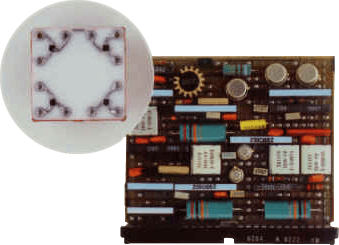
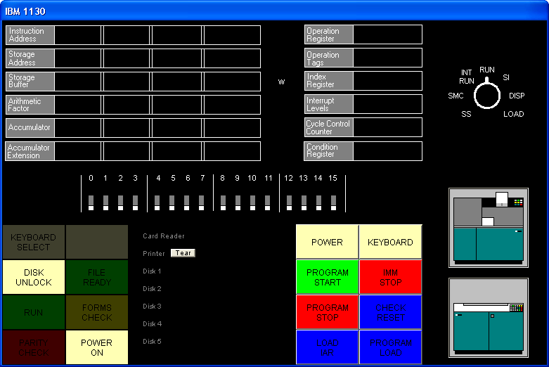

.. -*- coding: utf-8; mode: rst; tab-width: 4; truncate-lines: t; indent-tabs-mode: nil; truncate-lines: t; -*- vim:set et ts=4 ft=rst nowrap:

.. role:: html(raw)
   :format: html

.. role:: latex(raw)
   :format: latex

.. role:: man(raw)
   :format: manpage

.. role:: texi(raw)
   :format: texinfo

.. role:: xml(raw)
   :format: xml

.. |br| replace:: :html:` `\ :latex:`\newline`\ :man:`,\ `\ :texi:`@*`\ :xml:`&#x0A;`

.. |ANSI|   replace:: :html:`<abbr title="American National Standards Institute">ANSI</abbr>`
.. |ASCII|  replace:: :html:`<abbr title="American Standard Code for Information Interchange">ASCII</abbr>`
.. |EBCDIC| replace:: :html:`<abbr title="Extended Binary Coded Decimal Interchange Code">EBCDIC</abbr>`
.. |stdin|  replace:: :html:`<abbr title="Standard Input">stdin</abbr>`
.. |stdout| replace:: :html:`<abbr title="Standard Output">stdout</abbr>`
.. |stderr| replace:: :html:`<abbr title="Standard Error">stderr</abbr>`
.. |dpi|    replace:: :html:`<abbr title="Dots per inch">dpi</abbr>`

.. _simh.trailing-edge.com:              http://simh.trailing-edge.com/
.. _ibm1130.org:                         http://ibm1130.org/
.. _www.ibm1130.org:                     http://www.ibm1130.org/
.. _www.ibm1130.org/ibm1130code.zip:     http://www.ibm1130.org/ibm1130code.zip
.. _quarterbyte.com:                     http://quarterbyte.com/
.. _www.quarterbyte.com:                 http://www.quarterbyte.com/
.. _www.quarterbyte.com/ibm1130code.zip: http://www.quarterbyte.com/ibm1130code.zip

********************************************************************
SIMH IBM 1130 Emulator and Disk Monitor System R2V12 Reference Guide
********************************************************************
:Date: 2012-11-23
:Status: Work in progress
:Copyright: © Copyright 2002-2012
:Author: Brian Knittel
:Contact: www.ibm1130.org

.. footer:: IBM 1130 Emulator Reference
.. sectnum::
   :depth: 2
   :suffix: .
.. contents::
   :backlinks: none
   :depth: 2
   :local:

Introduction to the IBM 1130
============================
The IBM 1130 minicomputer was introduced by IBM in 1965 to serve the needs of scientific and engineering customers too small to afford IBM's newly-introduced Series /360 computers.
The 1130 found wide acceptance in the educational market as well,
as attested to by the number of middle-aged programmers' resumes that a Google search will turn up.

The 1130 came with a macro assembler and FORTRAN and RPG compilers as standard software.
COBOL and APL were available as add-on products.
1130 system configurations could include the following devices:

- IBM 1131 CPU with 4, 8, 16 or 32 K 16-bit words of 3.6μs or 2.2μs core memory,
  512K word removable cartridge hard disk,
  integral Selectric printer and Hollerith keyboard
- IBM 1132 Printer—80 lpm with alphanumeric mix, 110 lpm numeric only
- IBM 1442 Card Read/Punch Model 6, 7—300 or 400 cards/min read, 80 cols/sec punch
- IBM 1442 Card Punch Model 5A or 5B - 80 or 160 cols/sec punch
- IBM 2501 Card Reader Model A1 or A2—600 or 1000 cpm
- Synchronous Communications Adapter—Bisync/STR
- IBM 1231 Optical Mark Page Reader—33 pages/min
- IBM 1055 Paper Tape Punch and IBM 1134 Paper Tape Reader—60 cps read, 14 cps punch
- IBM 1627 Plotter Models 1 or 2—.01″ resolution, 1800 or 1200 steps/min
- IBM 1131 Storage Access Channel—interface for the following options:
- IBM 1133 Multiplex Control Enclosure—second SAC interface & multiplexer for disks
- IBM 1403 Printer Model 6 or 7—340 or 600 lpm
- IBM 2310 or 2311 Disk cartridge or Disk Pack—up to 5,120 KW additional storage
- IBM 2250 Graphical Display unit—21″ CRT, 1024×1024 resolution,
  display-list processor with light pen & keyboard
- Interface to IBM System/7 real-time acquisition system

A typical small system might include the 1131 CPU with 8KW or 16KW memory and the internal hard disk,
an 1442 card read/punch,
and the 1132 printer,
as shown below.

.. list-table::
   :width: 100%
   :align: center

   * - .. figure:: images/ibm1131-cpu-console.png

          1131 CPU and console printer

     - .. figure:: images/ibm1442-card-reader.png

          1442 card read/punch

     - .. figure:: images/ibm1132-printer.png

          1132 printer

It was not a screamingly fast machine,
but it could serve the needs of a small civil engineering firm,
or a community college's FORTRAN programming classes.

The 1130's CPU was built using the Solid Logic Technology (SLT) circuitry developed by IBM for the S/360 series computers.
For these circuits,
IBM developed a method of densely packing individual transistors,
diodes and other circuit components on a small ceramic plate,
rather than relying on the new and unproven monolithic integrated circuit technology that was just emerging at that time.
Individual transistor and diode dice were placed upside down on the ceramic substrate onto tiny solder balls,
and the assembly was heated to melt the solder.
The 1130's CPU is built from an array of small plug-in circuit boards,
each holding typically four or five discrete resistors or capacitors and four to eight half-inch square metal cans containing SLT circuits.
The CPU and was not based on a modern ALU/microcode model but was hardwired to decode and implement each of its instructions.

   SLT Module card (about 2″ × 3″) with four SLT circuit modules (square metal cans).
   Inset shows a close-up of the inside of a typical SLT circuit.

The emulated 1130
=================
The IBM1130 emulator is based on Bob Supnik's SIMH package as part of the `Computer History Simulation Project <http://simh.trailing-edge.com>`_.
The simulator and ancillary programs such as the cross-assembler are written in ANSI-C,
and may be compiled on Unix, Linux, VMS and Win32 platforms.
The program is a command-line, text-based program.
A graphical user interface option is available on Win32.

The emulated system sports the following hardware devices:
- IBM 1131 CPU with internal disk, printer and keyboard
- Four additional disk drives
- IBM 1132 Printer or IBM 1403 Printer
- IBM 1442 Card Read/Punch Model 7, or IBM 2501 Card Reader and 1442 Punch
- IBM 1627 Plotter
- IBM 1055 Paper Tape Punch and IBM 1134 Paper Tape Reader
- IBM 2250 Graphical Display Unit (Windows builds only)
- Synchronious communication adapter (not completed; work in progress).

The default configuration provides 16 KW of memory,
but this is adjustable.
The emulator software package includes the IBM 1130 Disk Monitor System Version 2 Release 12,
which includes the Macro Assembler and FORTRAN compiler.
RPG is not yet available.
The disk image included in the standard download (``dms.dsk``) is built for a 16KW machine with the 1132 printer.

.. note::
   You can find the most current version of the emulator and this documentation at `ibm1130.org`_.
   Sign up for the mailing list if you want to be notified of software updates or upcoming events.

.. note::
   Windows builds of the latest version of the emulator contain a new "drag and drop" interface that isn't well debugged yet,
   but it's getting there.
   There are notes about using this interface later in this manual.

Files included with the emulator
================================
The emulator and software are distributed in two ways:
one for users who have the entire SIMH package,
and another for users who want to download just the IBM1130 emulator.

SIMH users
----------
Download ``ibm1130code.zip``,
which contains the files in the ``ibm1130`` subdirectory in the main SIMH tree.
This ZIP file does not contain any of the SCP or SIM source files.
Download ``ibm1130software.zip`` to get the Windows emulator,
DMS image,
DMS sources,
sample jobs and ancillary programs.

Standalone users
----------------
Download ``ibm1130.zip`` to get the source code for the emulator.
This ZIP includes a several files which are part of the SIMH emulator package.
Download ``ibm1130software.zip`` to get the Windows version of the emulator,
DMS image,
DMS sources,
sample jobs and ancillary programs.
If you want to use the Windows version of the emulator and do not wish to modify the emulator source code,
you only need to download and install ``ibm1130software.zip``.

What's in the ZIP files
-----------------------
Files in ``ibm1130.zip`` (emulator sources):

+----------------------------+------------------------------------------------------+
| ``ibm1130.ico``            | Windows icon                                         |
+----------------------------+------------------------------------------------------+
| ``1130consoleblank.bmp``   | Background image for Windows GUI                     |
+----------------------------+------------------------------------------------------+
| ``1132empty.bmp``          | Drawings of the 1132 printer and 1442 card reader    |
+----------------------------+ in their "full" and "empty" states,                  |
| ``1132full.bmp``           | used by the GUI.                                     |
+----------------------------+                                                      |
| ``1442empty.bmp``          |                                                      |
+----------------------------+                                                      |
| ``1442full.bmp``           |                                                      |
+----------------------------+                                                      |
| ``1442eof.bmp``            |                                                      |
+----------------------------+------------------------------------------------------+
| ``ibm1130_cpu.c``          | CPU emulation                                        |
+----------------------------+------------------------------------------------------+
| ``ibm1130_cr.c``           | Card read punch emulation                            |
+----------------------------+------------------------------------------------------+
| ``ibm1130_disk.c``         | Disk emulation                                       |
+----------------------------+------------------------------------------------------+
| ``ibm1130_fmt.c``          | Card input reformatter                               |
+----------------------------+------------------------------------------------------+
| ``ibm1130_gdu.c``          | 2250 graphical display unit emulation                |
+----------------------------+------------------------------------------------------+
| ``ibm1130_gui.c``          | Emulator console GUI                                 |
+----------------------------+------------------------------------------------------+
| ``ibm1130_plot.c``         | Plotter emulation                                    |
+----------------------------+------------------------------------------------------+
| ``ibm1130_prt.c``          | Printer emulation                                    |
+----------------------------+------------------------------------------------------+
| ``ibm1130_ptrp.c``         | Paper tape read/punch emulation                      |
+----------------------------+------------------------------------------------------+
| ``ibm1130_sca.c``          | Synchronous communcation adapter emulation           |
+----------------------------+------------------------------------------------------+
| ``ibm1130_stddev.c``       | Console printer and toggle switch emulation          |
+----------------------------+------------------------------------------------------+
| ``ibm1130_sys.c``          | Emulator helper routines                             |
+----------------------------+------------------------------------------------------+
| ``ibm1130_t2741.c``        | Remote Selectric terminal emulation                  |
+----------------------------+------------------------------------------------------+
| ``scp.c``                  | SIMH main program [1]_                               |
+----------------------------+------------------------------------------------------+
| ``scp_tty.c``              | SIMH console I/O routines [1]_                       |
+----------------------------+------------------------------------------------------+
| ``sim_sock.c``             | SIMH network I/O routines [1]_                       |
+----------------------------+------------------------------------------------------+
| ``sim_tmxr.c``             | Emulator serial port emulation I/O routines [1]_     |
+----------------------------+------------------------------------------------------+
| ``HAND.CUR``               | Cursor for Windows GUI                               |
+----------------------------+------------------------------------------------------+
| ``dmsr2v12phases.h``       | DMS phase information for debugging purposes         |
+----------------------------+------------------------------------------------------+
| ``dmsr2v12slet.h``         | DMS disk location information for debugging purposes |
+----------------------------+------------------------------------------------------+
| ``ibm1130_conin.h``        | ASCII to console keyboard code (Hollerith) table     |
+----------------------------+------------------------------------------------------+
| ``ibm1130_conout.h``       | Console printer code to ASCII table                  |
+----------------------------+------------------------------------------------------+
| ``ibm1130_defs.h``         | Emulator definitions                                 |
+----------------------------+------------------------------------------------------+
| ``ibm1130_prtwheel.h``     | 1132 and 1403 printer code sequence tables           |
+----------------------------+------------------------------------------------------+
| ``ibm1130res.h``           | Windows GUI resource constants                       |
+----------------------------+------------------------------------------------------+
| ``sim_defs.h``             | SIMH definitions [1]_                                |
+----------------------------+------------------------------------------------------+
| ``sim_rev.h``              | SIMH definitions [1]_                                |
+----------------------------+------------------------------------------------------+
| ``sim_sock.h``             | SIMH definitions [1]_                                |
+----------------------------+------------------------------------------------------+
| ``sim_tmxr.h``             | SIMH definitions [1]_                                |
+----------------------------+------------------------------------------------------+
| ``ibm1130.mak``            | Windows VC2+ makefile for emulator with GUI          |
+----------------------------+------------------------------------------------------+
| ``ibm1130.rc``             | Windows GUI resource definitions                     |
+----------------------------+------------------------------------------------------+
| ``makefile``               | Makefile for emulator for other OSes                 |
+----------------------------+------------------------------------------------------+
| ``readme_update.txt``      | Comments                                             |
+----------------------------+------------------------------------------------------+
| ``readme1130.txt``         | Comments                                             |
+----------------------------+------------------------------------------------------+

.. [1] Not in ``ibm1130code.zip``, which is packaged for SIMH users.

Files in ``ibm1130software.zip`` (DMS and sample files):

=========================  ==========================================================================
``asm``                    Emulator script for assembler job
``for``                    Emulator script for FORTRAN job
``gdu``                    Emulator script for GDU sample program
``job``                    Emulator script for generic job
``list``                   Emulator script for disk listing job
``loaddms``                Emulator script for system load job
``guijob``                 Emulator script to boot DMS; useful with GUI
``dbootcd.asm``            Source code for DMS boot card
``fsysldr2.asm``           Edited version of system loader part 2
``gdu.asm``                Sample program to demonstrate 2250 display
``zcrdumpc.asm``           Copy of ZCRDUMPC with comments
``zdcip.asm``              Copy of disk cartridge initialization program
``mkdms.bat``              Windows batch file to build DMS binary files, needed for ``loaddms`` job
``loaddms.deck``           DMS initial load deck
``ibm1130.rst``            This manual
``dms.dsk``                Preloaded DMS bootable disk
``asm1130.exe``            Cross assembler (Win32 executable)
``bindump.exe``            Assembler binary display utility (Win32 exec)
``checkdisk.exe``          Disk dump utility (Win32 exec)*
``ibm1130.exe``            Emulator (Win32 executable)
``mkboot.exe``             Assembler binary to boot card converter (Win32 exec)
``viewdeck.exe``           Binary deck listing utility (Win32 exec)*
``csort.job``              Sample job deck
``for.job``                Generic Fortran job deck
``gdu.job``                Job deck to run ``GDU.ASM``
``list.job``               Job deck to list disk contents
``pltpn.job``              Installs routine PLTPN for programmatic control of emulated plotter's pen
``roots.job``              Job deck to print table of square roots
``swave.job``              Job deck to plot sine wave on line printer
``readme1130.txt``         Extra copy of readme file
``utils/``                 Sources for emulator utility programs
``utils/asm1130.c``        Cross assembler source
``utils/bindump.c``        Assembler binary display utility [2]_
``utils/checkdisk.c``      Disk check utility source†
``utils/diskview.c``       Disk dump utility source†
``utils/mkboot.c``         Assembler binary to boot card converter
``utils/viewdeck.c``       Binary deck listing utility†
``utils/*.mak``            Microsoft VC2+ makefiles
``dmsr2v12/``              Sources for DMS
``dmsr2v12/(a-d)*.asm``    System loader modules
``dmsr2v12/emonitor.asm``  Extracted part of PMONITOR (used to construct system load deck)
``dmsr2v12/fsysldr2.asm``  System loader part 2
``dmsr2v12/j*.asm``        DUP sources
``dmsr2v12/kforph*.asm``   Fortran compiler phases
``dmsr2v12/n*.asm``        Supervisor and Resident monitor
``dmsr2v12/ocldbldr.asm``  Core load builder
``dmsr2v12/p*.asm``        Resident monitor and device I/O routines
``dmsr2v12/pmondevs.asm``  Extracted part of PMONITOR (used to construct system load deck)
``dmsr2v12/ptmasmbl.asm``  Macro Assembler
``dmsr2v12/r*.asm``        Library routines
``dmsr2v12/s*.asm``        Library routines
``dmsr2v12/t*.asm``        Library routines
``dmsr2v12/u*.asm``        System library routines
``dmsr2v12/v*.asm``        Plotter routines
``dmsr2v12/w*.asm``        SCS (serial I/O) routines
``dmsr2v12/z*.asm``        Standalone utilities and coldstart cards
``onecard/``               Coldstart-mode cards from Oscar Wyss
``onecard/oc*.asm``        Coldstart-mode cards from Oscar Wyss
=========================  ==========================================================================

.. [2] These utilities are not terribly important.
       They were written mainly as debugging aids during development of the emulator and while learning how to build DMS.

Installing the emulator
=======================

Installing on Windows
---------------------
To use the emulator on Windows,
download ``ibm1130software.zip`` from `www.ibm1130.org`_ or `www.quarterbyte.com`_ and unzip it into a working directory,
say, ``\ibm1130``.
This directory will contain the Windows executables and the sample job files.
If you want to work with the emulator source code,
follow the instructions for working with other operating systems as described in the next section.
If you have a Microsoft compiler you can use the ``.mak`` files provided with the source code.
If you use another compiler,
you can use the standard makefiles.

Installing and building for other operating systems
---------------------------------------------------
If you have an operating system besides Windows,
or if you wish to work with the emulator's source code,
you can use one of two methods to build the emulator:
you can build it as part of the SIMH package,
or you can build it as a standalone program.

Building IBM1130 as part of SIMH
""""""""""""""""""""""""""""""""
1. Get the most current SIMH source code package from `simh.trailing-edge.com`_.
2. Expand the ZIP file, retaining the directory structure

3. Get the most recent 1130 subdirectory update from `www.ibm1130.org/ibm1130code.zip`_,
   or if that fails,
   `www.quarterbyte.com/ibm1130code.zip`_
4. Expand the 1130 ZIP file into the ``ibm1130`` directory under ``simh``.
   This will give you the most current version of the 1130 emulator.
5. Use the SIMH makefile to build the emulator.
   You may modify the makefile to specify an output directory for the executables that is in your path,
   or you may move the executables to a directory in your path after building.
6. In the ``ibm1130\utils`` directory,
   use the makefile to build the accessory programs.
   Move the executables to a directory in your path.
7. Download ``ibm1130software.zip`` from `simh.trailing-edge.com`_
   or `www.ibm1130.org`_
   or `www.quarterbyte.com`_.
8. Unzip the software ZIP file into a directory that you want to use for your 1130 projects.
   You can delete all of the Windows ``.exe`` files.

Building IBM1130 as a standalone program
""""""""""""""""""""""""""""""""""""""""
1. Get the most recent 1130 standalone emulator package from `www.ibm1130.org/ibm1130code.zip`_,
   or if that fails,
   `www.quarterbyte.com/ibm1130code.zip`_
2. Expand the ZIP file into a source code working directory, say ``\ibm1130\source``.
3. Use the supplied makefile to build the emulator.
   You may edit the makefile to specify an output directory for the executables that is in your path,
   or you may move the executables to a directory in your path after building.
   If you are using a Microsoft compiler on Windows,
   you may use the supplied ``.mak`` files instead of makefile.
4. In the ``ibm1130\utils`` directory,
   use the makefile or the ``.mak`` files to build the accessory programs.
   Move the executables to a directory in your path.
5. Download ``ibm1130software.zip`` from `simh.trailing-edge.com`_
   or `www.ibm1130.org`_
   or `www.quarterbyte.com`_.
6. Unzip the software ZIP file into a directory that you want to use for your 1130 projects.
   Since you are using your own builds of the programs,
   delete all of the Windows ``.exe`` files that came with this ZIP file.

Using the emulator
==================
Start the emulator by typing the command

.. parsed-literal::

   **ibm1130**

Later on, you may wish to run an emulator script directly from the command line by typing

.. parsed-literal::

   **ibm1130** *script-file* [*arg1* *arg2*...]

While the program is running,
the following control keys simulate certain 1130 keys and buttons:

=========================  ==============
Key                        Corresponds to
=========================  ==============
:html:`<kbd>Ctrl+E</kbd>`  Immediate stop
:html:`<kbd>Ctrl+P</kbd>`  Int req
:html:`<kbd>Ctrl+Q</kbd>`  Program stop
:html:`<kbd>Ctrl+U</kbd>`  Erase fld
=========================  ==============

The following emulator commands perform the same function as certain 1130 control buttons:

=======================================================  =========================================================
Command                                                  Corresponds to
=======================================================  =========================================================
:html:`<samp><b>go</b></samp>`                           Pressing Program Start
:html:`<samp><b>deposit ces</b> <var>xxxx</var></samp>`  Setting the Console Entry Switches to hex value *xxxx*
:html:`<samp><b>deposit iar</b> <var>xxxx</var></samp>`  Pressing Load IAR with console switches set to *xxxx*
:html:`<samp><b>reset</b></samp>`                        Pressing Check Reset
:html:`<samp><b>boot dsk</b></samp>`                     Pressing Check Reset, Program Load, Program Start with
                                                         the DMS R2V12 cold start card in the card reader
:html:`<samp><b>boot cr</b></samp>`                      Pressing Check Reset, Program Load, Program Start to boot
                                                         from the card reader.
                                                         (The virtual card reader must be attached to a binary
                                                         file containing the image of a cold-start card)
=======================================================  =========================================================

Emulator commands
-----------------
This is a list of the emulator's commands.
Some will be described from a functional standpoint later in this manual.
Commands and keywords can be abbreviated;
the minimum abbreviations are show in boldface.
In this table, :html:`<samp><b><var>device</var></b></samp>` refers to the name of a given device class,
such as ``dsk`` for disk drives or ``cr`` for the card reader.
:html:`<samp><b><var>unit</var></b></samp>` refers to a specific unit of the given class,
for example,
``dsk0``, ``dsk1``, ``dsk2``, etc.
Where a unit name is expected,
if the unit number is omitted,
unit 0 is implied.
So, as a unit name,
``dsk`` refers to ``dsk0``.

===========================================================================================  ======================================================
Command                                                                                      Description
===========================================================================================  ======================================================
:html:`<samp><b>at</b>tach [<var>options</var>] <var>unit</var> <var>filename</var></samp>`  Attach file to simulated unit
:html:`<samp><b>ba</b>cktrace [<var>n</var>]</samp>`                                         List last *n* branches/skips/interrupts\ [3]_
:html:`<samp><b>B</b>oot <var>unit</var></samp>`                                             Bootstrap *unit*
:html:`<samp><b>cgi</b></samp>`                                                              Run emulator in CGI mode
:html:`<samp><b>c</b>ont</samp>`                                                             Continue simulation
:html:`<samp><b>del</b>ete <var>filename</var></samp>`                                       Remove named file
:html:`<samp><b>d</b>eposit <var>list</var> <var>val</var></samp>`                           Deposit in memory or registers
:html:`<samp><b>det</b>ach <var>unit</var></samp>`                                           Detach file from simulated unit
:html:`<samp><b>do</b> <var>scriptfile</var> [<var>arg</var>, <var>arg</var> ...]</samp>`    Process command script
:html:`<samp><b>du</b>mp <var>filename</var> [<var>args</var> ...]</samp>`                   Dump binary file
:html:`<samp><b>echo</b> <var>arg</var> ...</samp>`                                          Echo arguments passed to command
:html:`<samp><b>e</b>xamine <var>list</var></samp>`                                          Examine memory or registers
:html:`{<samp><b>exi</b>t</samp> | <samp><b>q</b>uit</samp> | <samp><b>by</b>e</samp>}`      Exit from simulation
:html:`<samp><b>go</b> [<var>address</var>]</samp>`                                          Start simulation, optionally specifying run address
:html:`<samp><b>h</b>elp</samp>`                                                             Type this table of commands
:html:`<samp><b>h</b>elp <var>command</var></samp>`                                          Type help for a specific command
:html:`<samp><b>id</b>eposit <var>list</var></samp>`                                         Interactive deposit in memory or registers
:html:`<samp><b>ie</b>xamine <var>list</var></samp>`                                         Interactive examine memory or registers
:html:`<samp><b>l</b>oad <var>filename</var> [<var>args</var> ...]</samp>`                   Load binary file
:html:`<samp><b>ph</b>debug {<b>off</b> | <var>phlo phhi</var>}</samp>`                      Break emulation on phase load\ [3]_
:html:`<samp><b>r</b>eset [<b>ALL</b> | <var>device</var>]</samp>`                           Reset simulator or individual device class
:html:`<samp>{<b>rest</b>ore | <b>ge</b>t} <var>filename</var></samp>`                       Restore simulator from file
:html:`<samp><b>ru</b>n [<var>address</var>]</samp>`                                         Reset and start simulation
:html:`<samp><b>sa</b>ve <var>filename</var></samp>`                                         Save simulator to file
:html:`<samp><b>set</b> {<var>device</var> | <var>unit</var>} <var>parameter</var></samp>`   Set device/unit parameter
:html:`<samp><b>set</b> <var>device</var> {<b>OCT</b> | <b>DEC</b> | <b>HEX</b>}</samp>`     Set device display radix
:html:`<samp><b>set</b> <b>log</b> <var>filename</var></samp>`                               Enable logging to file
:html:`<samp><b>set</b> <b>nolog</b></samp>`                                                 Disable logging
:html:`<samp><b>set</b> <b>notelnet</b></samp>`                                              Disable Telnet for console
:html:`<samp><b>set</b> <b>telnet</b> <var>port</var></samp>`                                Enable Telnet port for console
:html:`<samp><b>sh</b>ow {<var>device</var> | <var>unit</var>}</samp>`                       Show device parameters
:html:`<samp><b>sh</b>ow <b>c</b>onfiguration</samp>`                                        Show current device configuration
:html:`<samp><b>sh</b>ow <b>d</b>evices</samp>`                                              Show list of all devices
:html:`<samp><b>sh</b>ow <b>l</b>og</samp>`                                                  Show state of simulator logging
:html:`<samp><b>sh</b>ow <b>m</b>odifiers</samp>`                                            Show all available options for all devices
:html:`<samp><b>sh</b>ow <b>q</b>ueue</samp>`                                                Show simulator event queue
:html:`<samp><b>sh</b>ow <b>te</b>lnet</samp>`                                               Show console Telnet status
:html:`<samp><b>sh</b>ow <b>ti</b>me</samp>`                                                 Show simulated time
:html:`<samp><b>sh</b>ow <b>ve</b>rsion</samp>`                                              Show simulator version
:html:`<samp><b>s</b>tep [<var>n</var>]</samp>`                                              Simulate *n* instructions and halt
:html:`<samp><b>v</b>iew <var>filename</var></samp>`                                         View a text file with Windows Notepad
:html:`<samp><b>w</b>here <var>address</var></samp>`                                         Find phase and offset of a system address
===========================================================================================  ======================================================

.. [3] This is used to help debug DMS.
       You can happily ignore it.

``DO`` scripts
--------------
You may put frequently-used sets of commands into a text file and execute it as a script using the ``do`` command:

.. parsed-literal::

   sim> **do** *filename* [*argument1* *argument2* ...]

Any arguments entered after the script filename are available to the script as tokens ``%1``, ``%2``, etc.
These substitution tokens may also appear in deck files
(see `Indirect (deck) files`_).

Drag and drop
-------------
The GUI window that appears in Windows has a new,
relatively untested feature that allows you to use "drag and drop" to run scripts and insert card deck files into the virtual card reader.
Here's how it to use it:

- To load a card deck file into the 1442 card reader,
  drag the file from an Explorer window and release it on the 1442 card reader icon.
  The emulator will automatically determine if this file is a binary card image file or an ASCII file.
  You can only attach one file at time this way.
- To load an indirect "deck file",
  that is,
  a file that lists the names files to be read,
  hold the :html:`<kbd>Shift</kbd>` key down when you release the dragged file on the 1442 card reader icon.
  See `Indirect (deck) files`_ for more information.
- To run a simulator ``do`` script,
  drag the script file and release it anywhere on the simulator window but on the 1442 card reader icon.
- To "tear off" and view printer output,
  click the 1132 printer icon picture.
  The file containing the print output is reset to an empty file after the Notepad window opens.

See `Running DMS Entirely from the GUI`_ on page 27 for instructions on using this GUI.

Emulator commands for peripheral control
========================================

The CPU
-------
The ``reset`` command resets the CPU and all hardware devices.

Modifying registers
"""""""""""""""""""
You can view and modify CPU the following CPU registers:

.. |IAR| replace:: :html:`<abbr title="Instruction Address Register">IAR</abbr>`
.. |ACC| replace:: :html:`<abbr title="Accumulator">ACC</abbr>`
.. |EXT| replace:: :html:`<abbr title="Accumulator Extension">EXT</abbr>`
.. |CES| replace:: :html:`<abbr title="Console Entry Switches">CES</abr>`

=============  ==============================================
Register name  Description
=============  ==============================================
``IAR``        Instruction Address Register (program counter)
``ACC``        Accumulator
``EXT``        Accumulator Extension
``Oflow``      Overflow bit
``Carry``      Carry bit
``CES``        Console Entry Switches
               (Switch :math:`0 = 8000`,
               Switch :math:`1 = 4000`, ...
               Switch :math:`15 = 0001`).
=============  ==============================================

The registers can be viewed and modified with the examine and deposit commands:

======================================================================  ===================================================
:html:`<samp>sim> <b>e</b>xamine <var>register</var></samp>`            Displays the contents of a CPU register.
                                                                        Most registers are also displayed on the GUI.
:html:`<samp>sim> <b>d</b>eposit <var>register</var> <var>value</var>`  Sets the specified register to the specified value.
======================================================================  ===================================================

You can also issue the command :html:`<samp><b>go</b> <var>address</var></samp>` to set the IAR and start the processor at the same time.
If you are using the GUI, you can enter values in the |IAR| and Console Entry Switches through the GUI switches.
To load the |IAR|,
enter a value in the switches and click Load IAR.

By default,
values are displayed and entered in hex, although you can change this with the command :html:`<samp>set cpu oct</samp>` or :html:`<samp>set cpu dec</samp>`.

CPU debugging
"""""""""""""
.. parsed-literal::

   sim> **at**\ tach **cpu** *filename.log*
   sim> **go**
   sim> **det**\ ach **cpu**
   sim> **v**\ iew *filename.log*

Attaching a file to the CPU device creates a log showing CPU register values before each instruction and lists each instruction executed.
This can create quite large output files,
so it must be used carefully.

Configuring memory
""""""""""""""""""
You can adjust the amount of memory in the emulated processor with the :html:`<samp>set cpu</samp>` command.
The default allotment is 16K words.
The options are:

.. parsed-literal::

   sim> **set cpu 4K**
   sim> **set cpu 8K**
   sim> **set cpu 16K**
   sim> **set cpu 32K**

.. note::
   The DMS operating system should be rebuilt before running with a different memory configuration.
   The DMS image ``dms.dsk`` provided in the distribution ZIP file is configured for the default 16K machine.

Enabling and disabling the GUI
""""""""""""""""""""""""""""""
On Windows builds,
you may turn the GUI display on and off with the :html:`<samp>set gui</samp>` command:

.. parsed-literal::

   sim> **set gui on**
   sim> **set gui off**

You can start the emulator with the GUI turned off by running ``ibm1130`` with the ``-g`` command-line option.

Console printer and Telnet support
----------------------------------
By default,
the main SIMH window serves as the 1130's console,
so, your computer's keyboard serves as the console keyboard,
and the SIMH window displays console typewriter output.
There is at present no support for ribbon color in this window.

When the simulator is running,
the following keyboard mappings are recognized:

=========================  ==============
:html:`<kbd>Ctrl+E</kbd>`  IMMEDIATE STOP
:html:`<kbd>Ctrl+P</kbd>`  PROGRAM STOP
:html:`<kbd>Ctrl+Q</kbd>`  INT REQ
:html:`<kbd>Ctrl+U</kbd>`  ERASE FLD
:html:`<kbd>Enter</kbd>`   End of input
=========================  ==============

.. compound::

   If you issue the SIMH command

   .. parsed-literal::

      **set telnet** *portnumber*

   for example

   .. parsed-literal::

      **set telnet 1130**

   then the SIMH console window is *NOT* used for the 1130's console keyboard and printer.
   Instead, the simulator accepts a Telnet session to port 1130 and uses that for console I/O.

(If you want the simulator to be reachable by machines other than the local host,
be sure to open this port in your computer's firewall.
On Windows, this is most easily done by adding program ``ibm1130.exe`` to the Windows Firewall exception list).

With telnet enabled, you can enable |ANSI| color control sequences with

.. parsed-literal::

   **set tto ansi**

so that ribbon color shifts will be simulated.

The commands

.. parsed-literal::

   **set notelnet**
   **set tto noansi**

disables Telnet and restores input and output through the SIMH console window,
and disables ANSI ribbon color control commands.

The default output mapping converts the Selectric rotate/shift codes to standard |ANSI|\ /\ |ASCII| characters.
You can output actual Selectric codes using the command

.. parsed-literal::

   **set tto 1130**

The command

.. parsed-literal::

   **set tto apl**

assumes that the 1130's Selectric has an APL typeball installed,
and maps characters to the output to the APLPLUS font.
(This is useful only in conjunction with a Telnet session).

The output mapping can be customized using the :html:`<samp>FONT</samp>` command,
but this is not documented here at present.

The command

.. parsed-literal::

   **set tto ansi**

restores normal character mapping.

Line printer
------------
The emulated system has one line printer,
which can be specifed to be an 1132 or a 1403 printer.
The default configuration uses the 1132.
If you plan on running intensive print output runs,
it may be worth altering the setup and reloading DMS to use the 1403,
which is much faster in emulation,
just as in real life.

Attaching an output file
""""""""""""""""""""""""
.. parsed-literal::

   sim> **att**\ ach **prt** *filename*

Viewing printer output
""""""""""""""""""""""
.. parsed-literal::

   sim> **det**\ ach **prt**
   sim> **v**\ iew *filename*

The ``view`` command is available only in the Windows version of the emulator.
In other operating systems, you'll have to use a separate console session to view the output file if you do not want to exit the emulator program.

Sending printer output to |stdout|
""""""""""""""""""""""""""""""""""
.. parsed-literal::

   sim> **att**\ ach **prt -**

This can be useful if you want to set up batch processing scripts that process an input deck,
send output to |stdout| and then quit.
This turns the emulator into a filter rather than an interactive program.

Selecting the printer model
"""""""""""""""""""""""""""
.. parsed-literal::

   sim> **set prt 1403**
   sim> **set prt 1132**

Default is 1132.

.. note::
   If you change the printer mode,
   your programs must be modified,
   and you will have to rerun the DMS cartridge load procedure with the appropriate device configuration cards.

   For an 1132 printer,
   Fortran requires an ``*IOCS (1132 PRINTER)`` card,
   and you must write to logical unit 3.
   For a 1403 printer,
   use an ``*IOCS (1403 PRINTER)`` card and write logical unit 5.

Disk drives
-----------
The emulator supports up to five 512K word disk drives.
Each drive is represented by a 1 MB file on the host computer.
Disk images must be initialized before they can be used by DMS.

.. note::
   I have not yet tested the emulator with more than one disk drive.

Attaching a disk image file
"""""""""""""""""""""""""""
.. parsed-literal::

   sim> **att**\ ach **dsk** *filename.dsk*
   sim> **att**\ ach **dsk1** *filename.dsk*
         ...
   sim> **att**\ ach **dsk4** *filename.dsk*

The emulator will create the image file if it does not already exist.

Detaching a disk image file
"""""""""""""""""""""""""""
.. parsed-literal::

   sim> **det**\ ach **dsk**\ *n*

Read-only mode
""""""""""""""
.. parsed-literal::

   sim> **att**\ ach **-r dsk** *filename.dsk*

A disk drive may be attached in read-only mode by specifying the ``-r`` option.
Write operations to the disk will fail.

.. note::
   DMS will not tolerate a read-only boot drive.

Memory cache mode
"""""""""""""""""
.. parsed-literal::

   sim> **att**\ ach **-m dsk** *filename.dsk*

The ``-m`` option directs the emulator to cache the disk image in memory.
The file is read once when the ``attach`` command is issued,
and is written back only when the disk is detached,
or when the emulator terminates.

CGI mode
""""""""
.. parsed-literal::

   sim> **cgi** [\ *maxsec*\ ]
   sim> **att**\ ach **-m -r dsk** *filename.dsk*

When ``-m`` and ``-r`` are used together in CGI mode,
changes to the disk image are not written back out when the disk is detached or when the emulator terminates.
This lets the emulation perform read and write operations without modifying the underlying file.
The emulator opens the file in read-only mode to avoid access permission issues.

The optional argument *maxsec* on the CGI command sets a run time limit so that a runaway emulated program doesn't hang indefinitely.
If the more than *maxsec* seconds elapse,
the emulation is terminated gracefully with an appropriate error message.

DMS tracing
"""""""""""
.. parsed-literal::

   sim> **att**\ ach **-d dsk** *filename*

The ``-d`` option instructs emulator to display a debugging trace printout of all disk reads and writes sector by sector,
showing location,
phase ID and phase name for DMS components.
Output is written to |stdout| (the emulator console window).

Initializing a disk image
"""""""""""""""""""""""""
.. parsed-literal::

   sim> **att**\ ach **dsk**\ *n* *filename.dsk*
   sim> **l**\ oad **zdcip.out**
   sim> **go**

Before an 1130 disk cartridge can be used by DMS,
it must be initialized (formatted).
This can be done by DMS,
if it is running,
or by the standalone program ``zdcip``.
``zdcip`` is provided with emulator package as a load-mode format file.
The program prompts you to make Console Switch settings and press Program Start to indicate desired actions.
You can use the GUI or the following commands to format a disk:

.. parsed-literal::

   sim> **dep**\ osit **ces 0200**       (switch 6)
   sim> **go**
   sim> **dep**\ osit **ces** *n*          (drive number used in attach, e.g. 0)
   sim> **go**
   sim> **dep**\ osit **ces** *nnnn*       (desired cartridge ID # in hex, e.g. 2222)
   sim> **go**
   sim> **go**
   sim> **reset**

The disk image may now be used with DMS.

Card reader
-----------

Attaching a file to the card reader
"""""""""""""""""""""""""""""""""""
.. parsed-literal::

   sim> **att**\ ach **cr** *filename*

Inserts file *filename* into the virtual card reader.
After one or more records have been read,
you must detach the reader and reattach the file if you want to run your job again.
There is no "rewind" command.

Detaching the card reader
"""""""""""""""""""""""""
.. parsed-literal::

   sim> **det**\ ach **cr**

Removes the current file from the card reader.

Binary vs |ASCII| decks
"""""""""""""""""""""""
By default,
the emulator assumes that files attached to the card reader are ASCII.
The contents are converted to 029 keypunch Hollerith code on input.
Unrepresentable characters
(including ASCII Tab)
are replaced with blanks.
Lines shorter than 80 characters are padded with blank to 80 characters.
Lines longer than 80 characters are truncated.

You can select any of four alternate conversion formats:

.. parsed-literal::

   sim> **set cr 029**         Input is ASCII, converted to 029 character set (default)
   sim> **set cr 026F**        Input is ASCII, converted to 026 Fortran character set [4]_
   sim> **set cr 026C**        Input is ASCII, converted to 026 Commercial character set [4]_
   sim> **set cr binary**      Input is binary

.. [4] These probably don't work yet

In binary mode,
the input file must be consist of a sequence of fixed-length 160-byte records,
one for each card.
Each record consists of 80 words stored in "little-endian" order,
that is, least significant byte first.
The correspondence between card rows and the bits in each word are shown below.

.. image:: images/binary-data-format.svg
   :align: center

Indirect (deck) files
"""""""""""""""""""""
.. parsed-literal::

   sim> **att**\ ach **cr** **@**\ *filename*

A series of files may be "stacked" into the card reader through the use of deck files.
A deck file contains a list of filenames that are to be read in sequence.
The following input lines are recognized:

- Blank lines and lines starting with ``*`` are ignored
- Lines starting with an exclamation point (``!``) are read as literal text cards after discarding the exclamation point.
- Other lines are taken to contain filenames.
  The filename may be followed with the letter ``a`` to indicate an ASCII text file
  (using the currently selected ASCII-to-Hollerith conversion table),
  or the letter ``b`` to indicate a binary card image file.

By convention, deck files are named ``xxx.deck``.

A sample deck file might look like this::

    * A boot card, followed by a Fortran program and data
    bootup.crd b
    !// FOR
    program.for a
    !// XEQ
    program.dat a

When you are using a ``do`` script,
indirect files may also make reference to the ``do`` command's arguments using the tokens ``%1``, ``%2``, etc.
This makes it possible to write scripts and construct deck files that can run arbitrary programs.
For instance,
a standard Fortran compile-and-run job might be run with the command

.. parsed-literal::

   sim> **do** **fortran** *myprogram.for*

If you used the following script file named ``fortran``::

    * standard Fortran job - run with command
    * do fortran sourcefile [datafile]

    attach dsk dms.dsk
    delete fortran.lst
    attach prt fortran.lst
    attach cr fortran.deck
    boot dsk
    detach prt
    detach cr
    view job.lst

and the deck file ``fortran.deck``::

    * deck file for script "fortran"
    !// JOB
    !// FOR
    %1
    !// XEQ
    %2

the ``do`` argument ``myprogram.for`` will be substituted in the deck file,
and the source program will thus be inserted between the ``// FOR`` and ``// XEQ`` cards.
If a second argument is specified on the ``do`` command line,
it will be read after the ``// XEQ`` card.
If no second argument is specified,
the substituted line will be blank and no error will result.

Reading |stdin|
"""""""""""""""
.. parsed-literal::

   sim> **att**\ ach **-a cr -**

This can be used to run the emulator as a filter,
reading input decks from |stdin| and writing output to |stdout|.
In this mode a script should be used to configure the emulator,
attach |stdin| and |stdout| to the reader and printer respectively,
run the job,
and quit so that no user input is requested.
In this case, the ``-q`` flag may be passed on the ``ibm1130`` command line to prevent it from printing informational messages.

Attachment to a real card reader
""""""""""""""""""""""""""""""""
The simulator supports attachment to a physical card reader using a custom protocol called ``CARDREAD``.
This has been used to let the simulated 1130 use a Documation card reader through a USB (virtual serial) interface device documented in http://media.ibm1130.org/sim/cardread.zip.
The command

.. parsed-literal::

   sim> **attach cr -p com2**

attaches the card reader to a physical reader using the ``CARD READ`` protocol through serial port ``COM2``.

Card punch
----------

Punching cards
""""""""""""""
.. parsed-literal::

   sim> **att**\ ach **cp** *filename*

The emulated card punch is iffy.
It appears to work but has not been well tested.

1627 plotter
------------
The compiled Windows version of ``ibm1130.exe`` distributed by `ibm1130.org`_ has plotter support built in,
using the ``libgd`` graphics library.
If you download ``ibm1130.exe`` from `simh.trailing-edge.com`_ or other locations,
plotter support will not be included.
If you compile ``ibm1130.exe`` yourself,
see the notes in ``ibm1130_plot.c``.

Starting a plot
"""""""""""""""
The default plot will be 11″ wide and 8″ long,
although you can make longer plots.
You can issue a ``set`` command to alter the length of the plot paper in inches using

.. parsed-literal::

   sim> **set plot length** *value*

The default pen is black and one pixel wide.
You can change the pen using the following commands ::

    set plot black       Changes the pen color
    set plot red
    set plot blue
    set plot green
    set plot yellow
    set plot purple
    set plor ltgrey
    set plot grey
    set plot 1.0         Changes pen thickness
    set plot 2.0
    set plot 3.0
    set plot 4.0

.. compound::

   Then, use the command

   .. parsed-literal::

      sim> **attach plot** *filename.gif*

   to start a plotting session with output to file *filename.gif*.
   This corresponds to putting a piece of paper onto the plot and putting it online.
   You can use the DMS plot routines to create plot output.
   Nothing will be written to the GIF file until the plotter device is detached.
   If you specify the ``-w`` option to the ``attach`` command,
   and the simulation does not actually use the plotter,
   when you detach the plotter,
   the GIF file will be deleted.
   (This option is really only useful in the CGI version of the simulator).

Changing plotter pens
"""""""""""""""""""""
As a plot program runs,
to change pen colors,
the normal procedure is to display a message such as _"Please insert the blue pen and press PROGRAM START"_ on the console printer,
and then execute a ``PAUSE`` statement.
This halts the simulator.
Type the appropriate ``set plot`` command,
then type ``cont`` or ``go`` or click the PROGRAM START button on the GUI.
While the simulator is halted,
you can manually move the plotter pen using the following commands:

.. parsed-literal::

   **set plot xpos** *value*    Sets the pen's horizontal position in plot units
   **set plot ypos** *value*    Sets the pen's vertical position in plot units
   **set plot penup**           Moves the pen on to or off of the paper
   **set plot pendown**

There was no way to set the pen color programmatically on a real 1130,
but ``ibm1130.exe`` has a way to do it using the ``XIO CONTROL`` instruction.
A real 1130 ignores ``XIO CONTROL`` to the plotter device (area code 5).
The ``ibm1130software.zip`` package includes a job file named ``PLTPN.JOB``,
which installs a Fortran callable routine that uses this nonstandard ``XIO`` to control the pen.
Once assembled and loaded onto your DMS disk,
subroutine ``PLTPN`` can be used as follows:

``CALL PLTPN(0,ICLR)``
    Sets color of pen, where ``iclr`` is one of:

    1. black
    2. red
    3. blue
    4. green
    5. yellow
    6. purple
    7. light grey
    8. grey

``CALL PLTPN(1,IWID)``
    Sets width of pen, where ``iwid`` is between 1 and 4.

``CALL PLTPN(2,IX)``
    Sets pen X position to ``IX``.
    Nothing is drawn whether the pen is up or down.
    If you specify an ``IX`` value that is out-of-range
    (less than 0 or greater than the maximum length of the plot),
    future plotter commands will not draw anything until the pen has moved back into range.

``CALL PLTPN(3,IY)``
    Sets pen Y position to ``IY``.
    ``IY`` is clipped to the valid range of 0 to 1099.
    Nothing is drawn whether the pen is up or down.

Exceeding the plot size
"""""""""""""""""""""""
If you attempt to plot outside the X range of 0 to :math:`(specified\ length-1)`,
the virtual pen *will* continue to move out of range.
No drawing will occur until the pen has been moved back into the valid range.
This correspnods to the plotter drum rotating past the end of the attached paper strip.
If the pen is at its maximum X position,
the sequence ``+X +X +X -X -X -X`` will leave the pen where it started,
at the edge of the paper.

If you attempt to plot outside the Y range of 0 to 1099,
the pen will stop at the limit and further movements will not change the pen position.
This corresponds to the physical pen hitting the ends of its range of motion.
If the pen is at its maximum Y position,
the sequence ``+Y +Y +Y  -Y -Y -Y`` will move the pen back three steps.

Ending a plot
"""""""""""""
When your plotting job is finished, use the SIMH command

.. parsed-literal::

   sim> **detach plot**

or issue an ``attach`` command to a different filename to finalize the plot.
This corresponds to taking the paper off of the plotter.
The file will have a resolution of 1100 for the Y dimension and by default 800 in the X direction.
The resolution is 100 |dpi|.

Viewing a plot
""""""""""""""
On Windows, the command

.. parsed-literal::

   sim> **!** *filename.gif*

should open the plot file in the default ``.GIF`` file-viewing application
(which may well be Internet Explorer).
The plot appear rotated 90 degrees
(that is, the plot's 11″ width is vertical on your screen,
and the length is horizontal).

Paper tape reader/punch
-----------------------
A paper tape reader and punch are supported.
To attach a file to the reader, use the command

.. parsed-literal::

   sim> **attch ptr** *filename*

To attach a file to the punch, use the command

.. parsed-literal::

   sim> **attch ptp** *filename*

2250 graphics display
---------------------
The compiled Windows version of ``ibm1130.exe`` distributed by `ibm1130.org`_ includes rudimentary support for the 2250 Graphical Display Subsystem.
If you download ``ibm1130.exe`` from `simh.trailing-edge.com`_ or other locations,
2250 support will not be included.
2250 support is not available on other operating systems at this time.

Any 1130 program that writes to the 2250 will cause a new window to open.
You may use the mouse as a light pen.

(At present,
we do not have the DMS graphics support library,
so this device is not well tested).

Synchronous communications adapter
----------------------------------
.. |SCA| replace:: :html:`<abbr title="Synchronous Communications Adapter">SCA</abbr>`

Rudimentrary support for the |SCA| is built into Windows builds of ``ibm1130.exe``,
but it is not completely implemented at this time.
It would be nice to eventually run the 1130 ``HASP RJE`` program to lsend jobs to a simulated IBM/360 or /370 running MVS under Hercules.

2741 terminal support
---------------------
There is rudimentary support for the 2741 RFQ,
a serial device talking to a remote Selectric terminal.
This can be used by APL\\1130 and the intention is to let SIMH talk through a real or USB simulated serial port to a real I/O Selectric.

The emulator display
====================
Windows builds of the IBM 1130 emulator include a graphical display that indicates the state of the processor and permits manual control of the processor and Console Entry Switches.
The display is shown in Figure 7.1.

   Figure 7.1 - Emulator GUI Display

The GUI display combines several parts of the IBM 1130 console in a non-standard arrangement.
The upper part of the display reflects fairly accurately the 1130's console display lamps and the processor mode switch,
which are located on the 1130's console pedestal.
Under the lamps are the console entry switches that on the real 1130 are found on the front of the console typewriter.
At the bottom left and right of the display are the lamps and pushbuttons found to the left and right of the console keyboard.
Between the lamps and buttons is a status display that shows the files attached to each simulated device.
To the right of the buttons are images that show when the simulated card reader has cards in its hopper,
and when print output has been generated.
The "tear" button displays the contents of the printer output file and empties the file.

The indicators and switches are described in the following tables.

=====================  =========================================================
Indicators             Description
=====================  =========================================================
Instruction Address    The current instruction address register value (IAR)
Storage Address        The last memory location read or written
Storage Buffer         The last value read from or written to memory
Arithmetic Factor      (not displayed)
Accumulator            The CPU accumulator register
Accumulator Extension  The CPU accumulator extension;
                       low 16 bits for mul/div and some rotate operation.
Operation Register     Last-executed instruction
                       (high 5 bits of instruction word)
Operation Tags         (not displayed)
W                      If illuminated, the processor is in a wait state
Index Register         Index register selected by last executed instruction
Interrupt Levels       Interrupt levels pending or active
Cycle Control Counter  Temporary register used during shift operations
Condition Register     | C = Carry bit
                       | V = Overflow bit. V remains set until tested
Keyboard Select        When illuminated, CPU will accept input from the keyboard
Disk Unlock            When illuminated, the disk drive is inactive (detached)
File Ready             When illuminated, the disk drive is ready (attached)
Run                    When illuminated, the CPU is running
Forms Check            | Yellow = out of paper (detached)
                       | Red = 1132 Scan check (software error)
Parity Check           (not used)
Power On               When illuminated, CPU is powered up
=====================  =========================================================

================  ================================================
Switches/Buttons  Description
================  ================================================
0 through 15      Console Entry Switches; click to toggle setting.
Power             Toggles CPU power
Keyboard          (not used)
Program Start     Starts CPU in Run, Int Run or SI modes.
                  Advances |IAR| in Disp or Load modes.
Imm Stop          Halts processor
Program Stop      Causes interrupt level 5, which usually ends current program.
Check Reset       Resets CPU and all devices.
Load IAR          Loads |CES| value into |IAR|.
Program Load      Reads a cold start card from the 1442 reader into core.
Mode              Sets CPU mode; click position to change setting.
================  ================================================

=============  =========================================
Mode settings  Description
=============  =========================================
Int Run        Generates interrupt level 5 after each instruction is executed
               (except when processing interrupts)
Run            Normal operation mode
SI             CPU executes one instruction for each Program Start press.
Disp           Displays memory contents of |IAR| address and advances |IAR|
Load           Stores |CES| value into memory address in |IAR| and advances |IAR|
SS, SMC        (not implemented)
=============  =========================================

The Interrupt Level indicators can tell you what hardware devices are active.
The interrupt levels and the associated hardware activity are indicated in the following table.

===============  ============================================================================================
Interrupt level  Hardware activity
===============  ============================================================================================
0                1442 Reader and Punch per-column interrupt
1                1132 Printer and Serial interface per-character interrupt
2                Disk operation complete
3                Plotter, 2250 Graphical Display interrupt
4                Card read, card punch, console printer, console typewriter and paper tape operation complete
5                Int Run, Program Stop
===============  ============================================================================================

IBM 1130 Disk Monitor System (DMS) release 2 version 12
=======================================================
``ibm1130software.zip`` includes a runnable version of Disk Monitor System Release 2 V12 (``DMSR2V12``, or DMS),
as well as the operating system's source code.
The package includes:

.. |DUP| replace:: :html:`<abbr title="Disk Utility Program">DUP</abbr>`

- DMS Executive
- Disk Utility Program (|DUP|)
- Fortran Compiler
- Macro Assembler
- Standalone programs including the formatting program ``ZDCIP``
- Boot program ``ZCLDSTRT``

Unfortunately,
we do not have the RPG compiler at the present time.
At a future date we hope to have RPG and APL available.
(If anyone can help us find these in machine-readable,
binary or source-code form,
we'd be very grateful.
We'd also like to find the graphics and math libraries,
COBOL,
the original Forth,
alternate Fortran compilers,
and the IBM experimental multiprocessing executive.
If you have these sitting in a box in your attic,
please let us know!)

.. note::
   It's interesting to note that DMS cannot be maintained and rebuilt under DMS.
   The DMS source code uses assembler directives not supported by the its own assembler,
   and, more surprisingly, the Macro Assembler does not correctly assemble the floating-point constants needed by the trig functions.
   IBM built DMS on the System/360 and possibly at a later date the /370.
   We built it with our cross assembler asm1103,
   which is provided with the emulator package.
   The ``loaddms`` script and ``mkdms`` batch file show how this is done.

Booting the emulated IBM 1130
-----------------------------
The normal procedure for booting an 1130 is to prepare the disk,
place a binary cold-start card in the card reader,
and then press the Check Reset,
Program Load,
and Program Start buttons in that order.
On the emulator you can do this by typing, for example,

.. parsed-literal::

   sim> **attach dsk dms.dsk**
   sim> **att cr coldsrt.crd**
   sim> **set cr binary**
   sim> **att prt -**

and then clicking the three buttons.
(Without the GUI, you'd type ``reset``, ``boot cr``, ``go``).
The processor will boot up DMS,
simulate the receipt of a ``// JOB`` card,
print the cartridge ID and memory size,
then halt waiting for more input.
To process a job,
you'd then need to attach the card reader to your input file and restart the processor with the Program Start button.

The DMS cold start card reads the console entry switches to determine which disk drive to use as the boot drive.
In most cases,
this will be ``DSK0``,
so the console entry switches must be set all off before booting DMS.

**However**,
to make life simpler,
the emulator has a built-in shortcut:
If the card reader is not attached to a file,
pressing Program Load will load the standard DMS cold start program which is stored in the emulator.

**Better still**,
type ``boot dsk``,
which performs the ``reset``/``load``/``go`` operation using a built-in copy of the ``DMSR2V12`` cold start card.
This eliminates the need to precede your text card input with the binary cold start card.

Furthermore: ``boot -a dsk`` loads the standard APL\\1130 cold start card,
and ``boot -a -p dsk`` boots the APL\\1130 privileged mode cold start card.

Running DMS entirely from the GUI
---------------------------------
If you are using a Windows build of the simulator that has the GUI built in,
you can run jobs on the simulated 1130 without using the simulator's command-line environment.
To do this,

1. Start the simulator with the command ``ibm1130 guijob``.
   DMS boots and waits.
2. Create a job deck file (a text file starting with |// JOB|_ and ending with |// XEQ|_ and data cards, for example),
   and locate it in a Windows Explorer window.

   .. image:: images/card-reader-icon.png
      :align: right

3. Drag the file and release it on the card reader icon (shown at right).
   Notice that the card reader icon changes to its "full" state,
   as shown to the right:
4. Click the "Program Start" button.
   Wait until the lights stop flashing and the accumulator displays 1000 hex.
   The cards on the card reader icon will move to the stacker.
5. Click the printer icon to "tear off" and view the printer output.
6. Click the card reader icon once to reload the deck in the hopper,
   or click it twice to remove the deck from the reader so you can edit it.

You can repeat this process over and over as desired.

If you need to reboot the system:

- Click the card reader icon twice to remove any cards in it.
- Click Immediate Stop, Check Reset, Program Load [#]_ and Program Start in that order. 
- Continue with step 3 above.

.. [#] When Program Load is pressed with no card file attached,
       the simulator pretends that a DMS Cold Start card was present in the card reader.
       The other steps are exactly those you'd follow on a real 1130.

Cold start program wait codes
-----------------------------
Error conditions during the cold start process may cause the processor to wait with one of the following values in the Instruction Address Register

========  ===========================================================================================
|IAR|     Description
========  ===========================================================================================
``001F``  Invalid disk drive number in console entry switches, or drive not ready
``0046``  Power is unsafe in disk drive or disk read error, or waiting for seek operation to complete
``0048``  Waiting for read operation to complete
========  ===========================================================================================

If the processor halts with any of these error codes, perform another cold start.

DMS disk basics
---------------
A DMS Disk is organized in roughly the following way:

| Resident Monitor
|
| System Area (System Program phases)
|
| Optional Fixed Area (Saved user data)
|
| User Area (Saved User Programs, routines and data)
|
| Working Storage

System programs such as Fortran and |DUP| are broken into many small overlays or phases,
so that the system can run on machines with as little as 4KW of memory.
The location of each system program phase is stored in table called the SLET, System Logical Equivalence Table.
This directory has no name entries,
but simply associates hard-coded phase or overlay numbers to their location and size in the System Area.
You'll never encounter the SLET as a day-to-day user.

After the System Area is an optional Fixed Area,
which can hold user data files.
These files are guaranteed never to change locations on the disk.

The User Area is the a familiar file and directory structure.
The User Area holds system library routines and utility programs,
as well as any data,
subroutines or programs you have saved.
Filenames have one to five letters.
The User Area directory is called the Logical Equivalence Table, or LET.

Working Storage is all of the space between the last stored file in the User Area and the end of the disk.

Saving a file in DMS involves writing data to Working Storage,
and then instructing the Disk Utility Program (|DUP|) to store and name the data.
The User Area region is expanded to include the data in Working Storage,
and Working Storage is now the rest of the disk.
Graphically it looks like this:

Original configuration:
    =======  ===============  =========  ===============
    Monitor  System programs  User area  Working storage
    =======  ===============  =========  ===============

After data is saved in Working Storage (e.g. object code saved by Fortran compiler)
    =======  ===============  =========  ==================================
    Monitor  System programs  User area  :html:`<ins>Working storage</ins>`
    =======  ===============  =========  ==================================

After WS is saved by the Disk Utility Program:
    =======  ===============  =========  ====================  ===============
    Monitor  System programs  User area  *(Newly saved file)*  Working storage
    =======  ===============  =========  ====================  ===============

There is a special "temporary job" mode provided by DMS in which the demarcation point between the User Area and Working Storage is automatically slid back to the original location at the end of the job,
thus erasing any files stored by the job.
This is handy when you are developing a program with subroutines.
(More about subroutines later on).

When a saved file is deleted,
all files after the deleted file are slid down sector by sector to close up the gap,
so the space occupied by the file is returned to Working Storage.
This can be quite time consuming on a real 1130.
(It's also problematic for programs that depend on disk data staying put at a particular location on disk,
hence the optional Fixed Area).

DMS job decks
-------------
An IBM 1130 DMS job deck consists of Monitor Control Records,
utility control records and user data.
Monitor control records begin with the characters slash,
slash,
space,
and their appearance is never ignored by DMS;
if one is encountered while reading data cards your program will be aborted.

A basic job deck
""""""""""""""""
A typical Fortran job deck might look like this:

.. code:: fortran

   // JOB
   // FOR
   *IOCS (1132 PRINTER)
   *LIST SOURCE PROGRAM
         DO 20 I = 1, 20
            WRITE(3,10) I
     10     FORMAT(1X,'ITERATION NUMBER', I5)
     20  CONTINUE
         END
   // XEQ

This job deck uses three Monitor Control records:

1. ``// JOB`` cancels any executing job and resets DMS for the upcoming job.
   A cold start issues an implicit ``// JOB``, by the way.
2. ``// FOR`` runs the Fortran compiler.
   Initial cards starting with ``*`` are Fortran Control Records and define the compilation environment.
   Fortran reads cards up to an ``END`` statement,
   and writes the compiled machine code to Working Storage.
3. ``// XEQ`` executes the program in Working Storage

A slightly more complex job deck is required if your program requires subroutines or functions.
Only one program or subprogram can be compiled at a time.
You must compile each subroutine and save it from Working Storage as a named file before proceeding to the next.
To complicate things,
you have to delete any previous version of the subroutine from the disk before saving a new version.
So, a Fortran deck might look like this:

.. code:: fortran

   // JOB
   // FOR
   *LIST SOURCE PROGRAM
         FUNCTION TRIPL (VALUE)
         TRIPL = VALUE*3.
         RETURN
         END
   // DUP
   *DELETE             TRIPL
   *STORE      WS  UA  TRIPL
   // FOR
   *LIST SOURCE PROGRAM
   *IOCS (1132 PRINTER)
       DO 20 I = 1, 10
          V = I+3.
          T = TRIPL(V)
          WRITE(3,10) I, T
     10   FORMAT(1X,'I = ', I3,'  T =', F6.2)
     20 CONTINUE
        END
   // XEQ

In this job,
the result of the first compilation is saved as a file named ``TRIPL``,
after deleting any previous version.
The second compilation is executed,
at which time the Core Load Builder locates and links in the external function.

When a series of subroutines have been debugged,
the compiled version can be left on disk and they do not need to be recompiled in subsequent runs.
In fact, the main program can also be saved and run repeatedly without recompilation:

.. code:: fortran

   // FOR
   ...
         END
   // DUP
   *STORE      WS  UA  MAINP

then,

.. code:: fortran

   // XEQ MAINP

will load and run the stored main program.

The following sections provide a reference for the DMS monitor control records and the control records for Fortran,
|DUP| and the Assembler.

This section will grow eventually,
but for now,
here is a quick overview of the basics of constructing a job deck.

Error wait codes
----------------
A preoperative error is an error condition detected before an I/O operation is attempted.
The following preoperative errors cause the monitor system to wait in ``$PRET`` at address ``/002A``:

- device not ready
- error check in device
- illegal parameter or illegal specification in an I/O area

Postoperative errors may result in waits in an interrupt service routines,
in ``$PST1`` at ``/0083``,
in ``$PST2`` at ``/0087``,
in ``$PST3`` at ``/008B`` or in ``$PST4`` at ``/008F``.
The accumulator indicates the device and condition.
In may cases you can correct the condition and press PROGRAM START (``go``) to retry the operation.

========  ==============================================================================================================================
|ACC|     Description
========  ==============================================================================================================================
``0000``  Last card
``0001``  Card Feed check, read check or punch check; disk read error or write error
``0003``  Disk seek failure, printer detected channel 9
``0004``  Paper tape punch not ready or disk overflow; printer detected channel 12
``0005``  Paper tape reader not ready
``1000``  1442 card read/punch or 1442 punch: not ready or hopper empty.
          [emulator: attach a file to CR or CP and go]
``1001``  Illegal device, function or word count
``100F``  Occurs in a |DUP| operation after |DUP| error ``D112``
``2000``  Keyboard/Console Printer not ready
``2001``  Illegal device, function or word count
``3000``  1134/1055 Paper Tape not ready
``3001``  Illegal device, function or word count, or invalid check digit
``4000``  2501 Card Reader not ready
``4001``  Illegal device, function or word count
``5000``  Disk not ready
``5001``  Illegal device, function or word count, or attempt to write in protected area
``5002``  Write select or power unsafe
``5003``  Read/write/seek failure after 16 attempts or disk overflow.
          Extension may display logical drive number in bits ``0``\ ..\ ``3`` and working storage address in bits ``4``\ ..\ ``15``.
          Program Start retries 16 more times.
``5004``  Same as above from routine ``DISK1`` and ``DISKN``, or,
          an uninitialized cartridge is online during a cold start.
``6000``  1132 Printer not ready or out of paper
``6001``  Illegal device, function or word count
``7000``  1627 Plotter not ready
``7001``  Illegal device, function or word count
``8001``  SCA Illegal function or word count
``8002``  :STR mode: Receive or transmit operation not completed
          :BSC mode: Invalid start characters in the I/O area for a transmit operation
``8003``  :STR mode: Failed to synchronize before attempt to read or write, or, attempted to receive before receiving ``INQ`` sequence
          :BSC mode: Invalid number of identification characters for an identification specification operation
``9000``  1403 printer no ready or out of paper
``9001``  Illegal device, function or word count
``9002``  Parity check, scan check or ring check
``A000``  1231 Optical Mark Reader not ready
``A001``  Illegal device, function or word count
``A002``  Feed check, last document was processed.
          Clear jam, do not refeed
``A003``  Feed check, last document not  processed.
          Clear jam and refeed
========  ==============================================================================================================================

Monitor control records
=======================
This section lists the available Monitor Control Records.
Column numbers are shown below fields that have a fixed location.

.. _// JOB T:
..    _JOB T:
.. |// JOB T| replace:: ``// JOB T``
..    |JOB T| replace::    ``JOB T``
.. parsed-literal::
   :class: control-record column-numbers
   :name:  // JOB

   **// JOB T**  *crt0* *crt1* *crt2* *crt3* *crt4* *crtc* *crtw* *crtu* *hhhhhhhh* *ee*
   │  │   │  │    │    │    │    │    │    │    │    │        │
   1  4   8  11   16   21   26   31   36   41   46   51       60
.. |// JOB|   replace:: ``// JOB``

Begin a new job.
The optional parameters are:

=======================================  ============================================================================
:html:`<code><b>T</b></code>`            Specifies temporary job mode.
                                         If used, no permanent changes are made to system files or the disk directory.
:html:`<code><var>crt0</var></code>`     Master cartridge ID (logical cartridge 0)
:html:`<code><var>crt1</var></code>`     Cartridge ID for logical drive 1
:html:`<code><var>crt2</var></code>`     Cartridge ID for logical drive 2
:html:`<code><var>crt3</var></code>`     Cartridge ID for logical drive 3
:html:`<code><var>crt4</var></code>`     Cartridge ID for logical drive 4
:html:`<code><var>crtc</var></code>`     Cartridge ID for core image buffer
:html:`<code><var>crtw</var></code>`     Cartridge ID for working storage
:html:`<code><var>crtu</var></code>`     Cartridge ID for unformatted disk I/O
:html:`<code><var>hhhhhhh</var></code>`  Heading (date, time etc) to print on each page
:html:`<code><var>ee</var></code>`       Number of ``EQUAT`` records following this ``JOB`` card
=======================================  ============================================================================

The ``T`` option indicates that no permanent changes are to be made to the system directory.
This option is often used during the program development cycle to so that any subroutines compiled and stored during the job are removed from the disk at the end of the job.
See `Temporary Mode Restrictions`_ for more detail.

.. note::
   This option is not necessary when using the `www.ibm1130.org`_ online (CGI) emulator,
   as the disk image is discarded at the end of each run.

The optional cartridge IDs indicate to DMS which of the mounted cartridges are to be used as logical drives 0 through 4,
and which cartridges are to be used for temporary and I/O storage.
These options are unnecessary if only one disk is mounted,
or if the master cartridge should be used for all operations.

``EQUAT`` records indicate substitutions for subprogram names.
See the description of the ``*EQUAT`` monitor control record later in this manual.

.. note::
   Immediately after a cold start,
   DMS simulates a ``//JOB`` record.
   While another ``//JOB`` record can't hurt,
   it's not necessary to use one with the `www.ibm1130.org`_ online emulator as each job begins with a cold start.

.. parsed-literal::
   :class: control-record
   :name:  // FOR

   **// FOR**
.. |// FOR| replace:: ``// FOR``

Run the Fortran compiler.
Fortran Control Records and Fortran source cards follow this record.
The Fortran compiler reads source records up to the ``END`` statement.
An |// XEQ|_ or |// DUP|_ monitor control record should follow the ``END`` statement.

.. parsed-literal::
   :class: control-record
   :name:  // ASM

   **// ASM**
.. |// ASM| replace:: ``// ASM``

Run the Macro Assembler.
Assembler Control Records and Assembler source cards follow this.
The assembler reads source records up to the ``END`` statement.
An |// XEQ|_ or |// DUP|_ monitor control record should follow the ``END`` statement.

.. parsed-literal::
   :class: control-record
   :name:  // RPG

   **// RPG**
.. |// RPG| replace:: ``// RPG``

Run the RPG compiler (not currently available).

.. parsed-literal::
   :class: control-record
   :name:  // COBOL

   **// COBOL**
.. |// COBOL| replace:: ``// COBOL``

Run the COBOL compiler (not currently available).

.. parsed-literal::
   :class: control-record
   :name:  // DUP

   **// DUP**
.. |// DUP| replace:: ``// DUP``

Run the Disk Utility Program.
|DUP| Control records follow this record.
See `Disk Utility Program (DUP)`_ for more information.

.. parsed-literal::
   :class: control-record
   :name:  // *

   **// *** *REMARKS*...
.. |// *| replace:: ``// *``

Print ``remarks`` on the primary printer.

.. parsed-literal::
   :class: control-record column-numbers
   :name:  // XEQ

   **// XEQ** *pname* **L** *nn* *D* *cart* **X** **X**
   │  │   │     │ │  │ │    │ │
   1  4   8    14 │ 19 21  26 28
                 16
.. |// XEQ| replace:: ``// XEQ``

Execute a program from Working storage or the User area.
The optional parameters are:

=====================================  ============================================================================================================
:html:`<code><var>pname</var></code>`  Name of program to execute. If omitted, the program in working storage is run.
:html:`<code><var>L</var></code>`      If ``L`` is punched in column 14, a core load map is printed
:html:`<code><var>nn</var></code>`     Number (right-justified) of supervisor control records that follow
:html:`<code><var>D</var></code>`      Disk routine to use:
                                       if blank or ``Z``, ``DISKZ`` is used.
                                       If 0 or 1, ``DISK1`` is used.
                                       If ``N``, ``DISKN`` is used.
:html:`<code><var>cart</var></code>`   If specified, the cartridge on which the program is to be found
:html:`<code><var>X</var></code>`      If there is a punch in column 26, ``LOCALS`` may call other ``LOCALS``
:html:`<code><var>X</var></code>`      If there is a punch in column 28, the special ``ILS``\ s are used,
                                       the routines with ``X`` in their names: ``ILSX4``, etc.
=====================================  ============================================================================================================

.. parsed-literal::
   :class: control-record
   :name:  // PAUS

   **// PAUS**
.. |// PAUS| replace:: ``// PAUS``

Halt the processor until the user presses PROGRAM START [emulator: ``go``].
This permits one to change cartridges, add cards, etc.

.. parsed-literal::
   :class: control-record
   :name:  // TYP

   **// TYP**
.. |// TYP| replace:: ``// TYP``

Make the console keyboard the principal input device.

.. parsed-literal::
   :class: control-record
   :name:  // TEND

   **// TEND**
.. |// TEND| replace:: ``// TEND``

End console keyboard input, and make the card reader the principal input device.

.. parsed-literal::
   :class: control-record
   :name:  // EJECT

   **// EJECT**
.. |// EJECT| replace:: ``// EJECT``

Issue a form feed to the principal output device.

.. parsed-literal::
   :class: control-record
   :name:  // CPRINT

   **// CPRINT**
.. |// CPRINT| replace:: ``// CPRINT``

Make the console printer the principal output device.

.. parsed-literal::
   :class: control-record
   :name:  // CEND

   **// CEND**
.. |// CEND| replace:: ``// CEND``

End console printer output, and restore the primary printer as principal output device.

Supervisor control records
--------------------------
.. attention::
   This section is not yet written.

.. parsed-literal::
   :class: control-record
   :name:  *LOCAL

   ***LOCAL**\ *main1*\ **,**\ *sub1*\ **,**\ *sub2*\ ,...,sub\ *n*
.. |*LOCAL| replace:: ``*LOCAL``

X

.. parsed-literal::
   :class: control-record
   :name:  *NOCAL

   ***NOCAL**\ *main1*\ **,**\ *sub1*\ **,**\ *sub2*\ ,...,sub\ *n*
.. |*NOCAL| replace:: ``*NOCAL``

X

.. parsed-literal::
   :class: control-record
   :name:  *FILES

   ***FILES(**\ file1,name1)\ **,**\ ...\ **,(**\ filen,namen\ **)**\ [**,**]
   ***FILES(**\ file1,name1,car1)\ **,**\ ...\ **,(**\ filen,namen,carn\ **)**\ [\ **,**\ ]
   ***FILES(**\ file1,,car1)\ **,**\ ...\ **,(**\ filen,,carn\ **)**\ [**,**\ ]
.. |*FILES| replace:: ``*FILES``

X

.. parsed-literal::
   :class: control-record
   :name:  *G2250

   ***G2250**\ pname U N N N N
.. |*G2250| replace:: ``*G2250``

X

.. parsed-literal::
   :class: control-record
   :name:  *EQUAT

   ***EQUAT(**\ *sub1*\ **,**\ *sub2*\ **),**\ ...\ **,(**\ *subn*\ **,**\ *subm*\ **)**
.. |*EQUAT| replace:: ``*EQUAT``

X

Disk utility program (|DUP|)
============================
|DUP| performs file transfer and file directory maintenance operations.
Many |DUP| operations involve the transfer of files to and from Working Storage,
the User Area on a disk,
the Fixed Area on a disk,
cards or paper tape.
The corresponding |DUP| control records use a two-character code to indicate the origin and destination of the file involved in such a transfer.
The following codes are used:

======  ===========================
Code    Location
======  ===========================
``UA``  User area
``FX``  Fixed area
``WS``  Working storage
``CD``  Card device
``PT``  Paper tape
``PR``  Principal print device
======  ===========================

|DUP| stores programs and data on disk,
cards,
paper tape,
and paper listings in any of several formats,
whose abbreviations are listed below.
The various dump and store operations listed below will indicate any format conversions that will apply.

=======  ================================================
Format   Description
=======  ================================================
``CDC``  Card core image format
``CDD``  Card data format
``CDS``  Card system format (absolute/relocatable object)
``DCI``  Disk core image format
``DDF``  Disk data format
``DSF``  Disk system format (absolute/relocatable object)
``PRD``  Printer data dump format
``PTC``  Paper tape core image format
``PTD``  Paper tape data format
``PTS``  Paper tape system format (absolute/relocatable object)
=======  ================================================

Filenames on disk may consist of up to five characters.
The first character must be ``A-Z``, ``$``, ``#`` or ``@``,
and the name may not include blanks.

Numeric values,
when required,
are right-justified.

On records that may include a cartridge ID,
if the cartridge is omitted,
for "source" names the monitor searches all mounted cartridges for a file with the specified name.
For "destination" names,
the monitor uses the master cartridge.

.. note::
   If the card reader becomes non-ready while |DUP| is reading control records,
   e.g. if the tail end of a job deck contains |// DUP|_ and some control records with no further monitor control records,
   DMS does not resume properly when more cards are inserted in the reader and ``PROGRAM START`` is pressed.
   We are not sure whether this is a simulator bug or a problem with DMSR2V12.
   At the present time,
   we recommend that if your job deck ends with |DUP| commands,
   that you put a |// *|_ comment monitor control at the end of the deck to terminate |DUP| and return to the monitor before the end of the deck.

DUP control records
-------------------
.. parsed-literal::
   :class: control-record column-numbers
   :name:  *DUMP

   ***DUMP**       *fm*  *to*  *fname*     *fmid*  *toid*
   │           │   │   │         │     │
   1           13  17  21        31    37
.. |*DUMP| replace:: ``*DUMP``

Dump data from location ``fm`` to location ``to``.
The program to be dumped is ``fname``,
which may omitted when dumping from WS to PR.
The optional ``fmid`` and ``toid`` parameters specify the source and destination cartridges,
if applicable.

The following format conversions will take place:

+--------------------------+-----------+-------------+------------------------+
| FM location              | FM format | TO location | Resulting TO format    |
+==========================+===========+=============+========================+
| ``UA``                   | ``DSF``   | ``WS``      | ``DSF``                |
+--------------------------+-----------+-------------+------------------------+
| ``UA`` or ``WS``         | ``DSF``   | ``CD``      | ``CDS``                |
+--------------------------+-----------+-------------+------------------------+
|                          |           | ``PT``      | ``PTS``                |
+--------------------------+-----------+-------------+------------------------+
|                          |           | ``PR``      | ``PRD``                |
+--------------------------+-----------+-------------+------------------------+
| ``UA`` or ``FX``         | ``DDF``   | ``WS``      | ``DDF``                |
+--------------------------+-----------+-------------+------------------------+
| ``UA``, ``FX`` or ``WS`` | ``DDF``   | ``CD``      | ``CDD``                |
+--------------------------+-----------+-------------+------------------------+
|                          |           | ``PT``      | ``PTD``                |
+--------------------------+-----------+-------------+------------------------+
|                          |           | ``PR``      | ``PRD``                |
+--------------------------+-----------+-------------+------------------------+
| ``UA`` or ``FX``         | ``DCI``   | ``WS``      | ``DCI``                |
+--------------------------+-----------+-------------+------------------------+
| ``UA``, ``FX`` or ``WS`` | ``DCI``   | ``CD``      | ``CDC``                |
+--------------------------+-----------+-------------+------------------------+
|                          |           | ``PT``      | ``PTC``                |
+--------------------------+-----------+-------------+------------------------+
|                          |           | ``PR``      | ``PRD``                |
+--------------------------+-----------+-------------+------------------------+

.. parsed-literal::
   :class: control-record column-numbers
   :name:  *DUMPDATA

   ***DUMPDATA**   *fm*  *to*  *fname* *nnnn*\ *fmid*  *toid*
   │           │   │   │     │   │     │
   1           13  17  21    27  31    37
.. |*DUMPDATA| replace:: ``*DUMPDATA``

Like |*DUMP|_, but the output is always in Data format.
The count parameter ``nnnn`` indicates the number of sectors to dump.

The following format conversions will take place:

+--------------------------+-----------+-------------+---------------------+
| FM location              | FM format | TO location | Resulting TO format |
+==========================+===========+=============+=====================+
| ``UA``                   | ``DSF``   | ``WS``      | ``DDF``             |
+--------------------------+-----------+-------------+---------------------+
| ``UA`` or ``WS``         | ``DSF``   | ``CD``      | ``CDD``             |
+--------------------------+-----------+-------------+---------------------+
|                          |           | ``PT``      | ``PTD``             |
+--------------------------+-----------+-------------+---------------------+
|                          |           | ``PR``      | ``PRD``             |
+--------------------------+-----------+-------------+---------------------+
| ``UA`` or ``FX``         | ``DDF``   | ``WS``      | ``DDF``             |
+--------------------------+-----------+-------------+---------------------+
| ``UA``, ``FX`` or ``WS`` | ``DDF``   | ``CD``      | ``CDD``             |
+--------------------------+-----------+-------------+---------------------+
|                          |           | ``PT``      | ``PTD``             |
+--------------------------+-----------+-------------+---------------------+
|                          |           | ``PR``      | ``PRD``             |
+--------------------------+-----------+-------------+---------------------+
| ``UA`` or ``FX``         | ``DCI``   | ``WS``      | ``DDF``             |
+--------------------------+-----------+-------------+---------------------+
| ``UA``, ``FX`` or ``WS`` | ``DCI``   | ``CD``      | ``CDD``             |
+--------------------------+-----------+-------------+---------------------+
|                          |           | ``PT``      | ``PTD``             |
+--------------------------+-----------+-------------+---------------------+
|                          |           | ``PR``      | ``PRD``             |
+--------------------------+-----------+-------------+---------------------+

.. parsed-literal::
   :class: control-record column-numbers
   :name:  *DUMPDATA E

   ***DUMPDATA E** *fm*  *to*  *fname* *nnnn*\ *fmid*  *toid*
   │         │ │   │   │     │   │     │
   1        11 13  17  21    27  31    37
.. |*DUMPDATA E| replace:: ``*DUMPDATA E``

Copy data in packed |EBCDIC| format (40 words per 80 card positions) from disk to card or printer.
Data is copied to WS without any conversion.

+--------------------------+-----------+-------------+---------------------+
| FM location              | FM format | TO location | Resulting TO format |
+==========================+===========+=============+=====================+
| ``UA`` or ``FX``         | Any       | ``WS``      | Same                |
+--------------------------+-----------+-------------+---------------------+
| ``UA``, ``FX`` or ``WS`` | |EBCDIC|  | ``CD``      | Hollerith text      |
+--------------------------+-----------+-------------+---------------------+
|                          |           | ``PR``      | Printed text        |
+--------------------------+-----------+-------------+---------------------+

.. parsed-literal::
   :class: control-record column-numbers
   :name:  *DUMPLET

   ***DUMPLET**            *fname*     *cart*
   │                   │         │
   1                   21        31
.. |*DUMPLET| replace:: ``*DUMPLET``

Display the location equivalence table (user area directory) of the specified cartridge,
or if ``cart`` is omitted,
all cartridges.
The listing is limited to a specific file if a filename ``fname`` is specified,
otherwise all files are listed.
If a fixed area is listed,
the FLET is listed as well.

.. parsed-literal::
   :class: control-record column-numbers
   :name:  *DUMPFLET

   ***DUMPFLET**           *fname*     *cart*
   │                   │         │
   1                   21        31
.. |*DUMPFLET| replace:: ``*DUMPFLET``

Display the fixed location equivalence table (fixed area directory) of the specified cartridge,
or if ``cart`` is omitted,
all cartridges.
The listing is limited to a specific file if a filename ``fname`` is specified,
otherwise all files are listed.

.. parsed-literal::
   :class: control-record column-numbers
   :name:  *STORE

   ***STORE**    *s* *fm*  *to*  *fname*     *fmid*  *toid*
   │         │ │   │   │         │     │
   1        11 13  17  21        31    37
.. |*STORE| replace:: ``*STORE``

Save a file.
Typically ``fm`` is WS for Working Storage,
``to`` is UA for the User Area,
and ``fname`` is the name to be given to the file.

.. attention::
   This section is not yet complete.

.. parsed-literal::
   :class: control-record column-numbers
   :name:  *STOREDATA

   ***STOREDATA**  *fm*  *to*  *fname*     *fmid*  *toid*
   │           │   │   │         │     │
   1           13  17  21        31    37
.. |*STOREDATA| replace:: ``*STOREDATA``

XXX

.. parsed-literal::
   :class: control-record column-numbers
   :name:  *STOREDATAE

   ***STOREDATAE** *fm*  *to*  *fname* *nnnn*\ *fmid*  *toid*
   │           │   │   │     │   │     │
   1           13  17  21    27  31    37
.. |*STOREDATAE| replace:: ``*STOREDATAE``

XXX

.. parsed-literal::
   :class: control-record column-numbers
   :name:  *STOREDATACI

   ***STOREDATACI**\ *fm*  *to*  *fname* *nnnn*\ *fmid*  *toid*
   │           │   │   │     │   │     │
   1           13  17  21    27  31    37
.. |*STOREDATACI| replace:: ``*STOREDATACI``

XXX

.. parsed-literal::
   :class: control-record column-numbers
   :name:  *STORECI

   ***STORECI**\ *d* **XX**\ *fm*  *to*  *fname* *nnnn*\ *fmid*  *toid* **N**
   │       │ │ │   │   │     │   │     │    │
   1       9 │ 13  17  21    27  31    37   42
             11
.. |*STORECI| replace:: ``*STORECI``

XXX

.. parsed-literal::
   :class: control-record column-numbers
   :name:  *STOREMOD

   ***STOREMOD**   *fm*  *to*  *fname*     *fmid*  *toid*
   │           │   │   │         │     │
   1           13  17  21        31    37
.. |*STOREMOD| replace:: ``*STOREMOD``

XXX

.. parsed-literal::
   :class: control-record column-numbers
   :name:  *DELETE

   ***DELETE**             *fname*     *fmid*
   │                   │         │
   1                   21        31
.. |*DELETE| replace:: ``*DELETE``

Delete a specified file from the LET directory.
``fname`` is the name of the file to delete.
The optional cartridge ID ``fmid`` specifies which cartridge contains the file.

.. parsed-literal::
   :class: control-record column-numbers
   :name:  *DEFINE CORE SIZE

   ***DEFINE CORE SIZE** *xxx*
   │                 │
   1                 19
.. |*DEFINE CORE SIZE| replace:: ``*DEFINE CORE SIZE``

Change the system core size value in COMMA (the supervisor data storage area,
which is kept in core and mirrored on the master cartridge).
This value sets the upper limit of storage which the system is permitted to use.
The value must be specified as :literal:`"4K "`, :literal:`"8K "`, :literal:`"16K"` or :literal:`"32K"`,
left-adjusted.

.. parsed-literal::
   :class: control-record column-numbers
   :name:  *DEFINE FIXED AREA

   ***DEFINE FIXED AREA**        *nnnn*\ **-**     *cart*
   │                         │   │     │
   1                         27  31    37
.. |*DEFINE FIXED AREA| replace:: ``*DEFINE FIXED AREA``

Create a file storage area called the "fixed area" on the specified cartridge.
(The fixed area is not automatically defragmented when files are deleted,
as the normal file storage area is).
The number of cylinders to reserve for the fixed area is specified in columns 27 through 30.
The minimum number of cylinders is two.

If a fixed area already exists,
this directive increases or decreases the fixed area by the specified number of cylinders.
To decrease the size,
punch a ``-`` sign in column 31.

.. _*DEFINE PRINC PRINT:
.. parsed-literal::
   :class: control-record column-numbers
   :name:  *DEFINE PRINC INPUT

   ***DEFINE PRINC INPUT** *xxxx*
   ***DEFINE PRINC PRINT** *xxxx*
   │                   │
   1                   21
.. |*DEFINE PRINC INPUT| replace:: ``*DEFINE PRINC INPUT``
.. |*DEFINE PRINC PRINT| replace:: ``*DEFINE PRINC PRINT``

Define the principal printer used for system output or the principal input used for card input.
The argument to |*DEFINE PRINC PRINT| can be ``1403`` to specify the 1403 printer,
``1132`` to specify the 1132 printer,
or blank to specify the console printer.
The argument to |*DEFINE PRINC INPUT| can be ``1442`` to specify the 1442 card read/punch,
or ``2501`` to specify the 2501 reader.

These directives copy the appropriate device I/O routines to fixed locations on the master cartridge,
from where they are loaded when the monitor needs to perform I/O.

.. _*DEFINE VOID FORTRAN:
.. parsed-literal::
   :class: control-record column-numbers
   :name:  *DEFINE VOID ASSEMBLER

   ***DEFINE VOID ASSEMBLER**
   ***DEFINE VOID FORTRAN**
   │
   1
.. |*DEFINE VOID ASSEMBLER| replace:: ``*DEFINE VOID ASSEMBLER``
.. |*DEFINE VOID FORTRAN|   replace:: ``*DEFINE VOID FORTRAN``

Delete the Assembler or Fortran compiler from the System Area on the master cartridge.
The system area is then packed to recover the space occupied by the deleted program.
(This must be done before defining a Fixed Area on the disk).

.. parsed-literal::
   :class: control-record column-numbers
   :name:  *DFILE

   ***DFILE**          *to*  *fname* *nnnn*      *toid*
   │               │   │     │         │
   1               17  21    27        37
.. |*DFILE| replace:: ``*DFILE``

XXX

.. parsed-literal::
   :class: control-record column-numbers
   :name:  *DWADR

   ***DWADR**                              *cart*
   │                                   │
   1                                   37
.. |*DWADR| replace:: ``*DWADR``

Write sector addresses on each sector in Working Storage,
used to repair the disk after an errant program has mangled these sectors.
The contents of Working Storage are destroyed.

(The first word of each sector of a DMS disk must contain the sector address.
This information is used to verify the position of the read head after track-to-track seeks.
Fortran I/O routines will not overwrite sector addresses,
but it's possible for a program that does direct disk I/O using assembly routines to do so;
this renders the disk useless until it is repaired by ``DWADR`` or reformatting).

.. parsed-literal::
   :class: control-record column-numbers
   :name:  *MACRO UPDATE

   ***MACRO UPDATE**
.. |*MACRO UPDATE| replace:: ``*MACRO UPDATE``

XXX

.. note::
   A zero punched in column 35 of a |DUP| control record causes |DUP| to print core dumps during its execution,
   for debugging purposes.
   Other digits in column 35 cause core dumps to be generated when specific phases are in control.
   See `IBM 1130 Disk Monitor Programming System, Version 2 Program Logic Manual`, file number 1130-36, page 63).

Temporary mode restrictions
---------------------------
When temporary mode was specified on the current |// JOB| monitor control record,
the following ``DUP`` restrictions apply:

================  =================
|DUP| operation   Restrictions
================  =================
|*STORECI|_       To UA only
|*STOREDATA|_     To UA and WS only
|*STOREDATACI|_   To UA only
|*STOREMOD|_      Not allowed
|*DWADR|_         Not allowed
|*DELETE|_        Not allowed
``*DEFINE`` ...   Not allowed
|*DFILE|_         To UA only
|*MACRO UPDATE|_  Not allowed
================  =================

At the end of the job,
the dividing line between the User Area and WS is slid back to its original location,
effectively deleting any files saved to UA during the job.
This is convenient when developing programs with subroutines,
as the subroutines will not accumulate on the disk between runs.

IBM 1130 Fortran
================
The Fortran compiler included with DMS R2 is a FORTRAN-66 compiler.
Arithmetic ``if``\ s,
``do``\ s can't run backwards,
one-trip ``do``\ s,
5-letter variable names, etc.

Using functions and subroutines
-------------------------------
Function subprograms are strictly prohibited from producing "side effects" and may not modify dummy variables (parameters) or variables in |COMMON|_.

In addition:

* Functions *must* have at least one argument.
  (Note: if you forget this and attempt to call a function with no arguments,
  you will get a syntax error,
  but the wrong statement will be flagged due to a bug in the compiler).
* Functions may not be called recursively.
* Calling a function or subroutine with the wrong number of arguments will cause a horrific crash.

Mainline programs and subprograms must be compiled separately.
Functions and subroutines are compiled first and stored on the disk in the User Area.
When the main program has been compiled,
the |// XEQ|_ control card will invoke the Core Load Builder (linker) which will pull in the subprograms.
The general order of a job deck looks like this:

.. parsed-literal::

   **// JOB T**
   **// FOR**
   *(first subprogram)*
   **// DUP**
   ***STORE**      **WS**  **UA**  *subn1*
               │   │   └─ column 21
               │   └─ column 17
               └─ column 13
   **// FOR**
   *(second subprogram)*
   **// DUP**
   ***STORE**      **WS**  **UA**  *subn2*
   **// FOR**
   *(mainline program)*
   **// XEQ**
   *(input cards, if any)*

During initial development,
you will probably want to recompile the subprograms with each run.
In this case,
use the |// JOB T|_ option to delete the routines from the disk at the end of the job,
or use a |*DELETE|_ |DUP| control record before the |*STORE|_ record to delete the previous version from the disk before attempting to store a new one.
In other words,
the deck should follow the deck outline above,
or omit the |JOB T|_ option and use |*DELETE|_ controls:

.. parsed-literal::

   **// JOB**
   **// FOR**
   *(first subprogram)*
   **// DUP**
   ***DELETE**             *subn1*
   ***STORE**      **WS**  **UA**  *subn1*
   ...

Once development has stabilized,
you may use the compiled subroutines already stored on the disk and omit them from future compile and run jobs.

Fortran control records
-----------------------
Fortran compiler control records are placed at the beginning of a source deck just after the |// FOR|_ monitor control record and before the first line of Fortran source code.

.. parsed-literal::
   :class: control-record
   :name:  *IOCS

   ***IOCS(name, name, ...)**
.. |*IOCS| replace:: ``*IOCS``

(Mainline programs only).
Specify hardware devices that the program will use.
The IOCS record causes Fortran to include references to the required I/O device subroutines.
The device names are listed in the following table.

================  ===========================  ===============  ===================
IOCS device name  Generates support for        Subroutine used  Logical unit number
================  ===========================  ===============  ===================
``DISK``          Disk (direct access)         ``DISKZ``        \*
``UDISK``         Unformatted disk I/O         ``DISKZ``        \*
``TYPEWRITER``    Console printer              ``TYPEZ``        1
``CARD``          1442 card read/punch models  ``CARDZ``        2
                  6 or 7 used as a reader
``1132 PRINTER``  1132 printer                 ``PRNTZ``        3

``PAPER TAPE``    1134/1055 paper tape         ``PAPTZ``        4
                  reader/punch
``1403 PRINTER``  1403 printer                 ``PRNZ``         5
``KEYBOARD``      Console keyboard             ``WRTYZ``        6
``PLOTTER``       1627 plotter                 ``PLOTX``        7
``2501 READER``   2501 card reader             ``READZ``        8
``1442 PUNCH``    1442 card punch model 5 or   ``PNCHZ``        9
                  read/punch models 6 or 7
                  used as a punch
================  ===========================  ===============  ===================

A Fortran program cannot use the 1442 as both a reader and a punch within the same program.
(Emulator note: the emulator does not yet support using both the 2501 and the 1403 as readers in the same run).

.. parsed-literal::
   :class: control-record
   :name:  *LIST SOURCE PROGRAM

   ***LIST SOURCE PROGRAM**
.. |*LIST SOURCE PROGRAM| replace:: ``*LIST SOURCE PROGRAM``

Direct the compiler to list the Fortran source code as it compiles the program or subprogram.

.. parsed-literal::
   :class: control-record
   :name:  *LIST SUBPROGRAM NAMES

   ***LIST SUBPROGRAM NAMES**
.. |*LIST SUBPROGRAM NAMES| replace:: ``*LIST SUBPROGRAM NAMES``

Direct the compiler to list the names of all subroutines and functions referenced by the compiled program or subprogram.

.. parsed-literal::
   :class: control-record
   :name:  *LIST SYMBOL TABLE

   ***LIST SYMBOL TABLE**
.. |*LIST SYMBOL TABLE| replace:: ``*LIST SYMBOL TABLE``

Direct the compiler to list the program's symbol table.

.. parsed-literal::
   :class: control-record
   :name:  *LIST ALL

   ***LIST ALL**
.. |*LIST ALL| replace:: ``*LIST ALL``

Direct the compiler to generate all of the optional listings.

.. parsed-literal::
   :class: control-record
   :name:  *EXTENDED PRECISION

   ***EXTENDED PRECISION**
.. |*EXTENDED PRECISION| replace:: ``*EXTENDED PRECISION``

Direct the compiler to use 48-bit (three word) floating point numbers,
rather than the default 32-bit (two word) numbers.
Extended precision numbers have a 31 significant bit fraction and an 8-bit binary exponent. Standard precision numbers have a 23 significant bit fraction and an 8-bit exponent.

.. parsed-literal::
   :class: control-record
   :name:  *ONE WORD INTEGERS

   ***ONE WORD INTEGERS**
.. |*ONE WORD INTEGERS| replace:: ``*ONE WORD INTEGERS``

Direct the compiler to use one word per integer,
rather than to have integers match the size of floating point numbers
(2 words with standard precision,
or 3 words with extended precision).
1130 Fortran uses only 16 bits of the allocated space in any case,
so the integer range is always -32,768 to +32,767.
If your application does not depend on having the size of integer and real numbers be equal,
you can save core by specifying 1-word integers.

.. parsed-literal::
   :class: control-record
   :name:  *NAME

   ***NAME** *xxxxx*
.. |*NAME| replace:: ``*NAME``

(Mainline programs only).
Specify the name of the mainline program.
The name may consist of one to five characters.

.. parsed-literal::
   :class: control-record
   :name:  **title

   ******\ *title* *string*\ ...
.. |**title| replace:: ``**title``

Display the title string in columns 3 through 72 at the top of each page of the listing.
A new page is cranked up when the first statement of the program is read.

.. parsed-literal::
   :class: control-record
   :name:  *ARITHMETIC TRACE

   ***ARITHMETIC TRACE**
.. |*ARITHMETIC TRACE| replace:: ``*ARITHMETIC TRACE``

Direct the compiled program to print the value assigned to each variable during program execution while Console Entry Switch 15 is raised.
A printer device must be specified in IOCS control record.
The fastest specified printer is used.
(Emulator note: use ``DEP CES 1`` to raise switch 15,
or ``DEP CES 0`` to lower it).
You may programmatically limit tracing with ``CALL TSTOP`` and ``CALL TSTART`` statements.
By default,
tracing is enabled (``TSTART`` is assumed).
Each displayed value is preceded by an asterisk.

.. parsed-literal::
   :class: control-record
   :name:  *TRANSFER TRACE

   ***TRANSFER TRACE**
.. |*TRANSFER TRACE| replace:: ``*TRANSFER TRACE``

Direct the compiled program to print the expression value computed by each ``IF`` statement and computed ``GO TO`` statement during program execution.
Output may be controlled by Console Entry Switch 15 and the ``TSTOP``/``TSTART`` subroutines as discussed above.
Each displayed value is preceded by two asterisks.

.. parsed-literal::
   :class: control-record
   :name:  *ORIGIN

   ***ORIGIN** *ddddd* or
   ***ORIGIN** **/**\ *xxxx*
.. |*ORIGIN| replace:: ``*ORIGIN``

(Mainline programs only).
Direct the compiler to compile the program starting at an absolute address,
specified as either :html:`<samp><var>ddddd</var></samp>` (in decimal)
or :html:`<b>/</b><samp><var>xxxx</var></samp>` (in hexadecimal).
The specified origin must past the end of the disk I/O routine.
The minimum ``ORIGIN`` values are
``510`` (**/**\ ``01FE``) with ``DISKZ``,
``690`` (**/**\ ``02B2``) with ``DISK1``, or
``960`` (**/**\ ``03C0``) with ``DISKN``.

Fortran declaration statements
------------------------------
.. parsed-literal::
   :class: fortran-decl
   :name: COMMON

   **COMMON** *var1*\ [\ **(**\ *n*\ **)**\ ][\ **,** *var2*\ [\ **(**\ *n*\ **)**\ ]\ **,** ...]
.. |COMMON| replace:: ``COMMON``

(There is no named common).

.. parsed-literal::
   :class: fortran-decl
   :name: DATA

   **DATA** *var1*\ [\ **,** *var2*\ **,** ...] /\ *val1*\ [\ **,** *val2*\ **,** ...]/
.. |DATA| replace:: ``DATA``

Data statements may not be used to initialize variables in |COMMON|_.

.. parsed-literal::
   :class: fortran-decl
   :name: DEFINE FILE

   **DEFINE FILE** *n* **(**\ *nrec*\ **,** *recl*\ **,** **U,** *ivar*\ **)**
.. |DEFINE FILE| replace:: ``DEFINE FILE``

X

.. parsed-literal::
   :class: fortran-decl
   :name: DIMENSION

   **DIMENSION** *var1*\ **(**\ *n*\ **)** [\ **,** *var2*\ **(**\ *n*\ **)**\ ]
.. |DIMENSION| replace:: ``DIMENSION``

X

.. parsed-literal::
   :class: fortran-decl
   :name: EXTERNAL

   **EXTERNAL** *name1* [\ **,** *name2*\ **,** ...]
.. |EXTERNAL| replace:: ``EXTERNAL``

X

.. _EQUIVALENCED:
.. parsed-literal::
   :class: fortran-decl
   :name: EQUIVALENCE

   **EQUIVALENCE**
.. |EQUIVALENCE|  replace:: ``EQUIVALENCE``
.. |EQUIVALENCED| replace:: ``EQUIVALENCED``

X

.. parsed-literal::
   :class: fortran-decl
   :name: FUNCTION

   **FUNCTION** *name* [\ **(**\ *arg1*\ [\ **,** *arg2*\ **,** ...]\ **)**\ ]
.. |FUNCTION| replace:: ``FUNCTION``

The function's return value is set by assigning a value to the variable :html:`<samp><var>name</var></samp>`.

.. parsed-literal::
   :class: fortran-decl
   :name: INTEGER

   **INTEGER** *var1*\ [\ **(**\ *n*\ **)**\ ][\ **,** *var2*\ [\ **(**\ *n*\ **)**\ ]]
.. |INTEGER| replace:: ``INTEGER``

X

.. parsed-literal::
   :class: fortran-decl
   :name: REAL

   **REAL** *var1*\ [\ **(**\ *n*\ **)**\ ][\ **,** *var2*\ [\ **(**\ *n*\ **)**\ ]]
.. |REAL| replace:: ``REAL``

X

.. parsed-literal::
   :class: fortran-decl
   :name:  SUBROUTINE

   **SUBROUTINE** *name* [\ **(**\ *arg1*\ [\ **,** *arg2*\ **,** ...]\ **)**\ ]
.. |SUBROUTINE| replace:: ``SUBROUTINE``

X

Fortran program statements
--------------------------
.. parsed-literal::
   :class: fortran-prog
   :name:  BACKSPACE

   **BACKSPACE** *iunit*
.. |BACKSPACE| replace:: ``BACKSPACE``

Not supported?

.. parsed-literal::
   :class: fortran-prog
   :name:  CALL

   **CALL** *name* [\ *arg1*\ **,** *arg2*\ **,** ...]
.. |CALL| replace:: ``CALL``

.. parsed-literal::
   :class: fortran-prog
   :name:  CONTINUE

   **CONTINUE**
.. |CONTINUE| replace:: ``CONTINUE``

A no-op statement;
usually carries a numeric statement label to serve as the closing statement of a ``DO`` loop or the target of an ``IF`` or ``GOTO`` statement.

.. parsed-literal::
   :class: fortran-prog
   :name:  DO

   **DO** *label* *var* **=** *i1*\ **,** *i2*\ [\ **,** *i3*\ ]
.. |DO| replace:: ``DO``

Value :html:`<code><var>i1</var></code>` cannot be zero,
and :html:`<code><var>i3</var></code>` cannot be negative.
The loop statements are executed at least once,
even if the condition test fails on the first iteration
(hence the term *­one-trip do loops*\ ).

.. parsed-literal::
   :class: fortran-prog
   :name:  END

   **END**
.. |END| replace:: ``END``

End compilation.
Must be followed by a `monitor control record <Monitor control records>`_,
usually |// XEQ|_ or |// DUP|_.
(Programs and subprograms must each be compiled and stored separately).

.. parsed-literal::
   :class: fortran-prog
   :name:  END FILE

   **END FILE** *iunit*
.. |END FILE| replace:: ``END FILE``

Not supported?

.. parsed-literal::
   :class: fortran-prog
   :name: FIND

   **FIND** **(**\ *iunit'irec*\ **)**
.. |FIND| replace:: ``FIND``

X

.. parsed-literal::
   :class: fortran-prog
   :name:  FORMAT

   **FORMAT** **(**\ ...\ **)**
.. |FORMAT| replace:: ``FORMAT``

X

.. parsed-literal::
   :class: fortran-prog
   :name:  GO TO

   **GO TO** *label*
   **GOTO** *label*
.. |GO TO| replace:: ``GO TO``

Jump to the indicated statement number.

.. parsed-literal::
   :class: fortran-prog
   :name:  GOTO

   **GOTO** **(**\ *lab1*\ **,** *lab2*\ **,** *lab3*\ ...\ **)** *ival*
.. |GOTO| replace:: ``GOTO``

X

.. parsed-literal::
   :class: fortran-prog
   :name:  IF

   **IF** **(**\ *expr*\ **)** *labn*\ **,** *labz*\ **,** *labp*
.. |IF| replace:: ``IF``

Evaluate the integer or floating point expression :html:`<code><var>expr</var></code>` and jumps to one of the three statement numbers:
:html:`<code><var>labn</var></code>` if the expression is negative,
:html:`<code><var>labz</var></code>` if the expression is zero, or
:html:`<code><var>labp</var></code>` if the expression is positive.

.. parsed-literal::
   :class: fortran-prog
   :name:  PAUSE

   **PAUSE** [\ *ival*\ ]
.. |PAUSE| replace:: ``PAUSE``

Halt the processor with the integer value :html:`<code><var>ival</var></code>` in the accumulator and thus displayed on the console lamps.
:html:`<code><var>Ival</var></code>` must be between 0 and 9999,
as it's converted to binary-coded decimal
(that is, ``1234`` would be displayed as ``0001 0010 0011 0100``).
Pressing Program Start lets the program resume with the next statement.

.. parsed-literal::
   :class: fortran-prog
   :name:  READ

   **READ** **(**\ *iunit*\ **)** *list*\ ...
   **READ** **(**\ *iunit*\ **,**\ *lab*\ **)** *list*\ ...
.. |READ| replace:: ``READ``

Implied ``do`` loops are permitted.

.. parsed-literal::
   :class: fortran-prog
   :name:  RETURN

   **RETURN**
.. |RETURN| replace:: ``RETURN``

X

.. parsed-literal::
   :class: fortran-prog
   :name:  REWIND

   **REWIND** *iunit*
.. |REWIND| replace:: ``REWIND``

Not supported?

.. parsed-literal::
   :class: fortran-prog
   :name:  STOP

   **STOP** [\ *ival*\ ]
.. |STOP| replace:: ``STOP``

Halt the processor with the integer value :html:`<code><var>ival</var></code>` in the accumulator.
(See the discussion of :html:`<code><var>ival</var></code>` under |PAUSE|_).
Pressing Program Start returns control to the Disk Monitor System.

.. parsed-literal::
   :class: fortran-prog
   :name:  WRITE

   **WRITE** **(**\ *iunit*\ **)** *list*\ ...
   **WRITE** **(**\ *iunit*\ ,\ *lab*\ **)** *list*\ ...
.. |WRITE| replace:: ``WRITE``

Implied ``do`` loops are permitted.

Fortran subroutine library
--------------------------
The Fortran library is documented in the IBM publication `IBM 1130 Subroutine Library`,
file no. 1130-30,
form C26-5929-2,
which is available in PDF format from `www.ibm1130.org <http://media.ibm1130.org/E0024.pdf>`__.
The library routines are summarized in this section.

.. warning::
   Be very careful about the data type of arguments you pass to subroutines and functions.
   The compiler does not have enough information to automatically convert values you supply to the type expected by a subprogram,
   so if you pass an integer where a real value is expected or vice versa,
   the results will be incorrect or the program may crash.

Floating point functions
""""""""""""""""""""""""
The following real-valued library functions may be called by 1130 Fortran programs.

.. parsed-literal::
   :class: fortran-lib float-function
   :name:  ABS

   **ABS(**\ *X*\ **)**
.. |ABS| replace:: ``ABS``

Return the absolute value of :html:`<code><var>X</var></code>`.

.. parsed-literal::
   :class: fortran-lib float-function
   :name:  ALOG

   **ALOG(**\ *X*\ **)**
.. |ALOG| replace:: ``ALOG``

Return the natural logarithm of :html:`<code><var>X</var></code>`.

.. parsed-literal::
   :class: fortran-lib float-function
   :name:  ATAN

   **ATAN(**\ *X*\ **)**
.. |ATAN| replace:: ``ATAN``

Return the arctangent of :html:`<code><var>X</var></code>`.
The result is expressed in radians,
in the range ±π/2.

.. parsed-literal::
   :class: fortran-lib float-function
   :name:  COS

   **COS(**\ *THETA*\ **)**
.. |COS| replace:: ``COS``

Return the cosine of angle :html:`<code><var>THETA</var></code>`,
expressed in radians.

.. parsed-literal::
   :class: fortran-lib float-function
   :name:  EXP

   **EXP(**\ *X*\ **)**
.. |EXP| replace:: ``EXP``

Return *e*\ :sup:`X`.

.. parsed-literal::
   :class: fortran-lib float-function
   :name:  FLOAT

   **FLOAT(**\ *IVAL*\ **)**
.. |FLOAT| replace:: ``FLOAT``

Convert integer :html:`<code><var>IVAL</var></code>` to a real value.

.. parsed-literal::
   :class: fortran-lib float-function
   :name:  SIGN

   **SIGN(**\ *XVAL*\ **,** *XSGN*\ **)**
.. |SIGN| replace:: ``SIGN``

Apply the sign of :html:`<code><var>XSGN</var></code>` to value :html:`<code><var>XVAL</var></code>`.
For example, ``SIGN(3.5, -5.2)`` returns -3.5.

.. parsed-literal::
   :class: fortran-lib float-function
   :name:  SIN

   **SIN(**\ *THETA*\ **)**
.. |SIN| replace:: ``SIN``

Return the sine of angle :html:`<code><var>THETA</var></code>`,
expressed in radians.

.. parsed-literal::
   :class: fortran-lib float-function
   :name:  SQRT

   **SQRT(**\ *X*\ **)**
.. |SQRT| replace:: ``SQRT``

Return the square root of :html:`<code><var>X</var></code>`.
:html:`<code><var>X</var></code>` must be non-negative.

.. parsed-literal::
   :class: fortran-lib float-function
   :name:  TANH

   **TANH(**\ *X*\ **)**
.. |TANH| replace:: ``TANH``

Return the hyperbolic tangent of :html:`<code><var>X</var></code>`.

Integer functions
"""""""""""""""""
The following integer-valued library functions may be called by 1130 Fortran programs.

.. parsed-literal::
   :class: fortran-lib int-function
   :name:  IABS

   **IABS(**\ *IVAL*\ **)**
.. |IABS| replace:: ``IABS``

Return the absolute value of integer :html:`<code><var>IVAL</var></code>`.

.. parsed-literal::
   :class: fortran-lib int-function
   :name:  IFIX

   **IFIX(**\ *X*\ **)**
.. |IFIX| replace:: ``IFIX``

Convert real value :html:`<code><var>X</var></code>` to an integer value by truncating the fractional part.
The effect is to round down,
so 1.5 is converted to 1 and -1.5 is converted to -2.

.. parsed-literal::
   :class: fortran-lib int-function
   :name:  ISIGN

   **ISIGN(**\ *IVAL*\ **,** *ISGN*\ **)**
.. |ISIGN| replace:: ``ISIGN``

Apply the sign of :html:`<code><var>ISGN</var></code>` to value :html:`<code><var>IVAL</var></code>`.
For example, ``ISIGN(3, -5)`` returns -3.

Subroutines
"""""""""""
The following library subroutines may be called by 1130 Fortran programs.

.. parsed-literal::
   :class: fortran-lib subroutine
   :name:  CALL CHAIN

   **CALL CHAIN**
.. |CALL CHAIN| replace:: ``CALL CHAIN``

XXX

.. parsed-literal::
   :class: fortran-lib subroutine
   :name:  CALL DVCHK

   **CALL DVCHK(**\ *J*\ **)**
.. |CALL DVCHK| replace:: ``CALL DVCHK``

Test an error indicator to determine if the previous floating point calculation resulted in an attempt to divide by zero.
If a division by zero occurred,
:html:`<code><var>J</var></code>` is set to 1.
If no division by zero occurred,
:html:`<code><var>J</var></code>` is set to 2.
After the call,
the error indicator is reset.

.. parsed-literal::
   :class: fortran-lib subroutine
   :name:  CALL DATSW

   **CALL DATSW(**\ *I*\ **,** *J*\ **)**
.. |CALL DATSW| replace:: ``CALL DATSW``

Test data entry switch (console sense switch) :html:`<code><var>I</var></code>`,
where :html:`<code><var>I</var></code>` is in the range 0 to 15.
:html:`<code><var>J</var></code>` is set to 1 if the switch is on,
or 2 if the switch is off.

.. parsed-literal::
   :class: fortran-lib subroutine
   :name:  CALL EXIT

   **CALL EXIT**
.. |CALL EXIT| replace:: ``CALL EXIT``

Terminate the program and immediately return control to the Disk Monitor System.
(This is in contrast to the |STOP|_ statement,
which halts the processor and returns control to the monitor only after the operator presses Program Start).

.. parsed-literal::
   :class: fortran-lib subroutine
   :name:  CALL FCTST

   **CALL FCTST(**\ *I*\ **,** *J*\ **)**
.. |CALL FCTST(I, J)| replace:: ``CALL FCTST(I, J)``

Test an error indicator to determine if the previous Fortran-supplied function subprogram resulted in an error.
If an error occured,
:html:`<code><var>J</var></code>` is set to 1.
If no error occurred,
:html:`<code><var>J</var></code>` is set to 2.
After the call,
the error indicator is reset.
Errors detected include arguments out-of-range, etc.

.. parsed-literal::
   :class: fortran-lib subroutine
   :name:  CALL OVERFL

   **CALL OVERFL(**\ *J*\ **)**
.. |CALL OVERFL| replace:: ``CALL OVERFL``

Test an error indicator to determine if the previous floating point calculation resulted in overflow or underflow.
:html:`<code><var>J</var></code>` is set to one of the following values:

=====  ========================================================================
Value  Interpretation
=====  ========================================================================
1      A previous calculation resulted in overflow
       (a result was greater in magnitude than 2\ :sup:`127`,
       approximately 10\ :sup:`38`).
2      There were no overflows or underflows since the last call to ``OVERFL``.
3      A previous operation resulted in underflow
       (a result greater in magnitude than zero but less than 10\ :sup:`-128`,
       approximately 10\ :sup:`-39`).
=====  ========================================================================

After the call,
the error indicator is reset.

.. parsed-literal::
   :class: fortran-lib subroutine
   :name:  CALL PDUMP

   **CALL PDUMP(**\ *VAR1*\ **,** *VAR2*\ **,** *IFMT*\ [\ **,** ...]\ **)**
.. |CALL PDUMP| replace:: ``CALL PDUMP``

Dump memory to the primary printer device.
Storage addresses from the location of variable :html:`<code><var>var1</var></code>` to :html:`<code><var>var2</var></code>` are dumped.
Integer value :html:`<code><var>IFMT</var></code>` controls the data format:
0 displays values in hexadecimal format,
4 in integer format,
or 5 in floating point format.
(If the address of :html:`<code><var>var2</var></code>` is less than that of :html:`<code><var>var1</var></code>`,
``PDUMP`` reverses the addresses).
Multiple address ranges can be dumped by repeating sets of three arguments.

.. parsed-literal::
   :class: fortran-lib subroutine
   :name:  CALL SLITE

   **CALL SLITE(**\ *I*\ **)**
.. |CALL SLITE| replace:: ``CALL SLITE``

Turn on sense light :html:`<code><var>I</var></code>`,
where :html:`<code><var>I</var></code>` is 1, 2, 3 or 4.
If :html:`<code><var>I</var></code>` is 0,
all sense lights are turned off.

.. parsed-literal::
   :class: fortran-lib subroutine
   :name:  CALL SLITET

   **CALL SLITET(**\ *I*\ **,** *J*\ **)**
.. |CALL SLITET| replace:: ``CALL SLITET``

Test the status of sense light :html:`<code><var>I</var></code>`,
where :html:`<code><var>I</var></code>` is 1, 2, 3 or 4,
and turns the light off.
:html:`<code><var>J</var></code>` is set to 1 if the light was on,
or 2 if the light was off.

Plotter library
"""""""""""""""

.. parsed-literal::
   :class: fortran-lib plot-function
   :name:  CALL ECHAR

   **CALL ECHAR(**\ *x0*\ **,** *y0*\ **,** *xs*\ **,** *ys*\ **,** *theta*\ **)**
.. |CALL ECHAR| replace:: ``CALL ECHAR``

.. XXX: Missing description

.. parsed-literal::
   :class: fortran-lib plot-function
   :name:  CALL EGRID

   **CALL EGRID(**\ *ictrl*\ **,** *x*\ **,** *y*\ **,** *delta*\ **,** *numbr*\ **)**
.. |CALL EGRID| replace:: ``CALL EGRID``

etc.

Fortran compiler error codes
""""""""""""""""""""""""""""
Fortran compiler errors are listed after the source code listing, if any.
Error codes are listed in the following format:

.. parsed-literal::

   C *errnum* ERROR AT STATEMENT NUMBER *stnum*\ +\ *offset*

where *errnum* is a Fortran compiler error code,
*stnum* is the number of the last numbered statement,
and *offset* is the offset in lines from the numbered statement.
Blank and comment lines are not counted.
Before the first numbered statement,
*stnum* is 0 and offset starts with 1.
For example, ::

    INVALID STATEMENTS
     C 36 ERROR AT STATEMENT NUMBER 00000+008

indicates error number 36 at the 8th line in the program
(not counting blanks and comments).
The message ::

    C 36 ERROR AT STATEMENT NUMBER 00010+001

would indicate error number 36 at the first statement after statement number 10.

======  =========================================================================
Error   Description
======  =========================================================================
_`C01`  Non-numeric character in statement number
_`C02`  More than 5 continuation cards, or continuation card out-of-sequence
_`C03`  Syntax error in ``CALL LINK`` or |CALL EXIT|_ statement
_`C04`  Unrecognizable, misspelled, or incorrectly-formed statement
_`C05`  Statement out-of-sequence
_`C06`  Unreachable statement
_`C07`  Name longer than 5 characters, or name not starting with alphabetic character
_`C08`  Incorrect or missing subscript within dimension information
_`C09`  Duplicate statement number
_`C10`  Syntax error 
_`C11`  Duplicate name in |COMMON|_ statement
_`C12`  Syntax error in |FUNCTION|_ or |SUBROUTINE|_ statement
_`C13`  Parameter (dummy argument) appears in |COMMON|_ statement
_`C14`  Name appears twice as a parameter in |SUBROUTINE|_ or |FUNCTION|_ statement
_`C15`  |*IOCS|_ control record in a subroutine or function
_`C16`  Syntax error in |DIMENSION|_ statement
_`C17`  Subprogram name in |DIMENSION|_ statement
_`C18`  Name dimensioned more than once or not dimensioned in first appearance
_`C19`  Syntax error in |REAL|_, |INTEGER|_, or |EXTERNAL|_ statement
_`C20`  Subprogram name in |REAL|_ or |INTEGER|_ statement, or a function contains its own name in an |EXTERNAL|_ statement
_`C21`  Name in |EXTERNAL|_ that is also in |COMMON|_ or |DIMENSION|_ statement
_`C22`  |IFIX|_ or |FLOAT|_ in |EXTERNAL|_ statement
_`C23`  Invalid real constant
_`C24`  Invalid integer constant
_`C25`  More than 15 dummy arguments, or duplicate dummy argument
_`C26`  Right parenthesis missing from a subscript expression
_`C27`  Syntax error in |FORMAT|_ statement
_`C28`  |FORMAT|_ statement without statement number
_`C29`  Field width specification greater than 145
_`C30`  In a |FORMAT|_ specification, ``E`` or ``F`` conversion is wider than 127 or has more than 31 decimal places
_`C31`  Syntax error in |EQUIVALENCE|_ statement
_`C32`  Subscripted variable in a statement function
_`C33`  Incorrectly formed subscript expression
_`C34`  Undefined variable in subscript expression
_`C35`  Number and/or range of subscripts does not agree with |DIMENSION|_
_`C36`  Invalid arithmetic statement or variable; or, in a |FUNCTION|_ subprogram the left side of the arithmetic statement is a dummy argument or in |COMMON|_
_`C37`  Syntax error in an |IF|_ statement
_`C38`  Invalid expression in an |IF|_ statement
_`C39`  Syntax error or invalid simple argument in |CALL|_ statement
_`C40`  Invalid expression in |CALL|_ statement
_`C41`  Invalid expression to the left of an equal sign in a statement function
_`C42`  Invalid expression to the right of an equal sign in a statement function
_`C43`  In an |IF|_, |GO TO|_ or |DO|_ statement, a statement number is missing or is the number of a |FORMAT|_ statement
_`C44`  Syntax error in |READ|_, |WRITE|_ or |FIND|_ statement
_`C45`  |READ|_ or |WRITE|_ statement requires an |*IOCS|_ record (mainline only)
_`C46`  |FORMAT|_ statement number missing or incorrect in a |READ|_ or |WRITE|_
_`C47`  Syntax error in input/output list, or a list element is invalid, or in a |FUNCTION|_ subprogram an input item is a dummy argument or is in |COMMON|_
_`C48`  Syntax error in |GO TO|_ statement
_`C49`  Index of a computed |GO TO|_ is missing, invalid, or not preceded by a comma
_`C50`  |*TRANSFER TRACE|_ or |*ARITHMETIC TRACE|_ or |CALL PDUMP|_ requires an |*IOCS|_ control record in a mainline program
_`C51`  Incorrect nesting of |DO|_ statements, or terminal statement of |DO|_ is a |GO TO|_, |IF|_, |RETURN|_, |FORMAT|_, |STOP|_, |PAUSE|_, or |DO|_ statement.
_`C52`  More than 25 nested |DO|_ statements
_`C53`  Syntax error in a |DO|_ statement
_`C54`  Initial value in a |DO|_ statement is zero
_`C55`  In a |FUNCTION|_, the index of |DO|_ is a dummy argument or is in |COMMON|_
_`C56`  Syntax error in |BACKSPACE|_ statement
_`C57`  Syntax error in |REWIND|_ statement
_`C58`  Syntax error in |END FILE|_ statement
_`C59`  Syntax error in |STOP|_ statement
_`C60`  Syntax error in |PAUSE|_ statement
_`C61`  Integer constant in |STOP|_ or |PAUSE|_ statement greater than 9999
_`C62`  Last executable statement before |END|_ is not a |STOP|_, |GO TO|_, |IF|_, |CALL EXIT|_, ``CALL LINK``, or |RETURN|_ statement
_`C63`  Statement contains more than 15 different subscript expressions
_`C64`  Statement too long because of subscript expansion or temporary storage use
_`C65`  All variables undefined in an |EQUIVALENCE|_ statement
_`C66`  |EQUIVALENCE|_ of an array element causes array to extend beyond end of |COMMON|_
_`C67`  Two variables or array elements in |COMMON|_ are |EQUIVALENCED|_, or the relative location of two variables or array elements are assigned more than once, or a standard precision real number is assigned to an odd address by means of an |EQUIVALENCE|_.
_`C68`  Syntax error in an |EQUIVALENCE|_ statement, or invalid variable name used
_`C69`  |RETURN|_ statement missing from subprogram or present in mainline program
_`C70`  No |DEFINE FILE|_ statement found in a program that uses disk I/O statements
_`C71`  Syntax error in a |DEFINE FILE|_ statement
_`C72`  Duplicate or more than 75 |DEFINE FILE|_ statements, or |DEFINE FILE|_ in subprogram
_`C73`  Syntax error in record number of disk |READ|_, |WRITE|_, or |FIND|_ statement
_`C74`  Defined file exceeds disk storage size
_`C75`  Syntax error in |DATA|_ statement
_`C76`  Names and constants in a |DATA|_ statement are not in a one-to-one correspondence
_`C77`  Mixed mode in |DATA|_ statement
_`C78`  Invalid Hollerith constant in |DATA|_ statement
_`C79`  Invalid hexadecimal specification in a |DATA|_ statement
_`C80`  Variable in a |DATA|_ statement not used, or argument appears in |DATA|_ statement
_`C81`  |COMMON|_ variable loaded by a |DATA|_ statement
_`C82`  |DATA|_ statement too long due to compiler limitations
_`C85`  |*ORIGIN|_ record appeared in a subprogram
_`C86`  |*ORIGIN|_ causes output to exceed address 7FFF hexadecimal
_`C96`  Working storage on disk is too small to hold compiled program
_`C97`  The program is too large to be compiled due to compiler limitations
_`C98`  The code used to initialize the addresses of dummy arguments in a subroutine has exceeded the limit of 511 words. In general, the number of arguments plus the number of times arguments are used in the subroutine must not exceed 506.
_`C99`  Total core requirements exceed 32767 words
======  =========================================================================

Fortran program I/O error wait codes
------------------------------------
Runtime errors in Fortran programs cause a processor halt.
The program can be resumed by pressing ``PROGRAM START``;
the action taken is indicated in the following table by the following letters:

===  ======================================================================
A    The actual format specification will be used
E    All remaining variables in the I/O statement will be treated as errors
N    Execution continues with next statement
U    UFIO updated
u    UFIO not updated
X    Program exits
Z    Value is read or written as zero
===  ======================================================================

=========  ==================================================================================  ======
ACC        Description                                                                         Action
=========  ==================================================================================  ======
_`F000`    No |*IOCS|_ was specified, but I/O was attempted                                    X
_`F001`    Local unit defined incorrectly, or no |*IOCS| for specified device                  N
_`F002`    Requested record exceeds buffer size                                                E
_`F003`    Illegal character encountered in input record                                       Z
_`F004`    Exponent too large or too small in input                                            Z
_`F005`    More than one exponent encountered in input                                         Z
_`F006`    More than one sign encountered in input                                             Z
_`F007`    More than one decimal point encountered in input                                    Z
_`F008`    Read of output-only device, or write to input-only device                           N
_`F009`    Real variable transmitted with ``I`` format,                                        A
           or integer transmitted with ``E`` or ``F``
_`F020`    Illegal unit reference                                                              u
_`F021`    Read list exceeds length of write list                                              U
_`F022`    Record does not exist in read list                                                  U
_`F023`    Maximum length of $$$$$ area on disk has been exceeded                              X
_`F024`    |*IOCS|_ (UDISK) was not specified                                                  X
_`F100`    File not defined by |DEFINE FILE|_ statement                                        X
_`F101`    File record number too large, zero, or negative                                     X
_`F102`    Read error on disk                                                                  X
_`F103`    |*IOCS|_\ (DISK) was not specified                                                  X
_`F104`    Write error on disk                                                                 X
_`F105`    Length of a list element exceeds record length in |DEFINE FILE|_                    X
_`F106`    Read-after-write failed                                                             X
_`F107`    Attempt to read or write an invalid sector address                                  X
           (may occur if a core image program is run with too little room in working storage)
_`F108`    Seek error                                                                          X
_`F10A`    Define file table and/or core image header corrupted,                               X
           probably by an out-of-bounds array subscript
=========  ==================================================================================  ======

Macro assembler
===============

Assembler control records
-------------------------

.. _TWO PASS MODE:
.. parsed-literal::
   :class: control-record
   :name:  *TWO PASS MODE

   ***TWO PASS MODE**
.. |*TWO PASS MODE| replace:: ``*TWO PASS MODE``
.. |TWO PASS MODE|  replace::  ``TWO PASS MODE``

Request that the assembler perform a two-pass assembly *by reading the source deck twice*.
By default, the assembler stores intermediate output in WS,
and actually does perform two logical passes,
so |TWO PASS MODE|_ is not needed in most cases.
It's only needed when you really **NEED** to physically run the source deck through twice,
as when you want to punch the object code onto the source cards.

.. parsed-literal::
   :class: control-record
   :name:  *LIST

   ***LIST**
.. |*LIST| replace:: ``*LIST``

Request that the assembler print a source listing (with object code values).

.. parsed-literal::
   :class: control-record
   :name:  *XREF

   ***XREF**
.. |*XREF| replace:: ``*XREF``

Request that the assembler print a cross-reference listing after the assembly.

.. parsed-literal::
   :class: control-record
   :name:  *LIST DECK

   ***LIST DECK**
.. |*LIST DECK| replace:: ``*LIST DECK``

XXX

.. parsed-literal::
   :class: control-record
   :name:  *LIST DECK E

   ***LIST DECK E**
.. |*LIST DECK E| replace:: ``*LIST DECK E``

XXX

.. parsed-literal::
   :class: control-record
   :name:  *PRINT SYMBOL TABLE

   ***PRINT SYMBOL TABLE**
.. |*PRINT SYMBOL TABLE| replace:: ``*PRINT SYMBOL TABLE``

Request that the assembler print a symbol table listing after the assembly.

.. parsed-literal::
   :class: control-record
   :name:  *PUNCH SYMBOL TABLE

   ***PUNCH SYMBOL TABLE**
.. |*PUNCH SYMBOL TABLE| replace:: ``*PUNCH SYMBOL TABLE``

XXX

.. parsed-literal::
   :class: control-record
   :name:  *SAVE SYMBOL TABLE

   ***SAVE SYMBOL TABLE**
.. |*SAVE SYMBOL TABLE| replace:: ``*SAVE SYMBOL TABLE``

Request that the symbol table be stored to disk as the System Symbol Table after assembly.
(The System Symbol table occupies a fixed location on the disk in one of the assembler phases,
and so does not appear in the LET or FLET).

.. parsed-literal::
   :class: control-record
   :name:  *SYSTEM SYMBOL TABLE

   ***SYSTEM SYMBOL TABLE**
.. |*SYSTEM SYMBOL TABLE| replace:: ``*SYSTEM SYMBOL TABLE``

Request that the System Symbol Table be read-in prior to assembly.

.. parsed-literal::
   :class: control-record
   :name:  *LEVEL

   ***LEVEL** *n*
.. |*LEVEL| replace:: ``*LEVEL``

XXX

.. parsed-literal::
   :class: control-record
   :name:  *OVERFLOW SECTORS

   ***OVERFLOW SECTORS** *n1*\ **,**\ *n2*\ **,**\ *n3*
.. |*OVERFLOW SECTORS| replace:: ``*OVERFLOW SECTORS``

XXX

.. parsed-literal::
   :class: control-record
   :name:  *COMMON

   ***COMMON** *nnnnn*
.. |*COMMON| replace:: ``*COMMON``

Request that when linked,
:html:`<code><var>nnnnn</var></code>` words of common be allocated.
Used when creating assembler modules that are to be linked with Fortran modules.

.. parsed-literal::
   :class: control-record
   :name:  *MACLIB

   ***MACLIB** *libnm*
.. |*MACLIB| replace:: ``*MACLIB``

XXX

Assembler statement format
--------------------------
After any Assembler Control statements,
Assembler coding statements are formatted in columns 21 through 72.
Columns 1 through 20 and 73 through 80 are ignored.
The statement fields are indicated below.

.. parsed-literal::
   :class: column-numbers
   :name:  asm-format

   21    27   32 35                                  72 73    80
   │     │    │  ├────────────────────────────────────┤ ├──────┤
   **label opcd FT operarand(s)...               comments sequence**

Most instructions follow the following field conventions:

============  =========  ========================================================================================================================
Field         Column(s)  Description
============  =========  ========================================================================================================================
``label``     21-25      An optional symbolic address definition of up to five letters.
                         The characters allowed are ``A-Z``, ``0-9``, ``@``, ``#``, ``$``, and the single quote ``'``.
                         The label must start with a non-numeric character.
``opcd``      27-30      An opcode or assembler directive.
``F``         32         The Format field controls the instruction mode and length and can be one of the following characters:

                         =============================  =========================================================================================
                         *blank*                        **Short**\ —The instruction will be one word long (except as noted).
                                                        The difference between the current location and the operand value will
                                                        be as the instruction's displacement field.
                         :html:`<samp><b>X</b></samp>`  **Absolute short**\ —The instruction will be one word long (except as noted).
                                                        The operand value will be used directly as the instruction's displacement field.
                         :html:`<samp><b>L</b></samp>`  **Long**\ —The instruction will be two words long.
                                                        The operand value will be placed in the second word of the instruction (except as noted).
                         :html:`<samp><b>I</b></samp>`  **Indirect**\ —The instruction will be two words long.
                                                        The operand value will be placed in the second word of the instruction and will indicate
                                                        the address from which the actual instruction data will be retrieved.
                         =============================  =========================================================================================

``T``         33         The Tag field indicates an index register for indexed instructions.
                         The tag can be one of the following values:

                         =============================  ==============================================
                         *blank*                        The instruction will not use an index register
                         :html:`<samp><b>1</b></samp>`  The instruction will use index register 1
                         :html:`<samp><b>2</b></samp>`  The instruction will use index register 2
                         :html:`<samp><b>3</b></samp>`  The instruction will use index register 3
                         =============================  ==============================================

``operands``  35...      Any required operands begin in column 35.
                         The first blank column usually terminates the operand field,
                         except in the case of DMES and in the case of the character constant (period blank).
``comments``  ...72      Comments may follow the operand field after one or more blanks.
``sequence``  73-80      A sequence number may be punched in columns 73 through 80.
============  =========  ========================================================================================================================

Assembler constants and expressions
-----------------------------------
Format of constants and expressions:

=====================================================================================================  ============================================
:html:`<samp><b>/</b><var>xxxx</var></samp>`                                                           Hexadecimal value
:html:`<samp><b>.</b><var>x</var></samp>`                                                              Character value (|EBCDIC| code, in low byte)
:html:`<samp><var>label</var></samp>`                                                                  Label value
:html:`<samp>±<var>nnn</var></samp>`                                                                   Decimal integer
:html:`<samp>±<var>nnn</var><b>.</b><var>nnn</var></samp>`                                             Floating point value
:html:`<samp>±<var>nnn</var><b>.</b><var>nnn</var><b>E</b>±<var>nn</var></samp>`                       Floating point value, exponential
:html:`<samp>±<var>nnn</var><b>.</b><var>nnn</var><b>B</b><var>nn</var></samp>`                        Fixed point value
:html:`<samp>±<var>nnn</var><b>.</b><var>nnn</var><b>E</b>±<var>nn</var><b>B</b><var>nn</var></samp>`  Fixed point value, exponential
=====================================================================================================  ============================================

Arithmetic expressions use standard algebraic precedence.
Are parentheses allowed?

Assembler directives and pseudo-ops
-----------------------------------

.. list-table::

   * - :html:`<samp>      <b>ABS</b></samp>`
     - Absolute assemble
   * - :html:`<samp><var>label</var> <b>AGO</b>     <var>dest</var></samp>`
     - Unconditional assembly branch
   * - :html:`<samp><var>label</var> <b>AGOB</b>    <var>dest</var></samp>`
     - Unconditional assembly branch back
   * - :html:`<samp><var>label</var> <b>AIF</b>     <var>cnd</var><b>,</b><var>dest</var></samp>`
     - Assemble if
   * - :html:`<samp><var>label</var> <b>AIFB</b>    <var>cnd</var><b>,</b><var>dest</var></samp>`
     - Assemble if back
   * - :html:`<samp><var>label</var> <b>ANOP</b></samp>`
     - Assembler no-op
   * - :html:`<samp><var>label</var> <b>BES</b>  <var>f</var>  <var>nwords</var></samp>`
     - Block ended by symbol

       Reserves *nwords* words of memory.
       The label is defined as the address of the last word.
       If *f* is ``E``, the memory block starts at an even address.
   * - :html:`<samp><var>label</var> <b>BSS</b>  <var>f</var>  <var>nwords</var></samp>`
     - Block started by symbol
   * - :html:`<samp><var>label</var> <b>DC</b>      <var>value</var></samp>`
     - Define constant

       Places the value *value* in memory.
       *Value* can be a constant or an expression.
   * - :html:`<samp><var>label</var> <b>DEC</b>     <var>value</var></samp>`
     - Define decimal constant
   * - :html:`<samp><var>label</var> <b>DMES</b>  <var>t</var> <var>message</var></samp>`
     - Define message
   * - :html:`<samp><var>label</var> <b>DN</b>      <var>xxxxx</var></samp>`
     - Define name
   * - :html:`<samp><var>label</var> <b>DSA</b>     <var>xxxxx</var></samp>`
     - Disk sector address
   * - :html:`<samp><var>label</var> <b>DUMP</b>    <var>saddr</var>[<b>,</b><var>eaddr</var>]</samp>`
     - Dump and terminate execution
   * - :html:`<samp><var>label</var> <b>EBC</b>     <b>.</b><var>characters</var><b>.</b></samp>`
     - Extended binary coded information
   * - :html:`<samp><var>label</var> <b>EJCT</b></samp>`
     - Eject page
   * - :html:`<samp><var>label</var> <b>END</b>     <var>dest</var></samp>`
     - End assembly
   * - :html:`<samp>      <b>ENT</b>     <var>dest</var></samp>`
     - Define subroutine entry point
   * - :html:`<samp>      <b>EPR</b></samp>`
     - Extended precision assemble
   * - :html:`<samp><var>label</var> <b>EQU</b>     <var>value</var></samp>`
     - Equate symbol
   * - :html:`<samp><var>label</var> <b>EXIT</b></samp>`
     - Return control to the supervisor
   * - :html:`<samp><var>label</var> <b>FILE</b>    <var>unit</var><b>,</b><var>nrec</var><b>,</b><var>recl</var><b>,U,</b><var>dest</var></samp>`
     - Define disk file
   * - :html:`<samp>      <b>HDNG</b>    <var>text</var>...</samp>`
     - Set page heading
   * - :html:`<samp>      <b>ILS</b>  <var>nn</var></samp>`
     - Define interrupt-level subroutine
   * - :html:`<samp>      <b>ISS</b>  <var>nn</var> <var>dest</var></samp>`
     - Define interrupt service subroutine
   * - :html:`<samp>      <b>LIBF</b>    <var>dest</var></samp>`
     - Call transfer vector subroutine
   * - :html:`<samp>      <b>LIBR</b></samp>`
     - Define transfer vector subroutine
   * - :html:`<samp><var>label</var> <b>LINK</b>    <var>xxxxx</var></samp>`
     - Load and execute another program
   * - :html:`<samp>      <b>LIST</b>   [<b>ON</b>|<b>OFF</b>]</samp>`
     - Listing on / off
   * - :html:`<samp>      <b>MAC</b>    [<var>x</var>]</samp>`
     - Define temporary macro
   * - :html:`<samp>      <b>MEND</b></samp>`
     - Macro end
   * - :html:`<samp><var>label</var> <b>ORG</b>    <var>value</var></samp>`
     - Define origin
   * - :html:`<samp><var>label</var> <b>PDMP</b>    <var>saddr</var>[<b>,</b><var>eaddr</var>]</samp>`
     - Print dump and continue execution
   * - :html:`<samp><var>label</var> <b>PURG</b>    <b>'</b><var>name</var><b>'</b></samp>`
     - Remove macro name from library
   * - :html:`<samp><var>label</var> <b>SET</b>     <var>value</var></samp>`
     - Set symbol
   * - :html:`<samp>      <b>SMAC</b>   [<var>x</var>]</samp>`
     - Define stored macro
   * - :html:`<samp>      <b>SPAC</b>    <var>nlines</var></samp>`
     - Space listing
   * - :html:`<samp>      <b>SPR</b></samp>`
     - Single-precision assemble mode
   * - :html:`<samp><var>label</var> <b>XFLC</b>    <var>value</var></samp>`
     - Define extended floating point constant

Instruction opcodes
-------------------

.. list-table::

   * - :html:`<samp><var>label</var> <b>A</b>    <var>ft</var> <var>operand</var></samp>`
     - Add
   * - :html:`<samp><var>label</var> <b>AND</b>  <var>ft</var> <var>operand</var></samp>`
     - Logical AND
   * - :html:`<samp><var>label</var> <b>B</b>    <var>ft</var> <var>dest</var></samp>`
     - Branch
   * - :html:`<samp><var>label</var> <b>BC</b>   <var>ft</var> <var>dest</var></samp>`
     - Branch if carry set
   * - :html:`<samp><var>label</var> <b>BN</b>   <var>ft</var> <var>dest</var></samp>`
     - Branch if negative
   * - :html:`<samp><var>label</var> <b>BNN</b>  <var>ft</var> <var>dest</var></samp>`
     - Branch if not negative
   * - :html:`<samp><var>label</var> <b>BNP</b>  <var>ft</var> <var>dest</var></samp>`
     - Branch if not positive
   * - :html:`<samp><var>label</var> <b>BNZ</b>  <var>ft</var> <var>dest</var></samp>`
     - Branch if not zero
   * - :html:`<samp><var>label</var> <b>BO</b>   <var>ft</var> <var>dest</var></samp>`
     - Branch if overflow set
   * - :html:`<samp><var>label</var> <b>BOD</b>  <var>ft</var> <var>dest</var></samp>`
     - Branch if odd
   * - | :html:`<samp><var>label</var> <b>BOSC</b>  <var>t</var> <var>cnds</var></samp>`
       | :html:`<samp><var>label</var> <b>BOSC</b> <var>ft</var> <var>dest</var>[<b>,</b><var>cnds</var>]</samp>`
     - Branch out or skip on condition
   * - :html:`<samp><var>label</var> <b>BP</b>   <var>ft</var> <var>dest</var></samp>`
     - Branch if positive
   * - | :html:`<samp><var>label</var> <b>BSC</b>   <var>t</var> <var>cnds</var></samp>`
       | :html:`<samp><var>label</var> <b>BSC</b>  <var>ft</var> <var>dest</var>[<b>,</b><var>cnds</var>]</samp>`
     - Branch out or skip on condition
   * - | :html:`<samp><var>label</var> <b>BSI</b>   <var>t</var> <var>cnds</var></samp>`
       | :html:`<samp><var>label</var> <b>BSI</b>  <var>ft</var> <var>dest</var>[<b>,</b><var>cnds</var>]</samp>`
     - Branch and store instruction address register
   * - :html:`<samp><var>label</var> <b>D</b>    <var>ft</var> <var>dest</var></samp>`
     - Divide
   * - :html:`<samp><var>label</var> <b>EOR</b>  <var>ft</var> <var>dest</var></samp>`
     - Logical exclusive OR
   * - :html:`<samp><var>label</var> <b>LD</b>   <var>ft</var> <var>dest</var></samp>`
     - Load accumulator
   * - :html:`<samp><var>label</var> <b>LDD</b>  <var>ft</var> <var>dest</var></samp>`
     - Load double
   * - :html:`<samp><var>label</var> <b>LDS</b>     <var>value</var></samp>`
     - Load status
   * - :html:`<samp><var>label</var> <b>M</b>    <var>ft</var> <var>dest</var></samp>`
     - Multiply
   * - :html:`<samp><var>label</var> <b>MDM</b>     <var>dest</var>,<var>incr</var></samp>`
     - Modify memory and skip
   * - | :html:`<samp><var>label</var> <b>MDX</b>  <var>ft</var> <var>incr</var></samp>`
       | :html:`<samp><var>label</var> <b>MDX</b>  <var>f</var>  <var>dest</var><b>,</b><var>incr</var></samp>`
     - Modify index and skip
   * - :html:`<samp><var>label</var> <b>NOP</b></samp>`
     - No operation
   * - :html:`<samp><var>label</var> <b>OR</b>   <var>ft</var> <var>dest</var></samp>`
     - Logical OR
   * - :html:`<samp><var>label</var> <b>RTE</b>  <var>ft</var> <var>nbits</var></samp>`
     - Rotate right accumulator and extension
   * - :html:`<samp><var>label</var> <b>S</b>    <var>ft</var> <var>dest</var></samp>`
     - Subtract
   * - :html:`<samp><var>label</var> <b>SD</b>   <var>ft</var> <var>dest</var></samp>`
     - Subtract double
   * - :html:`<samp><var>label</var> <b>SKP</b>     <var>cnds</var></samp>`
     - Skip on condition
   * - :html:`<samp><var>label</var> <b>SLA</b>  <var>ft</var> <var>nbits</var></samp>`
     - Shift left accumulator
   * - :html:`<samp><var>label</var> <b>SLC</b>  <var>ft</var> <var>nbits</var></samp>`
     - Shift left and count accumulator and extension
   * - :html:`<samp><var>label</var> <b>SLCA</b> <var>ft</var> <var>nbits</var></samp>`
     - Shift left and count accumulator
   * - :html:`<samp><var>label</var> <b>SLT</b>  <var>ft</var> <var>nbits</var></samp>`
     - Shift left accumulator and extension
   * - :html:`<samp><var>label</var> <b>SRA</b>  <var>ft</var> <var>nbits</var></samp>`
     - Shift right accumulator
   * - :html:`<samp><var>label</var> <b>SRT</b>  <var>ft</var> <var>nbits</var></samp>`
     - Shift right accumulator and extension
   * - :html:`<samp><var>label</var> <b>STD</b>  <var>ft</var> <var>dest</var></samp>`
     - Store double
   * - :html:`<samp><var>label</var> <b>STO</b>  <var>ft</var> <var>dest</var></samp>`
     - Store accumulator
   * - :html:`<samp><var>label</var> <b>STS</b>  <var>ft</var> <var>dest</var></samp>`
     - Store status
   * - :html:`<samp><var>label</var> <b>STX</b>  <var>ft</var> <var>dest</var></samp>`
     - Store index
   * - :html:`<samp><var>label</var> <b>WAIT</b></samp>`
     - Wait
   * - :html:`<samp><var>label</var> <b>XCH</b></samp>`
     - Exchange accumulator and extension
   * - :html:`<samp><var>label</var> <b>XIO</b>  <var>ft</var> <var>dest</var></samp>`
     - Execute I/O

Macro assembler error flags
---------------------------

=====  =================================================================================
Flag   Description
=====  =================================================================================
``A``  An attempt has been made to specify a displacement outside the range -128 to +127
``C``  A character other than ``+``, ``-``, ``Z``, ``E``, ``C``, or ``O`` was detected in the first operand of a short branch or in the second operand of a long ``BSC``, ``BOSC``, or ``BSI``
``F``  A character other than ``L``, ``I``, or ``X`` was found in column 32,
       or ``L`` or ``I`` was specified for an instruction valid only in short form,
       or ``I`` was used inappropriately
``L``  An invalid character was detected in the label field
``M``  Multiply defined label
``O``  Operation code is invalid, or pseudo-op incorrectly placed.
       (An assembler bug makes ``LIBR`` and ``ILS`` invalid after a ``HDNG``!)
``Q``  Questionable instruction, used on ``MDX`` with displacement of zero
       (which is valid but apparently suspect)
``R``  Relation error: an expression does not have a valid relocation,
       an absolute displacement was not specified,
       an absolute origin was specified in a relocatable program,
       a relocatable operand was specified as a ``BSS`` or ``BES`` parameter,
       the target of the ``END`` statement in relocatable program was not a relocatable value,
       or the operand of an ``ENT`` statement was not relocatable
``S``  Syntax error: an invalid expression was used,
       an invalid character was detected,
       ``END`` missing start address in a mainline program,
       ``EBC`` missing delimiter or has zero character count,
       invalid label in ``ENT`` or ``ISS``,
       or label appears in more than one ``ENT``.
``T``  Tag error: column 33 contains character other than blank, ``0``, ``1``, ``2``, or ``3``
       (Note: in ``ISS`` and ``ILS`` statements, columns 32 and 33 can contain other digits)
``U``  Undefined symbol
``W``  An X and/or Y coordinate is not within specified range, or invalid operand
``X``  A character other than ``R`` or ``I`` is in column 32,
       or a character other than ``D`` or ``N`` is in column 33
``Z``  An invalid condition was specified in a conditional branch or interrupt order
=====  =================================================================================

Loading a DMS disk image
========================
.. attention::
   This section is not yet written.

Batch file mkdms builds the components.

Job deck loaddms loads the components onto a cartridge.

Probably will not work on Unix/Linux until all files are renamed in lowercase.

Interestingly, the 1130's assembler cannot be used for several reasons:
no support for SBRK cards,
poor floating point constant precision (!),
and bugs which are tripped up by a ``LIBR`` directive after a ``HDNG`` directive.

Required files
--------------

Required utilities
------------------

Assembling DMS and components
-----------------------------

Building DMS for a 1132 printer
-------------------------------

Building DMS for a 1403 printer
-------------------------------

Building DMS for alternate memory configurations
------------------------------------------------

Data formats
============
This section lists 1130 numeric data representations.

Single-word integer format
--------------------------
Single-word integers are two's complement 16-bit values stored in one word.
The format is:

Double-word integer format
--------------------------
Double-word integers are two's complement 32-bit values stored in two words.
The first word must be stored at an even address.
The most significant word is stored first.
The ``LDD`` instruction loads the first word into the accumulator and the second word into the extension register.
(Double word integers are used only by assembly language programs.
Fortran programs always perform 16-bit integer arithmetic.
When the |*ONE WORD INTEGERS|_ control record is not used,
Fortran stores integers in two or three words to match the size of real numbers,
but uses only the first word for data).

   Even address *A*

   Odd address *A*\ +1

Standard precision floating point format
----------------------------------------
Standard precision floating point numbers are stored in two words.
The first word must be stored at an even address.
The 24-bit mantissa is stored as a two's complement signed value, with an implied binary point between bits 0 and 1 of the first word.
The characteristic (binary exponent) is offset by 128.
Numbers are stored in normalized form,
so bit 1 is always 1 for positive numbers,
and bit 1 is always 0 for negative numbers.
Zero is represented as all 32 bits set to 0.

   Even address *A*

   Odd address *A*\ +1

Extended precision floating point format
----------------------------------------
Extended precision floating point numbers are stored in three words with no address restrictions.
The 32-bit mantissa is stored as a two's complement signed value with an implied binary point between bits 0 and 1 of the second word.
The characteristic (binary exponent) is offset by 128.
Numbers are stored in normalized form,
so bit 1 is always 1 for positive numbers,
and bit 1 is always 0 for negative numbers.
Zero is represented as all 48 bits set to 0.

   Address *A*

   Address *A*\ +1

   Address *A*\ +2

Fixed-point format
------------------
Assembly language programs can specify fixed-point real constants.
These numbers are stored as two's complement numbers in two words,
with the first word at an even address.
The position of the binary point is *not* encoded in the stored value,
and must be tracked by the program.
The assembler syntax for such numbers is ±\ *nnn.nnn*\ **B**\ *bb* or ±\ *n.nnn*\ **E**\ ±\ *ee*\ **B**\ *bb*\ ,
where *bb* specifes the number of binary digits to the left of the implied binary point.
The specifier B0 places the binary point between bits 0 and 1 of the first word;
B31 places it after the least-significant bit and results in a standard double-word integer.
The illustration below shows the interpretation of B5 format.

   Even address *A*

   Odd address *A*\ +1

Character codes
===============
The following table lists the 1130 character codes.
The console keyboard generates Card Code values.
Card code values are stored in the uppermost 12 bits of a word according to the following diagram.
Eight-bit codes are stored in the lower 8 bits of a word,
or are packed two characters to a word.
The 1403 printer codes are actually 6-bit codes with a parity bit to ensure odd parity.

.. csv-table::
   :stub-columns: 1
   :align: right

   "Bit:",   "0",  "1",  "2", "3", "4", "5", "6", "7", "8", "9", "10", "11", "12", "13", "14", "15"
   "Punch:", "12", "11", "0", "1", "2", "3", "4", "5", "6", "7", "8",  "9",  "",   "",   "",   ""

+---------------------+-----------+------+----------+----------+------------+---------+
|                     |           | IBM  | 1132     |          | Paper      | 1403    |
|                     |           | card | printer  | Console  | tape       | printer |
|                     | |EBCDIC|  | code | subset   | printer  | PTTC/8     | code    |
|                     +-----+-----+------+----------+----------+------------+---------+
| Character           | Dec | Hex | Hex  | Hex [*]_ | Hex      | Hex        | Hex     |
+=====================+=====+=====+======+==========+==========+============+=========+
| ``NUL``             | 0   | 00  | B030 |          |          |            |         |
+---------------------+-----+-----+------+----------+----------+------------+---------+
| ``PF``  Punch off   | 4   | 04  | 8210 |          |          |            |         |
+---------------------+-----+-----+------+----------+----------+------------+---------+
| ``HT``  Horiz tab   | 5   | 05  | 8110 |          | 41       | 6D         |         |
+---------------------+-----+-----+------+----------+----------+------------+---------+
| ``LC``  Lowercase   | 6   | 06  | 8090 |          |          | 6E         |         |
+---------------------+-----+-----+------+----------+----------+------------+---------+
| ``DEL`` Delete      | 7   | 07  | 8050 |          |          | 7F         |         |
+---------------------+-----+-----+------+----------+----------+------------+---------+
| ``RES`` Restore     | 20  | 14  | 4210 |          | 05 [#]_  | 4C         |         |
+---------------------+-----+-----+------+----------+----------+------------+---------+
| ``NL``  New line    | 21  | 15  | 4110 |          | 81 [#]_  | DD         |         |
+---------------------+-----+-----+------+----------+----------+------------+---------+
| ``BS``  Backspace   | 22  | 16  | 4090 |          | 11       | 5E         |         |
+---------------------+-----+-----+------+----------+----------+------------+---------+
| ``IDL`` Idle        | 23  | 17  | 4050 |          |          |            |         |
+---------------------+-----+-----+------+----------+----------+------------+---------+
| ``BYP`` Bypass      | 36  | 24  | 2210 |          |          |            |         |
+---------------------+-----+-----+------+----------+----------+------------+---------+
| ``LF``  Line feed   | 37  | 25  | 2110 |          | 03       | 3D         |         |
+---------------------+-----+-----+------+----------+----------+------------+---------+
| ``EOB`` End of blk  | 38  | 26  | 2090 |          |          | 3E         |         |
+---------------------+-----+-----+------+----------+----------+------------+---------+
| ``PRE`` Prefix      | 39  | 27  | 2050 |          |          |            |         |
+---------------------+-----+-----+------+----------+----------+------------+---------+
| ``PN``  Punch on    | 52  | 34  | 0210 |          |          |            |         |
+---------------------+-----+-----+------+----------+----------+------------+---------+
| ``RS``  Reader stop | 53  | 35  | 0110 |          | 09 [#]_  | 0D         |         |
+---------------------+-----+-----+------+----------+----------+------------+---------+
| ``UC``  Uppercase   | 54  | 36  | 0090 |          |          | 0E         |         |
+---------------------+-----+-----+------+----------+----------+------------+---------+
| ``EOT`` End of xmit | 55  | 37  | 0050 |          |          |            |         |
+---------------------+-----+-----+------+----------+----------+------------+---------+
| Space               | 64  | 40  | 0000 |          | 21       | 10         | 7F      |
+---------------------+-----+-----+------+----------+----------+------------+---------+
| ``¢``               | 74  | 4A  | 8820 |          | 02       | 20 (U) [*]_|         |
+---------------------+-----+-----+------+----------+----------+------------+---------+
| ``.`` (period)      | 75  | 4B  | 8420 | 4B       | 00       | 6B (L)     | 6E      |
+---------------------+-----+-----+------+----------+----------+------------+---------+
| ``<``               | 76  | 4C  | 8220 |          | DE       | 02 (U)     |         |
+---------------------+-----+-----+------+----------+----------+------------+---------+
| ``(``               | 77  | 4D  | 8120 | 4D       | FE       | 19 (U)     | 57      |
+---------------------+-----+-----+------+----------+----------+------------+---------+
| ``+``               | 78  | 4E  | 80A0 | 4E       | DA       | 70 (U)     | 6D      |
+---------------------+-----+-----+------+----------+----------+------------+---------+
| ``|``               | 79  | 4F  | 8060 |          | C6       | 3B (U)     |         |
+---------------------+-----+-----+------+----------+----------+------------+---------+
| ``&``               | 80  | 50  | 8000 | 50       | 44       | 70 (L)     | 15      |
+---------------------+-----+-----+------+----------+----------+------------+---------+
| ``!``               | 90  | 5A  | 4820 |          | 42       | 5B (U)     |         |
+---------------------+-----+-----+------+----------+----------+------------+---------+
| ``$``               | 91  | 5B  | 4420 | 5B       | 40       | 5B (L)     | 62      |
+---------------------+-----+-----+------+----------+----------+------------+---------+
| ``*`` (caret)       | 92  | 5C  | 4220 | 5C       | D6       | 08 (U)     | 23      |
+---------------------+-----+-----+------+----------+----------+------------+---------+
| ``)``               | 93  | 5D  | 4110 | 5D       | F6       | 1A (U)     | 2F      |
+---------------------+-----+-----+------+----------+----------+------------+---------+
| ``;`` (semicolon)   | 94  | 5E  | 40A0 |          | D2       | 13 (U)     |         |
+---------------------+-----+-----+------+----------+----------+------------+---------+
| ``¬`` (not)         | 95  | 5F  | 4060 |          | F2       | 6B (U)     |         |
+---------------------+-----+-----+------+----------+----------+------------+---------+
| ``-`` (dash)        | 96  | 60  | 4000 | 60       | 84       | 40 (L)     | 61      |
+---------------------+-----+-----+------+----------+----------+------------+---------+
| ``/``               | 97  | 61  | 3000 | 61       | BC       | 31 (L)     | 4C      |
+---------------------+-----+-----+------+----------+----------+------------+---------+
| ``,`` (comma)       | 107 | 6B  | 2420 | 6B       | 80       | 3B (L)     | 16      |
+---------------------+-----+-----+------+----------+----------+------------+---------+
| ``%``               | 108 | 6C  | 2220 |          | 06       | 15 (U)     |         |
+---------------------+-----+-----+------+----------+----------+------------+---------+
| ``_`` (underscore)  | 109 | 6D  | 2120 |          | BE       | 40 (U)     |         |
+---------------------+-----+-----+------+----------+----------+------------+---------+
| ``>``               | 110 | 6E  | 20A0 |          | 46       | 07 (U)     |         |
+---------------------+-----+-----+------+----------+----------+------------+---------+
| ``?``               | 111 | 6F  | 2060 |          | 86       | 31 (U)     |         |
+---------------------+-----+-----+------+----------+----------+------------+---------+
| ``:`` (colon)       | 122 | 7A  | 0820 |          | 82       | 04 (U)     |         |
+---------------------+-----+-----+------+----------+----------+------------+---------+
| ``#``               | 123 | 7B  | 0420 |          | C0       | 0B (L)     |         |
+---------------------+-----+-----+------+----------+----------+------------+---------+
| ``@``               | 124 | 7C  | 0220 |          | 04       | 20 (L)     |         |
+---------------------+-----+-----+------+----------+----------+------------+---------+
| ``'`` (apostrophe)  | 125 | 7D  | 0120 | 7D       | E6       | 16 (U)     | 0B      |
+---------------------+-----+-----+------+----------+----------+------------+---------+
| ``=``               | 126 | 7E  | 00A0 | 7E       | C2       | 01 (U)     | 4A      |
+---------------------+-----+-----+------+----------+----------+------------+---------+
| ``"`` (quotation)   | 127 | 7F  | 0060 |          | E2       | 0B (U)     |         |
+---------------------+-----+-----+------+----------+----------+------------+---------+
| ``a``               | 129 | 81  | B000 |          |          |            |         |
+---------------------+-----+-----+------+----------+----------+------------+---------+
| ``b``               | 130 | 82  | A800 |          |          |            |         |
+---------------------+-----+-----+------+----------+----------+------------+---------+
| ``c``               | 131 | 83  | A400 |          |          |            |         |
+---------------------+-----+-----+------+----------+----------+------------+---------+
| ``d``               | 132 | 84  | A200 |          |          |            |         |
+---------------------+-----+-----+------+----------+----------+------------+---------+
| ``e``               | 133 | 85  | A100 |          |          |            |         |
+---------------------+-----+-----+------+----------+----------+------------+---------+
| ``f``               | 134 | 86  | A080 |          |          |            |         |
+---------------------+-----+-----+------+----------+----------+------------+---------+
| ``g``               | 135 | 87  | A040 |          |          |            |         |
+---------------------+-----+-----+------+----------+----------+------------+---------+
| ``h``               | 136 | 88  | A020 |          |          |            |         |
+---------------------+-----+-----+------+----------+----------+------------+---------+
| ``i``               | 137 | 89  | A010 |          |          |            |         |
+---------------------+-----+-----+------+----------+----------+------------+---------+
| ``j``               | 145 | 91  | D000 |          |          |            |         |
+---------------------+-----+-----+------+----------+----------+------------+---------+
| ``k``               | 146 | 92  | C800 |          |          |            |         |
+---------------------+-----+-----+------+----------+----------+------------+---------+
| ``l``               | 147 | 93  | C400 |          |          |            |         |
+---------------------+-----+-----+------+----------+----------+------------+---------+
| ``m``               | 148 | 94  | C200 |          |          |            |         |
+---------------------+-----+-----+------+----------+----------+------------+---------+
| ``n``               | 149 | 95  | C100 |          |          |            |         |
+---------------------+-----+-----+------+----------+----------+------------+---------+
| ``o``               | 150 | 96  | C080 |          |          |            |         |
+---------------------+-----+-----+------+----------+----------+------------+---------+
| ``p``               | 151 | 97  | C040 |          |          |            |         |
+---------------------+-----+-----+------+----------+----------+------------+---------+
| ``q``               | 152 | 98  | C020 |          |          |            |         |
+---------------------+-----+-----+------+----------+----------+------------+---------+
| ``r``               | 153 | 99  | C010 |          |          |            |         |
+---------------------+-----+-----+------+----------+----------+------------+---------+
| ``s``               | 162 | A2  | 6800 |          |          |            |         |
+---------------------+-----+-----+------+----------+----------+------------+---------+
| ``t``               | 163 | A3  | 6400 |          |          |            |         |
+---------------------+-----+-----+------+----------+----------+------------+---------+
| ``u``               | 164 | A4  | 6200 |          |          |            |         |
+---------------------+-----+-----+------+----------+----------+------------+---------+
| ``v``               | 165 | A5  | 6110 |          |          |            |         |
+---------------------+-----+-----+------+----------+----------+------------+---------+
| ``w``               | 166 | A6  | 6080 |          |          |            |         |
+---------------------+-----+-----+------+----------+----------+------------+---------+
| ``x``               | 167 | A7  | 6040 |          |          |            |         |
+---------------------+-----+-----+------+----------+----------+------------+---------+
| ``y``               | 168 | A8  | 6020 |          |          |            |         |
+---------------------+-----+-----+------+----------+----------+------------+---------+
| ``z``               | 169 | A9  | 6010 |          |          |            |         |
+---------------------+-----+-----+------+----------+----------+------------+---------+
| ( + zero)           | 192 | C0  | A000 |          |          |            |         |
+---------------------+-----+-----+------+----------+----------+------------+---------+
| ``A``               | 193 | C1  | 9000 | C1       | 3C or 3E | 61 (U)     | 64      |
+---------------------+-----+-----+------+----------+----------+------------+---------+
| ``B``               | 194 | C2  | 8800 | C2       | 18 or 1A | 62 (U)     | 25      |
+---------------------+-----+-----+------+----------+----------+------------+---------+
| ``C``               | 195 | C3  | 8400 | C3       | 1C or 1E | 73 (U)     | 26      |
+---------------------+-----+-----+------+----------+----------+------------+---------+
| ``D``               | 196 | C4  | 8200 | C4       | 30 or 32 | 64 (U)     | 67      |
+---------------------+-----+-----+------+----------+----------+------------+---------+
| ``E``               | 197 | C5  | 8110 | C5       | 34 or 36 | 75 (U)     | 68      |
+---------------------+-----+-----+------+----------+----------+------------+---------+
| ``F``               | 198 | C6  | 8080 | C6       | 10 or 12 | 76 (U)     | 29      |
+---------------------+-----+-----+------+----------+----------+------------+---------+
| ``G``               | 199 | C7  | 8040 | C7       | 14 or 16 | 67 (U)     | 2A      |
+---------------------+-----+-----+------+----------+----------+------------+---------+
| ``H``               | 200 | C8  | 8020 | C8       | 24 or 26 | 68 (U)     | 6B      |
+---------------------+-----+-----+------+----------+----------+------------+---------+
| ``I``               | 201 | C9  | 8010 | C9       | 20 or 22 | 79 (U)     | 2C      |
+---------------------+-----+-----+------+----------+----------+------------+---------+
| (- zero)            | 208 | D0  | 6000 |          |          |            |         |
+---------------------+-----+-----+------+----------+----------+------------+---------+
| ``J``               | 209 | D1  | 5000 | D1       | 7C or 7E | 51 (U)     | 58      |
+---------------------+-----+-----+------+----------+----------+------------+---------+
| ``K``               | 210 | D2  | 4800 | D2       | 5B or 5A | 52 (U)     | 19      |
+---------------------+-----+-----+------+----------+----------+------------+---------+
| ``L``               | 211 | D3  | 4400 | D3       | 5C or 5E | 43 (U)     | 1A      |
+---------------------+-----+-----+------+----------+----------+------------+---------+
| ``M``               | 212 | D4  | 4200 | D4       | 70 or 72 | 54 (U)     | 5B      |
+---------------------+-----+-----+------+----------+----------+------------+---------+
| ``N``               | 213 | D5  | 4100 | D5       | 74 or 76 | 45 (U)     | 1C      |
+---------------------+-----+-----+------+----------+----------+------------+---------+
| ``O``               | 214 | D6  | 4080 | D6       | 50 or 52 | 46 (U)     | 5D      |
+---------------------+-----+-----+------+----------+----------+------------+---------+
| ``P``               | 215 | D7  | 4040 | D7       | 54 or 56 | 57 (U)     | 5E      |
+---------------------+-----+-----+------+----------+----------+------------+---------+
| ``Q``               | 216 | D8  | 4020 | D8       | 64 or 66 | 58 (U)     | 1F      |
+---------------------+-----+-----+------+----------+----------+------------+---------+
| ``R``               | 217 | D9  | 4010 | D9       | 60 or 62 | 49 (U)     | 20      |
+---------------------+-----+-----+------+----------+----------+------------+---------+
| ``S``               | 226 | E2  | 2800 | E2       | 98 or 9A | 32 (U)     | 0D      |
+---------------------+-----+-----+------+----------+----------+------------+---------+
| ``T``               | 227 | E3  | 2400 | E3       | 9C or 9E | 23 (U)     | 0E      |
+---------------------+-----+-----+------+----------+----------+------------+---------+
| ``U``               | 228 | E4  | 2200 | E4       | B0 or B2 | 34 (U)     | 4F      |
+---------------------+-----+-----+------+----------+----------+------------+---------+
| ``V``               | 229 | E5  | 2100 | E5       | B4 or B6 | 25 (U)     | 10      |
+---------------------+-----+-----+------+----------+----------+------------+---------+
| ``W``               | 230 | E6  | 2080 | E6       | 90 or 92 | 26 (U)     | 51      |
+---------------------+-----+-----+------+----------+----------+------------+---------+
| ``X``               | 231 | E7  | 2040 | E7       | 94 or 96 | 37 (U)     | 52      |
+---------------------+-----+-----+------+----------+----------+------------+---------+
| ``Y``               | 232 | E8  | 2020 | E8       | A4 or A6 | 38 (U)     | 13      |
+---------------------+-----+-----+------+----------+----------+------------+---------+
| ``Z``               | 233 | E9  | 2010 | E9       | A0 or A2 | 29 (U)     | 54      |
+---------------------+-----+-----+------+----------+----------+------------+---------+
| ``0``               | 240 | F0  | 2000 | F0       | C4       | 1A (L)     | 49      |
+---------------------+-----+-----+------+----------+----------+------------+---------+
| ``1``               | 241 | F1  | 1000 | F1       | FC       | 01 (L)     | 40      |
+---------------------+-----+-----+------+----------+----------+------------+---------+
| ``2``               | 242 | F2  | 0800 | F2       | D8       | 02 (L)     | 01      |
+---------------------+-----+-----+------+----------+----------+------------+---------+
| ``3``               | 243 | F3  | 0400 | F3       | DC       | 13 (L)     | 02      |
+---------------------+-----+-----+------+----------+----------+------------+---------+
| ``4``               | 244 | F4  | 0200 | F4       | F0       | 04 (L)     | 43      |
+---------------------+-----+-----+------+----------+----------+------------+---------+
| ``5``               | 245 | F5  | 0100 | F5       | F4       | 15 (L)     | 04      |
+---------------------+-----+-----+------+----------+----------+------------+---------+
| ``6``               | 246 | F6  | 0080 | F6       | D0       | 16 (L)     | 45      |
+---------------------+-----+-----+------+----------+----------+------------+---------+
| ``7``               | 247 | F7  | 0040 | F7       | D4       | 07 (L)     | 46      |
+---------------------+-----+-----+------+----------+----------+------------+---------+
| ``8``               | 248 | F8  | 0020 | F8       | E4       | 08 (L)     | 07      |
+---------------------+-----+-----+------+----------+----------+------------+---------+
| ``9``               | 249 | F9  | 0010 | F9       | E0       | 19 (L)     | 08      |
+---------------------+-----+-----+------+----------+----------+------------+---------+

.. [*] Any unlisted code will be printed as a space by the ``PRNT1`` subroutine
.. [*] ``(U)`` or ``(L)`` mean that the code is defined in uppercase mode or lowercase mode, respectively
.. [#] Black ribbon
.. [#] Carriage return
.. [#] Red ribbon

Known problems/limitations
==========================
Simulator issues
----------------
* The serial communications adapter is not yet functional.
* You cannot currently have both an 1132 and 1403 printer at the same time.

DMS issues
----------
* The DMS macro assembler does not like some of the directives and fixed-point constants in the DMS source code.
  This is not a bug in the emulator,
  but in the 1130's own assembler.
  IBM cross-assembled DMS on a 360 or 370.
  For this package,
  DMS must be assembled using the asm1130 cross-assembler.
* Until October 24th 2012,
  due to a bug in the cross-assembler asm1130,
  the FORTRAN extended-precision ``SQRT()`` function was defective.
  DMS images obtained from us prior to this date should be replaced with a newer version. 
* There is a bug in the Fortran compiler:
  if you call a function with no arguments,
  it will flag the wrong statement with the C36 syntax error.
* Be very careful when calling subroutines and functions.
  The 1130's subroutine linkage is pretty fragile.
  If you pass the wrong number of arguments,
  the 1130 will end up executing data.
* On our DMS image,
  ``DUP STORECI`` crashes DMS.
  This is likely due to a bug in the simulator or the cross-assembler.
