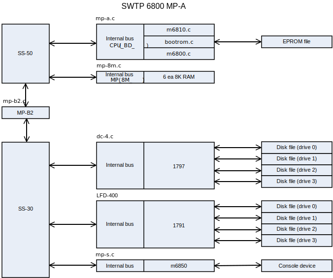

.. -*- coding: utf-8; mode: rst; tab-width: 4; truncate-lines: t; indent-tabs-mode: nil; truncate-lines: t; -*- vim:set et ts=4 ft=rst nowrap:

***********************************
     SWTP 6800 simulator usage
***********************************
:Date: 2022-06-06
:Revision: $Format:%H$
:Copyright: See `LICENSE.txt <../LICENSE.txt>`_ for terms of use.

.. topic:: **Copyright notice**

   The following copyright notice applies to the SIMH source, binary, and documentation:

   .. include:: ../LICENSE.txt

.. sectnum:: :suffix: .
.. contents::
   :backlinks: none
   :depth: 3
   :local:

This memorandum documents the SWTP 6800 simulator.

Simulator files
===============

``sim/``
    | ``scp.h``
    | ``sim_console.h``
    | ``sim_defs.h``
    | ``sim_fio.h``
    | ``sim_rev.h``
    | ``sim_sock.h``
    | ``sim_tape.h``
    | ``sim_timer.h``
    | ``sim_tmxr.h``
    | ``scp.c``
    | ``sim_console.c``
    | ``sim_fio.c``
    | ``sim_sock.c``
    | ``sim_tape.c``
    | ``sim_timer.c``
    | ``sim_tmxr.c``

``sim/swtp6800/common``
    | ``bootrom.c`` – Boot ROM simulator
    | ``dc-4.c``    – Disk controller simulator
    | ``lfd-400.c`` – Disk controller simulator
    | ``i2716.c``   – 2716 ROM simulator D
    | ``m6800.c``   – M6800 CPU simulator
    | ``m6810.c``   – M6810 RAM simulator
    | ``mp-8m.c``   – 8K RAM board simulator
    | ``mp-a.c``    – MP-A CPU board simulator
    | ``mp-a2.c``   – MP-A2 CPU board simulator
    | ``mp-b2.c``   – MP-B2 Motherboard board simulator
    | ``mp-s.c``    – Serial port board simulator

``sim/swtp6800/swtp6800``
    | ``mp-a_sys.c``  – System definitions for MP-A CPU board
    | ``mp-a2_sys.c`` – System definitions for MP-A2 CPU board
    | ``swtp_defs.h`` – System definitions for the SWTP 6800

Additional files are:

``sim/swtp6800/swtp6800``
    | ``swtbug.bin``        – SWTBUG boot ROM code
    | ``swtp6800mp-a.ini``  – Initialization for MP-A CPU
    | ``swtp6800mp-a2.ini`` – Initialization for MP-A2 CPU

SWTP 6800 features
==================
The SWTP 6800 simulator is configured as follows:

===============  ==========================================================
Device names(s)  Simulates
===============  ==========================================================
``m6800+``       MP-A CPU with
``m6810+``       - 128B of RAM and
``bootrom``      - 512 – 8192B of boot ROM
``m6800+``       MP-A2 CPU with
``m6810+``       - 128B of RAM
``bootrom+``     - 512 – 8192B of boot ROM
``i2716``        4 each 2716 EPROMS and external RAM above 40K
``Motherboard``  MP-B2 with 8 SS-30 plugs and 7 SS-50 plugs
``MP-8M``        6 each 8K byte memory board (``0-7FFFH`` & ``A000-DFFFH``)
``DC-4``         SS-30 5-¼″ dual floppy disk controller
``LFD-400``      SS-30 5-¼″ dual floppy disk controller
``MP-S``         SS-30 serial I/O port
===============  ==========================================================

The simulator builds as two executable files, ``SWTP6800MP-A`` and ``SWTP6800MP-A2``,
one for each of the processor boards available.

Most devices can be disabled or enabled, by the commands::

    SET <dev> DISABLED
    SET <dev> ENABLED

The SWTP 6800 simulator implements several unique stop conditions:

- If an undefined instruction is decoded, a ``STOP_INST`` is set
- If an undefined memory or I/O address is selected and ``MTRAP`` is enabled, a ``STOP_INST`` is set
- If an undefined interrupt occurs and ``ITRAP`` is enabled, a ``STOP_INST`` is set

The ``LOAD`` command supports both S19 format and BIN format tapes.
If the file extension is ``.S19``,
or the ``-h`` switch is specified with ``LOAD``,
the file is assumed to be ``S19`` format;
if the file extension is ``.BIN``,
or the ``-b`` switch is specified,
the file is assumed to be BIN format.

Motherboard
-----------
The current simulator supports the MP-B2 motherboard.
This board allows for inserting of the selected CPU,
up to 6 MP-8M 8K byte memory boards,
and one additional SS-50 board.
It will allow the addition of up to 6 other SS-50 peripherals with the MP-S and DC-4.

Addresses are fixed for each of the 6 MP-8M boards as shown below:

=======  ============
Device   Base address
=======  ============
``bd0``  ``0000H``
``bd1``  ``2000H``
``bd2``  ``4000H``
``bd3``  ``6000H``
``bd4``  ``0A000H``
``bd5``  ``0C000H``
=======  ============

The simulator allows each board to be enabled or disabled individually to simulate the presence or absence of a particular board.
This is the standard layout of memory in a SWTP 6800.

If the LFD-400 FDC is enabled,
then the bd5 MP-8M must be disabled.
The LFD-400 used CC00-CC0FH for its I/O address space.

MP-A CPU card
-------------
The simulator for the SWTP 6800 MP-A uses several files.
The simulator is depicted in figure 1.

   Figure 1. MP-A Simulator

The MP-A CPU has several available options.

BOOTROM device
""""""""""""""
The BOOTROM allows selection of the size of the ROM::

    SET BOOTROM NONE              No Boot PROM
    SET BOOTROM 2704              0.5K PROM
    SET BOOTROM 2708              1K PROM
    SET BOOTROM 2716              2K PROM
    SET BOOTROM 2732              4K PROM
    SET BOOTROM 2764              8K PROM

The BOOTROM device assigns the base of the ROM image to 0E000H of simulated memory.

The BOOTROM image file is attached to the BOOTROM device as follows::

    ATTACH BOOTROM SWTBUG.BIN

CPU device
""""""""""
The CPU device allows setting the simulated behavior for interrupts and references to unimplemented memory. ::

    SET CPU ITRAP                 Trap interrupts
    SET CPU NOITRAP               Don't trap interrupts
    SET CPU MTRAP                 Trap unimplemented memory
    SET CPU NOMTRAP               Don't trap unimplemented memory
    SET CPU HISTORY               Enable the collection of history

M6800 registers
"""""""""""""""
The CPU registers include the visible state of the processor as well as the control registers for the interrupt system.

=======  ======  =======================
Name     Size    Comments
=======  ======  =======================
``PC``   16      Program counter
``SP``   16      Stack pointer
``A``    8       Accumulator A
``B``    8       Accumulator B
``IX``   16      Index register
``CCR``  8       Condition code register
=======  ======  =======================

The CPU display radix can be set for octal, decimal or hexadecimal.
The commands are as follows::

    SET CPU OCT
    SET CPU DEC
    SET CPU HEX

The current CPU display radix can be found with::

    SHOW CPU RADIX

MP-A2 CPU card
--------------
The simulator for the SWTP 6800 MP-A uses several files.
The simulator is depicted in figure 2.

.. figure:: images/swtp6800-mpa2.svg
   :align: center

   Figure 2. MP-A2 Simulator

The MP-A CPU has several available options.

BOOTROM device
""""""""""""""
The BOOTROM allows selection of the size of the ROM::

    SET BOOTROM NONE              No Boot PROM
    SET BOOTROM 2704              0.5K PROM
    SET BOOTROM 2708              1K PROM
    SET BOOTROM 2716              2K PROM
    SET BOOTROM 2732              4K PROM
    SET BOOTROM 2764              8K PROM

The BOOTROM device assigns the base of the ROM image to 0E000H of simulated memory.

The BOOTROM image file is attached to the BOOTROM device as follows::

    ATTACH BOOTROM SWTBUG.BIN

I2716 device
""""""""""""
The i2716 device provides 4 units to simulate the 4 2716 ROM positions on the MP-A2 CPU board.
They are i27160 to i27163.

The i2716 ROM image file is attached to one of the i2716 devices as follows::

    ATTACH I27160 FILE0.BIN

CPU device
""""""""""
The CPU device allows setting the simulated behavior for interrupts and references to unimplemented memory. ::

    SET CPU ITRAP                 Trap interrupts
    SET CPU NOITRAP               Don't trap interrupts
    SET CPU MTRAP                 Trap unimplemented memory
    SET CPU NOMTRAP               Don't trap unimplemented memory

M6800 registers
"""""""""""""""
The CPU registers include the visible state of the processor as well as the control registers for the interrupt system.

=======  ====  ==============================
Name     Size  Comments
=======  ====  ==============================
``PC``   16    Program counter
``SP``   16    Stack pointer
``A``    8     Accumulator A
``B``    8     Accumulator B
``IX``   16    Index register
``CCR``  8     Condition code register
=======  ====  ==============================

The CPU display radix can be set for octal, decimal or hexadecimal.
The commands are as follows::

    SET CPU OCT
    SET CPU DEC
    SET CPU HEX

The current CPU display radix can be found with::

    SHOW CPU RADIX

Programmed I/O devices
----------------------

MP-S serial I/O board
"""""""""""""""""""""
This driver simulates the MP-S serial I/O board for the console connection to the SWTP 6800.
The console simulated is either an ANSI terminal or a Teletype Model 33 with paper tape reader and punch.
The console functions work correctly but the paper tape functions do not.
The simulator simulates the M6850 registers to the extent required to support the console.

Console mode can be set as follows::

    SET MP-S ANSI
    SET MP-S TTY

Current console status can be shown with the following command::

    SHOW MP-S

The MP-S driver simulates the paper tape reader (PTR) and paper tape punch (PTP) devices.
These devices need to be attached to files before use.
If the file specified is not present, then a new file is created.
The attach and detach commands are as follows::

    ATTACH PTR TEST
    ATTACH PTP TEST1
    DETACH PTR
    DETACH PTP

Current PTP and PTR status can be shown with the following commands::

    SHOW PTP
    SHOW PTR

DC-4 quad double-sided single-/double-density 5-¼″ floppy disk controller board
"""""""""""""""""""""""""""""""""""""""""""""""""""""""""""""""""""""""""""""""
This driver simulates the DC-4 floppy disk controller board.
Normally this board connects to a dual drive DSDD 5-¼″ floppy system.
In this emulation, I have provided for 4 drives,
the maximum the WD1797 can support and the emulated drive images are also increased in size to 1.44 MB.
FLEX can handle this size drive with no problems.

The DC-4 simulator provides for four drive units.
The units are DC-40 to DC-43.
These devices need to be attached to files before use.
If the file specified is not present, then a new file is created.
The units can be attached and detached to files as follows::

    ATTACH DC-40 BOOT.IMG
    DETACH DC-43

Current DC-4 status can be displayed with the following command::

    SHOW DC-4

LFD-400 quad single-density 5-¼″ floppy disk controller board
"""""""""""""""""""""""""""""""""""""""""""""""""""""""""""""
This driver simulates the LFD-400 floppy disk controller board.
Normally this board connects to a dual drive SSSD 5-¼″ floppy system.
In this emulation, I have provided for 4 drives, the maximum the WD1791 can support.

The LDF-400 simulator provides for four drive units.
The units are LDF-4000 to LDF-4003.
The LDF-400 needs to be enabled before use as follows::

    SET LDS-400 ENABLE

These devices need to be attached to files before use.
If the file specified is not present, then a new file is created.
The units can be attached and detached to files as follows::

    ATTACH LDF-4000 BOOT.IMG
    DETACH LDS-4002

Current DC-4 status can be displayed with the following command::

    SHOW LDF-4000
